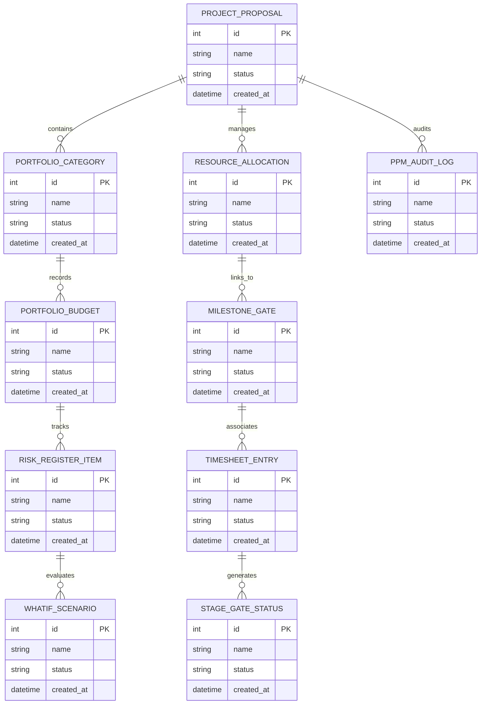

# Conceptual ERD — Project Portfolio Management System

## Mermaid Code

## Entity Description Table | Bảng mô tả Entity

| # | Entity Name | Vietnamese Name | Description | Key Attributes | Main Relationships |
|---|-------------|-----------------|-------------|----------------|-------------------|
| 1 | PROJECT_PROPOSAL | Thực thể PROJECT_PROPOSAL | Quản lý thông tin chi tiết cho project_proposal | id (PK), name, status, created_at | Links with related entities |
| 2 | PORTFOLIO_CATEGORY | Thực thể PORTFOLIO_CATEGORY | Quản lý thông tin chi tiết cho portfolio_category | id (PK), name, status, created_at | Links with related entities |
| 3 | RESOURCE_ALLOCATION | Thực thể RESOURCE_ALLOCATION | Quản lý thông tin chi tiết cho resource_allocation | id (PK), name, status, created_at | Links with related entities |
| 4 | PORTFOLIO_BUDGET | Thực thể PORTFOLIO_BUDGET | Quản lý thông tin chi tiết cho portfolio_budget | id (PK), name, status, created_at | Links with related entities |
| 5 | MILESTONE_GATE | Thực thể MILESTONE_GATE | Quản lý thông tin chi tiết cho milestone_gate | id (PK), name, status, created_at | Links with related entities |
| 6 | RISK_REGISTER_ITEM | Thực thể RISK_REGISTER_ITEM | Quản lý thông tin chi tiết cho risk_register_item | id (PK), name, status, created_at | Links with related entities |
| 7 | TIMESHEET_ENTRY | Thực thể TIMESHEET_ENTRY | Quản lý thông tin chi tiết cho timesheet_entry | id (PK), name, status, created_at | Links with related entities |
| 8 | WHATIF_SCENARIO | Thực thể WHATIF_SCENARIO | Quản lý thông tin chi tiết cho whatif_scenario | id (PK), name, status, created_at | Links with related entities |
| 9 | STAGE_GATE_STATUS | Thực thể STAGE_GATE_STATUS | Quản lý thông tin chi tiết cho stage_gate_status | id (PK), name, status, created_at | Links with related entities |
| 10 | PPM_AUDIT_LOG | Thực thể PPM_AUDIT_LOG | Quản lý thông tin chi tiết cho ppm_audit_log | id (PK), name, status, created_at | Links with related entities |

## Relationship Description | Mô tả Quan hệ

| # | From Entity | Cardinality | To Entity | Relationship Label | Business Explanation |
|---|-------------|-------------|-----------|-------------------|----------------------|
| 1 | PROJECT_PROPOSAL | 1 to Many | PORTFOLIO_CATEGORY | relates_to | Quản lý mối quan hệ giữa PROJECT_PROPOSAL và PORTFOLIO_CATEGORY |
| 2 | PORTFOLIO_CATEGORY | 1 to Many | RESOURCE_ALLOCATION | relates_to | Quản lý mối quan hệ giữa PORTFOLIO_CATEGORY và RESOURCE_ALLOCATION |
| 3 | RESOURCE_ALLOCATION | 1 to Many | PORTFOLIO_BUDGET | relates_to | Quản lý mối quan hệ giữa RESOURCE_ALLOCATION và PORTFOLIO_BUDGET |
| 4 | PORTFOLIO_BUDGET | 1 to Many | MILESTONE_GATE | relates_to | Quản lý mối quan hệ giữa PORTFOLIO_BUDGET và MILESTONE_GATE |
| 5 | MILESTONE_GATE | 1 to Many | RISK_REGISTER_ITEM | relates_to | Quản lý mối quan hệ giữa MILESTONE_GATE và RISK_REGISTER_ITEM |
| 6 | RISK_REGISTER_ITEM | 1 to Many | TIMESHEET_ENTRY | relates_to | Quản lý mối quan hệ giữa RISK_REGISTER_ITEM và TIMESHEET_ENTRY |
| 7 | TIMESHEET_ENTRY | 1 to Many | WHATIF_SCENARIO | relates_to | Quản lý mối quan hệ giữa TIMESHEET_ENTRY và WHATIF_SCENARIO |
| 8 | WHATIF_SCENARIO | 1 to Many | STAGE_GATE_STATUS | relates_to | Quản lý mối quan hệ giữa WHATIF_SCENARIO và STAGE_GATE_STATUS |
| 9 | STAGE_GATE_STATUS | 1 to Many | PPM_AUDIT_LOG | relates_to | Quản lý mối quan hệ giữa STAGE_GATE_STATUS và PPM_AUDIT_LOG |
