# Action Tree — Project Portfolio Management System

## Mermaid Code

```mermaid
graph TD
    Root["Project Portfolio Management System"]

    Root --> M1["Portfolio Selection & Alignment Strategy"]
    Root --> M2["Project Proposal & Stage-Gate Control"]
    Root --> M3["Resource Capacity & Allocation Management"]
    Root --> M4["Portfolio Financials & Budget Tracking"]
    Root --> M5["Risk & Dependency Management"]
    Root --> M6["Executive Portfolio Dashboard"]

    M1 --> A11["Configure Portfolio Selection & Alignment Strategy Policies"]
    M1 --> A12["Execute Portfolio Selection & Alignment Strategy Tasks"]
    M1 --> A13["Monitor Portfolio Selection & Alignment Strategy Telemetry"]
    M1 --> A14["Export Portfolio Selection & Alignment Strategy Audit Logs"]

    M2 --> A21["Configure Project Proposal & Stage-Gate Control Policies"]
    M2 --> A22["Execute Project Proposal & Stage-Gate Control Tasks"]
    M2 --> A23["Monitor Project Proposal & Stage-Gate Control Telemetry"]
    M2 --> A24["Export Project Proposal & Stage-Gate Control Audit Logs"]

    M3 --> A31["Configure Resource Capacity & Allocation Management Policies"]
    M3 --> A32["Execute Resource Capacity & Allocation Management Tasks"]
    M3 --> A33["Monitor Resource Capacity & Allocation Management Telemetry"]
    M3 --> A34["Export Resource Capacity & Allocation Management Audit Logs"]

    M4 --> A41["Configure Portfolio Financials & Budget Tracking Policies"]
    M4 --> A42["Execute Portfolio Financials & Budget Tracking Tasks"]
    M4 --> A43["Monitor Portfolio Financials & Budget Tracking Telemetry"]
    M4 --> A44["Export Portfolio Financials & Budget Tracking Audit Logs"]

    M5 --> A51["Configure Risk & Dependency Management Policies"]
    M5 --> A52["Execute Risk & Dependency Management Tasks"]
    M5 --> A53["Monitor Risk & Dependency Management Telemetry"]
    M5 --> A54["Export Risk & Dependency Management Audit Logs"]

    M6 --> A61["Configure Executive Portfolio Dashboard Policies"]
    M6 --> A62["Execute Executive Portfolio Dashboard Tasks"]
    M6 --> A63["Monitor Executive Portfolio Dashboard Telemetry"]
    M6 --> A64["Export Executive Portfolio Dashboard Audit Logs"]
```

## Module Description | Mô tả Module

| # | Module | Description | Actions |
|---|--------|-------------|---------|
| 1 | Portfolio Selection & Alignment Strategy | Quản lý các chức năng cốt lõi thuộc phân hệ portfolio selection & alignment strategy. | Configure Portfolio Selection & Alignment Strategy Policies, Execute Portfolio Selection & Alignment Strategy Tasks, Monitor Portfolio Selection & Alignment Strategy Telemetry, Export Portfolio Selection & Alignment Strategy Audit Logs |
| 2 | Project Proposal & Stage-Gate Control | Quản lý các chức năng cốt lõi thuộc phân hệ project proposal & stage-gate control. | Configure Project Proposal & Stage-Gate Control Policies, Execute Project Proposal & Stage-Gate Control Tasks, Monitor Project Proposal & Stage-Gate Control Telemetry, Export Project Proposal & Stage-Gate Control Audit Logs |
| 3 | Resource Capacity & Allocation Management | Quản lý các chức năng cốt lõi thuộc phân hệ resource capacity & allocation management. | Configure Resource Capacity & Allocation Management Policies, Execute Resource Capacity & Allocation Management Tasks, Monitor Resource Capacity & Allocation Management Telemetry, Export Resource Capacity & Allocation Management Audit Logs |
| 4 | Portfolio Financials & Budget Tracking | Quản lý các chức năng cốt lõi thuộc phân hệ portfolio financials & budget tracking. | Configure Portfolio Financials & Budget Tracking Policies, Execute Portfolio Financials & Budget Tracking Tasks, Monitor Portfolio Financials & Budget Tracking Telemetry, Export Portfolio Financials & Budget Tracking Audit Logs |
| 5 | Risk & Dependency Management | Quản lý các chức năng cốt lõi thuộc phân hệ risk & dependency management. | Configure Risk & Dependency Management Policies, Execute Risk & Dependency Management Tasks, Monitor Risk & Dependency Management Telemetry, Export Risk & Dependency Management Audit Logs |
| 6 | Executive Portfolio Dashboard | Quản lý các chức năng cốt lõi thuộc phân hệ executive portfolio dashboard. | Configure Executive Portfolio Dashboard Policies, Execute Executive Portfolio Dashboard Tasks, Monitor Executive Portfolio Dashboard Telemetry, Export Executive Portfolio Dashboard Audit Logs |
