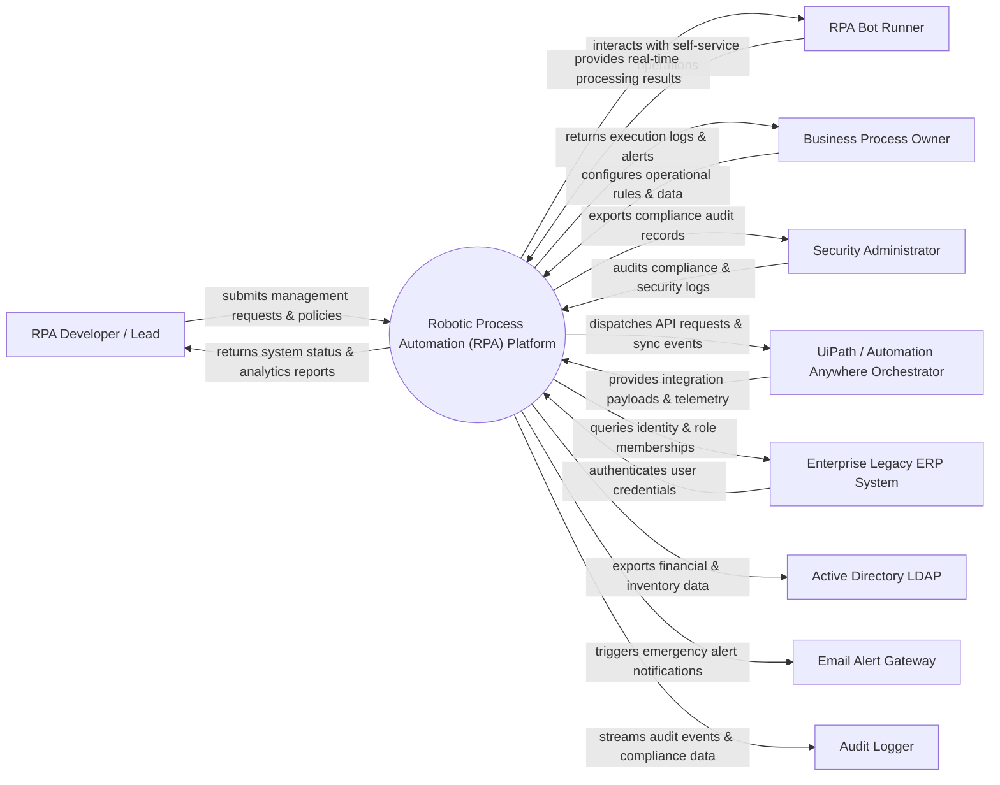

# Context Diagram — Robotic Process Automation (RPA) Platform

## Mermaid Code

## Actor & Interaction Table | Bảng Actor & Tương tác

| # | Actor | Actor Type | Data Sent TO System | Data Received FROM System | Notes |
|---|-------|------------|---------------------|---------------------------|-------|
| 1 | RPA Developer / Lead | Primary | Operational requests, policy configurations, audit queries | Status updates, performance reports, audit results | RPA Developer / Lead role |
| 2 | RPA Bot Runner | Primary | Operational requests, policy configurations, audit queries | Status updates, performance reports, audit results | RPA Bot Runner role |
| 3 | Business Process Owner | Primary | Operational requests, policy configurations, audit queries | Status updates, performance reports, audit results | Business Process Owner role |
| 4 | Security Administrator | Primary | Operational requests, policy configurations, audit queries | Status updates, performance reports, audit results | Security Administrator role |
| 5 | UiPath / Automation Anywhere Orchestrator | Supporting | Integration payloads, auth claims, event logs | API sync responses, verification tokens | UiPath / Automation Anywhere Orchestrator role |
| 6 | Enterprise Legacy ERP System | Supporting | Integration payloads, auth claims, event logs | API sync responses, verification tokens | Enterprise Legacy ERP System role |
| 7 | Active Directory LDAP | Supporting | Integration payloads, auth claims, event logs | API sync responses, verification tokens | Active Directory LDAP role |
| 8 | Email Alert Gateway | Supporting | Integration payloads, auth claims, event logs | API sync responses, verification tokens | Email Alert Gateway role |
| 9 | Audit Logger | Supporting | Integration payloads, auth claims, event logs | API sync responses, verification tokens | Audit Logger role |

## System Boundary Description | Mô tả Scope Hệ thống

Hệ thống **Robotic Process Automation (RPA) Platform** (Nền tảng Tự động hóa Quy trình bằng Robot (RPA)) được thiết kế nhằm quản lý tập trung và tự động hóa các quy trình vận hành CNTT cốt lõi trong doanh nghiệp.

- **Phạm vi bên trong hệ thống (In-Scope)**:
  - Quản lý dữ liệu nghiệp vụ trung tâm, tự động hóa quy trình theo chính sách doanh nghiệp.
  - Phân quyền người dùng chi tiết, theo dõi lịch sử thao tác và xuất báo cáo tuân thủ (ISO/SOC2).
  - Tích hợp phát hiện sự cố, gửi cảnh báo tức thì và kết nối dữ liệu hai chiều.

- **Bên ngoài phạm vi hệ thống (Out-of-Scope)**:
  - Trực tiếp quản lý hạ tầng phần cứng máy chủ vật lý.
  - Trực tiếp xử lý xác thực mật khẩu người dùng gốc (do Identity Provider đảm nhận).
