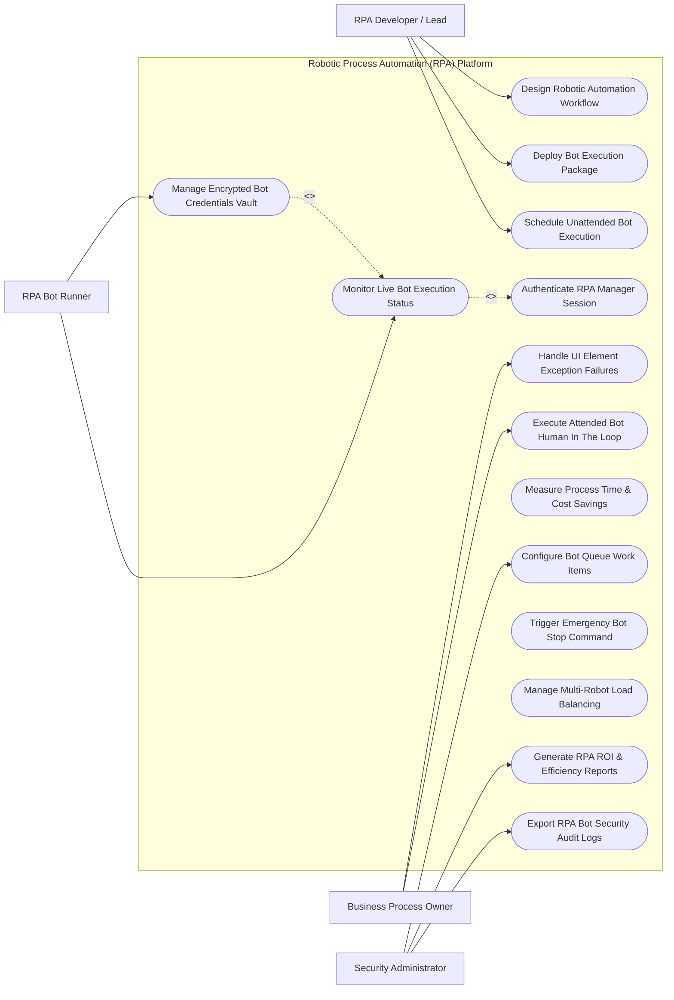

# Use Case Diagram — Robotic Process Automation (RPA) Platform

## Mermaid Code

## Actor Table | Bảng Actor

| # | Actor | Actor Type | Role Description | Related Use Cases |
|---|-------|------------|------------------|-------------------|
| 1 | RPA Developer / Lead | Primary | Main actor responsible for system operations and oversight | UC01, UC02, UC05, UC10 |
| 2 | RPA Bot Runner | Primary | Main actor responsible for system operations and oversight | UC01, UC02, UC05, UC10 |
| 3 | Business Process Owner | Primary | Main actor responsible for system operations and oversight | UC01, UC02, UC05, UC10 |
| 4 | Security Administrator | Primary | Main actor responsible for system operations and oversight | UC01, UC02, UC05, UC10 |

## Use Case Table | Bảng Use Case

| # | UC ID | Use Case Name | Primary Actor | Secondary Actor | Description | Priority |
|---|-------|---------------|---------------|-----------------|-------------|----------|
| 1 | UC01 | Design Robotic Automation Workflow | RPA Developer / Lead | Supporting System | Handles design robotic automation workflow operations within system boundary | High |
| 2 | UC02 | Deploy Bot Execution Package | RPA Bot Runner | Supporting System | Handles deploy bot execution package operations within system boundary | High |
| 3 | UC03 | Schedule Unattended Bot Execution | Business Process Owner | Supporting System | Handles schedule unattended bot execution operations within system boundary | High |
| 4 | UC04 | Authenticate RPA Manager Session | Security Administrator | Supporting System | Handles authenticate rpa manager session operations within system boundary | High |
| 5 | UC05 | Monitor Live Bot Execution Status | RPA Developer / Lead | Supporting System | Handles monitor live bot execution status operations within system boundary | High |
| 6 | UC06 | Manage Encrypted Bot Credentials Vault | RPA Bot Runner | Supporting System | Handles manage encrypted bot credentials vault operations within system boundary | High |
| 7 | UC07 | Handle UI Element Exception Failures | Business Process Owner | Supporting System | Handles handle ui element exception failures operations within system boundary | High |
| 8 | UC08 | Execute Attended Bot Human In The Loop | Security Administrator | Supporting System | Handles execute attended bot human in the loop operations within system boundary | Medium |
| 9 | UC09 | Measure Process Time & Cost Savings | RPA Developer / Lead | Supporting System | Handles measure process time & cost savings operations within system boundary | Medium |
| 10 | UC10 | Configure Bot Queue Work Items | RPA Bot Runner | Supporting System | Handles configure bot queue work items operations within system boundary | High |
| 11 | UC11 | Trigger Emergency Bot Stop Command | Business Process Owner | Supporting System | Handles trigger emergency bot stop command operations within system boundary | High |
| 12 | UC12 | Manage Multi-Robot Load Balancing | Security Administrator | Supporting System | Handles manage multi-robot load balancing operations within system boundary | Medium |
| 13 | UC13 | Generate RPA ROI & Efficiency Reports | RPA Developer / Lead | Supporting System | Handles generate rpa roi & efficiency reports operations within system boundary | Medium |
| 14 | UC14 | Export RPA Bot Security Audit Logs | RPA Bot Runner | Supporting System | Handles export rpa bot security audit logs operations within system boundary | Low |

## Use Case Specification | Đặc tả Use Case

---

### UC01 — Design Robotic Automation Workflow

| Field | Detail |
|-------|--------|
| **UC ID** | UC01 |
| **Use Case Name** | Design Robotic Automation Workflow |
| **Actor(s)** | Primary: RPA Developer / Lead |
| **Description** | Allows primary actors to configure and execute design robotic automation workflow within the system. |
| **Precondition** | 1. Actor must be authenticated.   2. System must be in operational status. |
| **Main Flow** | 1. Actor accesses system module.   2. System displays input form.   3. Actor inputs required details.   4. System validates parameters.   5. Actor submits request.   6. System saves record and updates status. |
| **Alternative Flow** | **AF1** — Bulk Operation: System processes input items in batch mode.   **AF2** — Template Loading: System auto-populates fields using preset template. |
| **Exception Flow** | **EX1** — Validation Error: System highlights missing mandatory fields.   **EX2** — System Timeout: System logs transaction and prompts retry. |
| **Postcondition** | Record is saved and audit trail entry is generated. |
| **Business Rule** | **BR1**: Operation requires valid administrative privileges. |

---

### UC05 — Monitor Live Bot Execution Status

| Field | Detail |
|-------|--------|
| **UC ID** | UC05 |
| **Use Case Name** | Monitor Live Bot Execution Status |
| **Actor(s)** | Primary: RPA Bot Runner |
| **Description** | Executes monitor live bot execution status with real-time feedback and validation. |
| **Precondition** | 1. User must have operational role.   2. Target items must exist. |
| **Main Flow** | 1. User initiates operation.   2. System retrieves target data.   3. User verifies details.   4. User confirms execution.   5. System processes transaction.   6. System returns success confirmation. |
| **Alternative Flow** | **AF1** — Automated Trigger: System executes operation automatically based on policy. |
| **Exception Flow** | **EX1** — Resource Locked: System alerts user if item is locked by another session. |
| **Postcondition** | Execution status is updated to completed. |
| **Business Rule** | **BR1**: All state changes must record timestamp and operator ID. |

---

### UC06 — Manage Encrypted Bot Credentials Vault

| Field | Detail |
|-------|--------|
| **UC ID** | UC06 |
| **Use Case Name** | Manage Encrypted Bot Credentials Vault |
| **Actor(s)** | Primary: Business Process Owner |
| **Description** | Performs manage encrypted bot credentials vault to ensure operational compliance and quality. |
| **Precondition** | 1. System policies must be active. |
| **Main Flow** | 1. User opens audit/monitoring view.   2. System performs automated scan.   3. System presents findings.   4. User applies corrective action.   5. System updates compliance status.   6. System dispatches notification. |
| **Alternative Flow** | **AF1** — Auto-Remediation: System auto-corrects non-compliant items. |
| **Exception Flow** | **EX1** — Access Denied: System blocks unauthorized role access. |
| **Postcondition** | Compliance logs are updated. |
| **Business Rule** | **BR1**: Non-compliant items must generate high-priority alerts. |

---

### UC07 — Handle UI Element Exception Failures

| Field | Detail |
|-------|--------|
| **UC ID** | UC07 |
| **Use Case Name** | Handle UI Element Exception Failures |
| **Actor(s)** | Primary: Business Process Owner |
| **Description** | Manages handle ui element exception failures to maintain system efficiency. |
| **Precondition** | 1. Threshold rules must be defined. |
| **Main Flow** | 1. System detects threshold event.   2. System alerts user.   3. User reviews event parameters.   4. User confirms action.   5. System executes update.   6. System logs outcome. |
| **Alternative Flow** | **AF1** — Scheduled Task: System executes task at off-peak hours. |
| **Exception Flow** | **EX1** — Integration Fail: System retries external API connection. |
| **Postcondition** | Metric trends are updated. |
| **Business Rule** | **BR1**: Critical metrics require immediate notification. |

---

### UC10 — Configure Bot Queue Work Items

| Field | Detail |
|-------|--------|
| **UC ID** | UC10 |
| **Use Case Name** | Configure Bot Queue Work Items |
| **Actor(s)** | Primary: Security Administrator |
| **Description** | Conducts configure bot queue work items for governance and security audits. |
| **Precondition** | 1. Audit rules must be pre-configured. |
| **Main Flow** | 1. Auditor opens governance portal.   2. System compiles audit report.   3. Auditor reviews compliance score.   4. Auditor exports documentation.   5. System logs audit event.   6. System updates compliance status. |
| **Alternative Flow** | **AF1** — Automated Export: System dispatches weekly audit summary email. |
| **Exception Flow** | **EX1** — Data Gap Warning: System flags unverified data points. |
| **Postcondition** | Audit compliance record is finalized. |
| **Business Rule** | **BR1**: Audit records are immutable after publication. |
