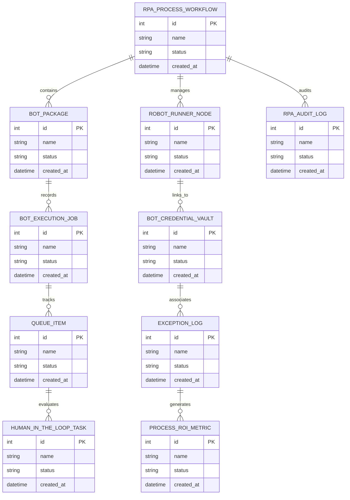

# Conceptual ERD — Robotic Process Automation (RPA) Platform

## Mermaid Code

## Entity Description Table | Bảng mô tả Entity

| # | Entity Name | Vietnamese Name | Description | Key Attributes | Main Relationships |
|---|-------------|-----------------|-------------|----------------|-------------------|
| 1 | RPA_PROCESS_WORKFLOW | Thực thể RPA_PROCESS_WORKFLOW | Quản lý thông tin chi tiết cho rpa_process_workflow | id (PK), name, status, created_at | Links with related entities |
| 2 | BOT_PACKAGE | Thực thể BOT_PACKAGE | Quản lý thông tin chi tiết cho bot_package | id (PK), name, status, created_at | Links with related entities |
| 3 | ROBOT_RUNNER_NODE | Thực thể ROBOT_RUNNER_NODE | Quản lý thông tin chi tiết cho robot_runner_node | id (PK), name, status, created_at | Links with related entities |
| 4 | BOT_EXECUTION_JOB | Thực thể BOT_EXECUTION_JOB | Quản lý thông tin chi tiết cho bot_execution_job | id (PK), name, status, created_at | Links with related entities |
| 5 | BOT_CREDENTIAL_VAULT | Thực thể BOT_CREDENTIAL_VAULT | Quản lý thông tin chi tiết cho bot_credential_vault | id (PK), name, status, created_at | Links with related entities |
| 6 | QUEUE_ITEM | Thực thể QUEUE_ITEM | Quản lý thông tin chi tiết cho queue_item | id (PK), name, status, created_at | Links with related entities |
| 7 | EXCEPTION_LOG | Thực thể EXCEPTION_LOG | Quản lý thông tin chi tiết cho exception_log | id (PK), name, status, created_at | Links with related entities |
| 8 | HUMAN_IN_THE_LOOP_TASK | Thực thể HUMAN_IN_THE_LOOP_TASK | Quản lý thông tin chi tiết cho human_in_the_loop_task | id (PK), name, status, created_at | Links with related entities |
| 9 | PROCESS_ROI_METRIC | Thực thể PROCESS_ROI_METRIC | Quản lý thông tin chi tiết cho process_roi_metric | id (PK), name, status, created_at | Links with related entities |
| 10 | RPA_AUDIT_LOG | Thực thể RPA_AUDIT_LOG | Quản lý thông tin chi tiết cho rpa_audit_log | id (PK), name, status, created_at | Links with related entities |

## Relationship Description | Mô tả Quan hệ

| # | From Entity | Cardinality | To Entity | Relationship Label | Business Explanation |
|---|-------------|-------------|-----------|-------------------|----------------------|
| 1 | RPA_PROCESS_WORKFLOW | 1 to Many | BOT_PACKAGE | relates_to | Quản lý mối quan hệ giữa RPA_PROCESS_WORKFLOW và BOT_PACKAGE |
| 2 | BOT_PACKAGE | 1 to Many | ROBOT_RUNNER_NODE | relates_to | Quản lý mối quan hệ giữa BOT_PACKAGE và ROBOT_RUNNER_NODE |
| 3 | ROBOT_RUNNER_NODE | 1 to Many | BOT_EXECUTION_JOB | relates_to | Quản lý mối quan hệ giữa ROBOT_RUNNER_NODE và BOT_EXECUTION_JOB |
| 4 | BOT_EXECUTION_JOB | 1 to Many | BOT_CREDENTIAL_VAULT | relates_to | Quản lý mối quan hệ giữa BOT_EXECUTION_JOB và BOT_CREDENTIAL_VAULT |
| 5 | BOT_CREDENTIAL_VAULT | 1 to Many | QUEUE_ITEM | relates_to | Quản lý mối quan hệ giữa BOT_CREDENTIAL_VAULT và QUEUE_ITEM |
| 6 | QUEUE_ITEM | 1 to Many | EXCEPTION_LOG | relates_to | Quản lý mối quan hệ giữa QUEUE_ITEM và EXCEPTION_LOG |
| 7 | EXCEPTION_LOG | 1 to Many | HUMAN_IN_THE_LOOP_TASK | relates_to | Quản lý mối quan hệ giữa EXCEPTION_LOG và HUMAN_IN_THE_LOOP_TASK |
| 8 | HUMAN_IN_THE_LOOP_TASK | 1 to Many | PROCESS_ROI_METRIC | relates_to | Quản lý mối quan hệ giữa HUMAN_IN_THE_LOOP_TASK và PROCESS_ROI_METRIC |
| 9 | PROCESS_ROI_METRIC | 1 to Many | RPA_AUDIT_LOG | relates_to | Quản lý mối quan hệ giữa PROCESS_ROI_METRIC và RPA_AUDIT_LOG |
