# Action Tree — Robotic Process Automation (RPA) Platform

## Mermaid Code

```mermaid
graph TD
    Root["Robotic Process Automation (RPA) Platform"]

    Root --> M1["Process Studio & Workflow Designer"]
    Root --> M2["Bot Deployment & Orchestration"]
    Root --> M3["Robot Runner Pool & Queue Management"]
    Root --> M4["Encrypted Credentials Vault"]
    Root --> M5["Exception Handling & Human-in-the-Loop"]
    Root --> M6["RPA ROI & Performance Analytics"]

    M1 --> A11["Configure Process Studio & Workflow Designer Policies"]
    M1 --> A12["Execute Process Studio & Workflow Designer Tasks"]
    M1 --> A13["Monitor Process Studio & Workflow Designer Telemetry"]
    M1 --> A14["Export Process Studio & Workflow Designer Audit Logs"]

    M2 --> A21["Configure Bot Deployment & Orchestration Policies"]
    M2 --> A22["Execute Bot Deployment & Orchestration Tasks"]
    M2 --> A23["Monitor Bot Deployment & Orchestration Telemetry"]
    M2 --> A24["Export Bot Deployment & Orchestration Audit Logs"]

    M3 --> A31["Configure Robot Runner Pool & Queue Management Policies"]
    M3 --> A32["Execute Robot Runner Pool & Queue Management Tasks"]
    M3 --> A33["Monitor Robot Runner Pool & Queue Management Telemetry"]
    M3 --> A34["Export Robot Runner Pool & Queue Management Audit Logs"]

    M4 --> A41["Configure Encrypted Credentials Vault Policies"]
    M4 --> A42["Execute Encrypted Credentials Vault Tasks"]
    M4 --> A43["Monitor Encrypted Credentials Vault Telemetry"]
    M4 --> A44["Export Encrypted Credentials Vault Audit Logs"]

    M5 --> A51["Configure Exception Handling & Human-in-the-Loop Policies"]
    M5 --> A52["Execute Exception Handling & Human-in-the-Loop Tasks"]
    M5 --> A53["Monitor Exception Handling & Human-in-the-Loop Telemetry"]
    M5 --> A54["Export Exception Handling & Human-in-the-Loop Audit Logs"]

    M6 --> A61["Configure RPA ROI & Performance Analytics Policies"]
    M6 --> A62["Execute RPA ROI & Performance Analytics Tasks"]
    M6 --> A63["Monitor RPA ROI & Performance Analytics Telemetry"]
    M6 --> A64["Export RPA ROI & Performance Analytics Audit Logs"]
```

## Module Description | Mô tả Module

| # | Module | Description | Actions |
|---|--------|-------------|---------|
| 1 | Process Studio & Workflow Designer | Quản lý các chức năng cốt lõi thuộc phân hệ process studio & workflow designer. | Configure Process Studio & Workflow Designer Policies, Execute Process Studio & Workflow Designer Tasks, Monitor Process Studio & Workflow Designer Telemetry, Export Process Studio & Workflow Designer Audit Logs |
| 2 | Bot Deployment & Orchestration | Quản lý các chức năng cốt lõi thuộc phân hệ bot deployment & orchestration. | Configure Bot Deployment & Orchestration Policies, Execute Bot Deployment & Orchestration Tasks, Monitor Bot Deployment & Orchestration Telemetry, Export Bot Deployment & Orchestration Audit Logs |
| 3 | Robot Runner Pool & Queue Management | Quản lý các chức năng cốt lõi thuộc phân hệ robot runner pool & queue management. | Configure Robot Runner Pool & Queue Management Policies, Execute Robot Runner Pool & Queue Management Tasks, Monitor Robot Runner Pool & Queue Management Telemetry, Export Robot Runner Pool & Queue Management Audit Logs |
| 4 | Encrypted Credentials Vault | Quản lý các chức năng cốt lõi thuộc phân hệ encrypted credentials vault. | Configure Encrypted Credentials Vault Policies, Execute Encrypted Credentials Vault Tasks, Monitor Encrypted Credentials Vault Telemetry, Export Encrypted Credentials Vault Audit Logs |
| 5 | Exception Handling & Human-in-the-Loop | Quản lý các chức năng cốt lõi thuộc phân hệ exception handling & human-in-the-loop. | Configure Exception Handling & Human-in-the-Loop Policies, Execute Exception Handling & Human-in-the-Loop Tasks, Monitor Exception Handling & Human-in-the-Loop Telemetry, Export Exception Handling & Human-in-the-Loop Audit Logs |
| 6 | RPA ROI & Performance Analytics | Quản lý các chức năng cốt lõi thuộc phân hệ rpa roi & performance analytics. | Configure RPA ROI & Performance Analytics Policies, Execute RPA ROI & Performance Analytics Tasks, Monitor RPA ROI & Performance Analytics Telemetry, Export RPA ROI & Performance Analytics Audit Logs |
