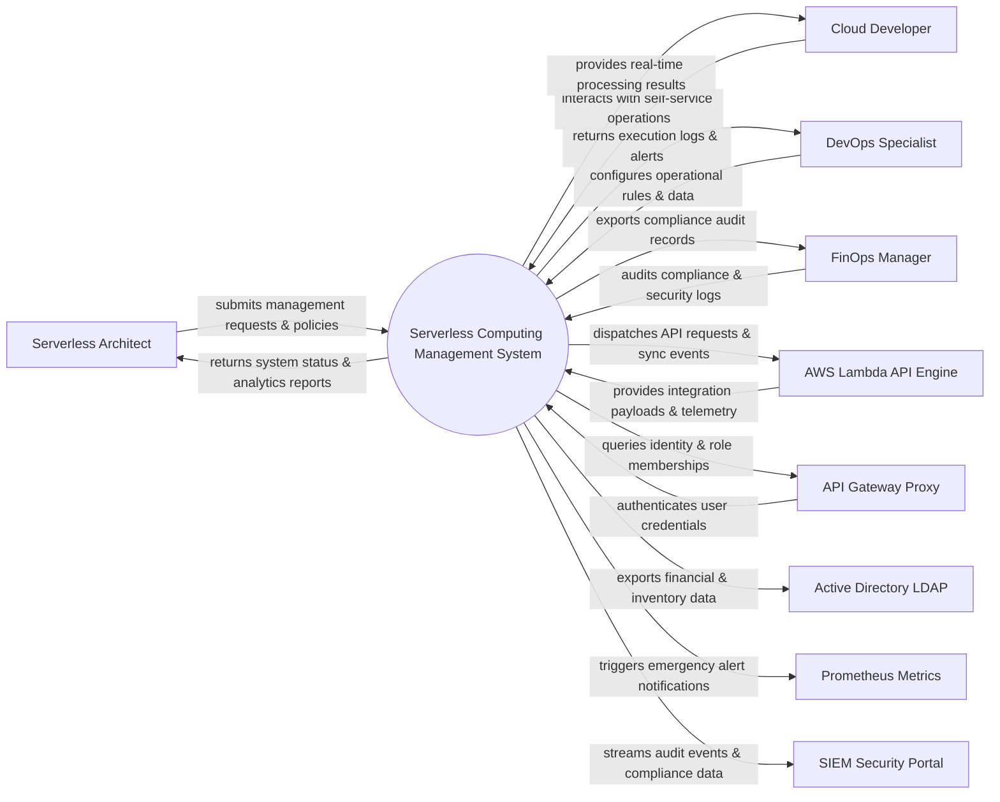

# Context Diagram — Serverless Computing Management System

## Mermaid Code

## Actor & Interaction Table | Bảng Actor & Tương tác

| # | Actor | Actor Type | Data Sent TO System | Data Received FROM System | Notes |
|---|-------|------------|---------------------|---------------------------|-------|
| 1 | Serverless Architect | Primary | Operational requests, policy configurations, audit queries | Status updates, performance reports, audit results | Serverless Architect role |
| 2 | Cloud Developer | Primary | Operational requests, policy configurations, audit queries | Status updates, performance reports, audit results | Cloud Developer role |
| 3 | DevOps Specialist | Primary | Operational requests, policy configurations, audit queries | Status updates, performance reports, audit results | DevOps Specialist role |
| 4 | FinOps Manager | Primary | Operational requests, policy configurations, audit queries | Status updates, performance reports, audit results | FinOps Manager role |
| 5 | AWS Lambda API Engine | Supporting | Integration payloads, auth claims, event logs | API sync responses, verification tokens | AWS Lambda API Engine role |
| 6 | API Gateway Proxy | Supporting | Integration payloads, auth claims, event logs | API sync responses, verification tokens | API Gateway Proxy role |
| 7 | Active Directory LDAP | Supporting | Integration payloads, auth claims, event logs | API sync responses, verification tokens | Active Directory LDAP role |
| 8 | Prometheus Metrics | Supporting | Integration payloads, auth claims, event logs | API sync responses, verification tokens | Prometheus Metrics role |
| 9 | SIEM Security Portal | Supporting | Integration payloads, auth claims, event logs | API sync responses, verification tokens | SIEM Security Portal role |

## System Boundary Description | Mô tả Scope Hệ thống

Hệ thống **Serverless Computing Management System** (Hệ thống Quản lý Điện toán Serverless) được thiết kế nhằm quản lý tập trung và tự động hóa các quy trình vận hành CNTT cốt lõi trong doanh nghiệp.

- **Phạm vi bên trong hệ thống (In-Scope)**:
  - Quản lý dữ liệu nghiệp vụ trung tâm, tự động hóa quy trình theo chính sách doanh nghiệp.
  - Phân quyền người dùng chi tiết, theo dõi lịch sử thao tác và xuất báo cáo tuân thủ (ISO/SOC2).
  - Tích hợp phát hiện sự cố, gửi cảnh báo tức thì và kết nối dữ liệu hai chiều.

- **Bên ngoài phạm vi hệ thống (Out-of-Scope)**:
  - Trực tiếp quản lý hạ tầng phần cứng máy chủ vật lý.
  - Trực tiếp xử lý xác thực mật khẩu người dùng gốc (do Identity Provider đảm nhận).
