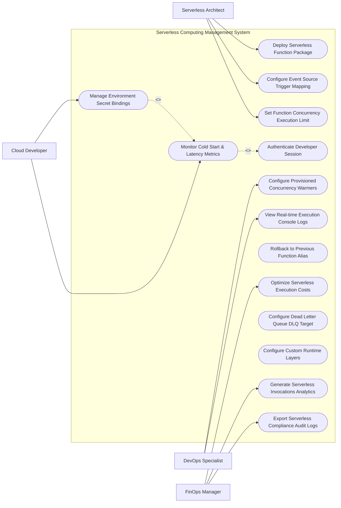

# Use Case Diagram — Serverless Computing Management System

## Mermaid Code

## Actor Table | Bảng Actor

| # | Actor | Actor Type | Role Description | Related Use Cases |
|---|-------|------------|------------------|-------------------|
| 1 | Serverless Architect | Primary | Main actor responsible for system operations and oversight | UC01, UC02, UC05, UC10 |
| 2 | Cloud Developer | Primary | Main actor responsible for system operations and oversight | UC01, UC02, UC05, UC10 |
| 3 | DevOps Specialist | Primary | Main actor responsible for system operations and oversight | UC01, UC02, UC05, UC10 |
| 4 | FinOps Manager | Primary | Main actor responsible for system operations and oversight | UC01, UC02, UC05, UC10 |

## Use Case Table | Bảng Use Case

| # | UC ID | Use Case Name | Primary Actor | Secondary Actor | Description | Priority |
|---|-------|---------------|---------------|-----------------|-------------|----------|
| 1 | UC01 | Deploy Serverless Function Package | Serverless Architect | Supporting System | Handles deploy serverless function package operations within system boundary | High |
| 2 | UC02 | Configure Event Source Trigger Mapping | Cloud Developer | Supporting System | Handles configure event source trigger mapping operations within system boundary | High |
| 3 | UC03 | Set Function Concurrency Execution Limit | DevOps Specialist | Supporting System | Handles set function concurrency execution limit operations within system boundary | High |
| 4 | UC04 | Authenticate Developer Session | FinOps Manager | Supporting System | Handles authenticate developer session operations within system boundary | High |
| 5 | UC05 | Monitor Cold Start & Latency Metrics | Serverless Architect | Supporting System | Handles monitor cold start & latency metrics operations within system boundary | High |
| 6 | UC06 | Manage Environment Secret Bindings | Cloud Developer | Supporting System | Handles manage environment secret bindings operations within system boundary | High |
| 7 | UC07 | Configure Provisioned Concurrency Warmers | DevOps Specialist | Supporting System | Handles configure provisioned concurrency warmers operations within system boundary | Medium |
| 8 | UC08 | View Real-time Execution Console Logs | FinOps Manager | Supporting System | Handles view real-time execution console logs operations within system boundary | High |
| 9 | UC09 | Rollback to Previous Function Alias | Serverless Architect | Supporting System | Handles rollback to previous function alias operations within system boundary | Medium |
| 10 | UC10 | Optimize Serverless Execution Costs | Cloud Developer | Supporting System | Handles optimize serverless execution costs operations within system boundary | High |
| 11 | UC11 | Configure Dead Letter Queue DLQ Target | DevOps Specialist | Supporting System | Handles configure dead letter queue dlq target operations within system boundary | Medium |
| 12 | UC12 | Configure Custom Runtime Layers | FinOps Manager | Supporting System | Handles configure custom runtime layers operations within system boundary | Low |
| 13 | UC13 | Generate Serverless Invocations Analytics | Serverless Architect | Supporting System | Handles generate serverless invocations analytics operations within system boundary | Medium |
| 14 | UC14 | Export Serverless Compliance Audit Logs | Cloud Developer | Supporting System | Handles export serverless compliance audit logs operations within system boundary | Low |

## Use Case Specification | Đặc tả Use Case

---

### UC01 — Deploy Serverless Function Package

| Field | Detail |
|-------|--------|
| **UC ID** | UC01 |
| **Use Case Name** | Deploy Serverless Function Package |
| **Actor(s)** | Primary: Serverless Architect |
| **Description** | Allows primary actors to configure and execute deploy serverless function package within the system. |
| **Precondition** | 1. Actor must be authenticated.   2. System must be in operational status. |
| **Main Flow** | 1. Actor accesses system module.   2. System displays input form.   3. Actor inputs required details.   4. System validates parameters.   5. Actor submits request.   6. System saves record and updates status. |
| **Alternative Flow** | **AF1** — Bulk Operation: System processes input items in batch mode.   **AF2** — Template Loading: System auto-populates fields using preset template. |
| **Exception Flow** | **EX1** — Validation Error: System highlights missing mandatory fields.   **EX2** — System Timeout: System logs transaction and prompts retry. |
| **Postcondition** | Record is saved and audit trail entry is generated. |
| **Business Rule** | **BR1**: Operation requires valid administrative privileges. |

---

### UC05 — Monitor Cold Start & Latency Metrics

| Field | Detail |
|-------|--------|
| **UC ID** | UC05 |
| **Use Case Name** | Monitor Cold Start & Latency Metrics |
| **Actor(s)** | Primary: Cloud Developer |
| **Description** | Executes monitor cold start & latency metrics with real-time feedback and validation. |
| **Precondition** | 1. User must have operational role.   2. Target items must exist. |
| **Main Flow** | 1. User initiates operation.   2. System retrieves target data.   3. User verifies details.   4. User confirms execution.   5. System processes transaction.   6. System returns success confirmation. |
| **Alternative Flow** | **AF1** — Automated Trigger: System executes operation automatically based on policy. |
| **Exception Flow** | **EX1** — Resource Locked: System alerts user if item is locked by another session. |
| **Postcondition** | Execution status is updated to completed. |
| **Business Rule** | **BR1**: All state changes must record timestamp and operator ID. |

---

### UC06 — Manage Environment Secret Bindings

| Field | Detail |
|-------|--------|
| **UC ID** | UC06 |
| **Use Case Name** | Manage Environment Secret Bindings |
| **Actor(s)** | Primary: DevOps Specialist |
| **Description** | Performs manage environment secret bindings to ensure operational compliance and quality. |
| **Precondition** | 1. System policies must be active. |
| **Main Flow** | 1. User opens audit/monitoring view.   2. System performs automated scan.   3. System presents findings.   4. User applies corrective action.   5. System updates compliance status.   6. System dispatches notification. |
| **Alternative Flow** | **AF1** — Auto-Remediation: System auto-corrects non-compliant items. |
| **Exception Flow** | **EX1** — Access Denied: System blocks unauthorized role access. |
| **Postcondition** | Compliance logs are updated. |
| **Business Rule** | **BR1**: Non-compliant items must generate high-priority alerts. |

---

### UC07 — Configure Provisioned Concurrency Warmers

| Field | Detail |
|-------|--------|
| **UC ID** | UC07 |
| **Use Case Name** | Configure Provisioned Concurrency Warmers |
| **Actor(s)** | Primary: DevOps Specialist |
| **Description** | Manages configure provisioned concurrency warmers to maintain system efficiency. |
| **Precondition** | 1. Threshold rules must be defined. |
| **Main Flow** | 1. System detects threshold event.   2. System alerts user.   3. User reviews event parameters.   4. User confirms action.   5. System executes update.   6. System logs outcome. |
| **Alternative Flow** | **AF1** — Scheduled Task: System executes task at off-peak hours. |
| **Exception Flow** | **EX1** — Integration Fail: System retries external API connection. |
| **Postcondition** | Metric trends are updated. |
| **Business Rule** | **BR1**: Critical metrics require immediate notification. |

---

### UC10 — Optimize Serverless Execution Costs

| Field | Detail |
|-------|--------|
| **UC ID** | UC10 |
| **Use Case Name** | Optimize Serverless Execution Costs |
| **Actor(s)** | Primary: FinOps Manager |
| **Description** | Conducts optimize serverless execution costs for governance and security audits. |
| **Precondition** | 1. Audit rules must be pre-configured. |
| **Main Flow** | 1. Auditor opens governance portal.   2. System compiles audit report.   3. Auditor reviews compliance score.   4. Auditor exports documentation.   5. System logs audit event.   6. System updates compliance status. |
| **Alternative Flow** | **AF1** — Automated Export: System dispatches weekly audit summary email. |
| **Exception Flow** | **EX1** — Data Gap Warning: System flags unverified data points. |
| **Postcondition** | Audit compliance record is finalized. |
| **Business Rule** | **BR1**: Audit records are immutable after publication. |
