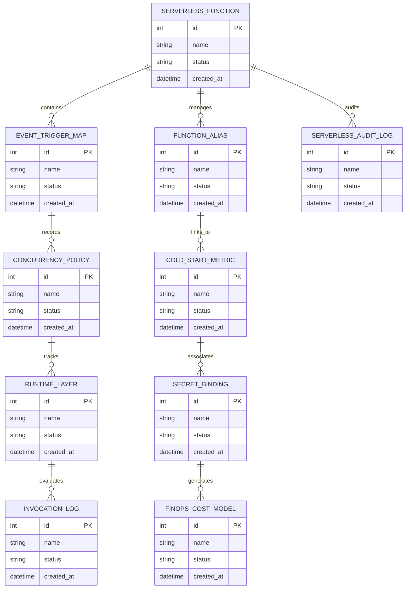

# Conceptual ERD — Serverless Computing Management System

## Mermaid Code

## Entity Description Table | Bảng mô tả Entity

| # | Entity Name | Vietnamese Name | Description | Key Attributes | Main Relationships |
|---|-------------|-----------------|-------------|----------------|-------------------|
| 1 | SERVERLESS_FUNCTION | Thực thể SERVERLESS_FUNCTION | Quản lý thông tin chi tiết cho serverless_function | id (PK), name, status, created_at | Links with related entities |
| 2 | EVENT_TRIGGER_MAP | Thực thể EVENT_TRIGGER_MAP | Quản lý thông tin chi tiết cho event_trigger_map | id (PK), name, status, created_at | Links with related entities |
| 3 | FUNCTION_ALIAS | Thực thể FUNCTION_ALIAS | Quản lý thông tin chi tiết cho function_alias | id (PK), name, status, created_at | Links with related entities |
| 4 | CONCURRENCY_POLICY | Thực thể CONCURRENCY_POLICY | Quản lý thông tin chi tiết cho concurrency_policy | id (PK), name, status, created_at | Links with related entities |
| 5 | COLD_START_METRIC | Thực thể COLD_START_METRIC | Quản lý thông tin chi tiết cho cold_start_metric | id (PK), name, status, created_at | Links with related entities |
| 6 | RUNTIME_LAYER | Thực thể RUNTIME_LAYER | Quản lý thông tin chi tiết cho runtime_layer | id (PK), name, status, created_at | Links with related entities |
| 7 | SECRET_BINDING | Thực thể SECRET_BINDING | Quản lý thông tin chi tiết cho secret_binding | id (PK), name, status, created_at | Links with related entities |
| 8 | INVOCATION_LOG | Thực thể INVOCATION_LOG | Quản lý thông tin chi tiết cho invocation_log | id (PK), name, status, created_at | Links with related entities |
| 9 | FINOPS_COST_MODEL | Thực thể FINOPS_COST_MODEL | Quản lý thông tin chi tiết cho finops_cost_model | id (PK), name, status, created_at | Links with related entities |
| 10 | SERVERLESS_AUDIT_LOG | Thực thể SERVERLESS_AUDIT_LOG | Quản lý thông tin chi tiết cho serverless_audit_log | id (PK), name, status, created_at | Links with related entities |

## Relationship Description | Mô tả Quan hệ

| # | From Entity | Cardinality | To Entity | Relationship Label | Business Explanation |
|---|-------------|-------------|-----------|-------------------|----------------------|
| 1 | SERVERLESS_FUNCTION | 1 to Many | EVENT_TRIGGER_MAP | relates_to | Quản lý mối quan hệ giữa SERVERLESS_FUNCTION và EVENT_TRIGGER_MAP |
| 2 | EVENT_TRIGGER_MAP | 1 to Many | FUNCTION_ALIAS | relates_to | Quản lý mối quan hệ giữa EVENT_TRIGGER_MAP và FUNCTION_ALIAS |
| 3 | FUNCTION_ALIAS | 1 to Many | CONCURRENCY_POLICY | relates_to | Quản lý mối quan hệ giữa FUNCTION_ALIAS và CONCURRENCY_POLICY |
| 4 | CONCURRENCY_POLICY | 1 to Many | COLD_START_METRIC | relates_to | Quản lý mối quan hệ giữa CONCURRENCY_POLICY và COLD_START_METRIC |
| 5 | COLD_START_METRIC | 1 to Many | RUNTIME_LAYER | relates_to | Quản lý mối quan hệ giữa COLD_START_METRIC và RUNTIME_LAYER |
| 6 | RUNTIME_LAYER | 1 to Many | SECRET_BINDING | relates_to | Quản lý mối quan hệ giữa RUNTIME_LAYER và SECRET_BINDING |
| 7 | SECRET_BINDING | 1 to Many | INVOCATION_LOG | relates_to | Quản lý mối quan hệ giữa SECRET_BINDING và INVOCATION_LOG |
| 8 | INVOCATION_LOG | 1 to Many | FINOPS_COST_MODEL | relates_to | Quản lý mối quan hệ giữa INVOCATION_LOG và FINOPS_COST_MODEL |
| 9 | FINOPS_COST_MODEL | 1 to Many | SERVERLESS_AUDIT_LOG | relates_to | Quản lý mối quan hệ giữa FINOPS_COST_MODEL và SERVERLESS_AUDIT_LOG |
