# Action Tree — Serverless Computing Management System

## Mermaid Code

```mermaid
graph TD
    Root["Serverless Computing Management System"]

    Root --> M1["Function Deployment & Alias Management"]
    Root --> M2["Event Source Binding & Triggers"]
    Root --> M3["Concurrency & Cold Start Optimization"]
    Root --> M4["Runtime Layer & Secret Management"]
    Root --> M5["Invocation Telemetry & Log Streaming"]
    Root --> M6["Serverless FinOps & Cost Optimization"]

    M1 --> A11["Configure Function Deployment & Alias Management Policies"]
    M1 --> A12["Execute Function Deployment & Alias Management Tasks"]
    M1 --> A13["Monitor Function Deployment & Alias Management Telemetry"]
    M1 --> A14["Export Function Deployment & Alias Management Audit Logs"]

    M2 --> A21["Configure Event Source Binding & Triggers Policies"]
    M2 --> A22["Execute Event Source Binding & Triggers Tasks"]
    M2 --> A23["Monitor Event Source Binding & Triggers Telemetry"]
    M2 --> A24["Export Event Source Binding & Triggers Audit Logs"]

    M3 --> A31["Configure Concurrency & Cold Start Optimization Policies"]
    M3 --> A32["Execute Concurrency & Cold Start Optimization Tasks"]
    M3 --> A33["Monitor Concurrency & Cold Start Optimization Telemetry"]
    M3 --> A34["Export Concurrency & Cold Start Optimization Audit Logs"]

    M4 --> A41["Configure Runtime Layer & Secret Management Policies"]
    M4 --> A42["Execute Runtime Layer & Secret Management Tasks"]
    M4 --> A43["Monitor Runtime Layer & Secret Management Telemetry"]
    M4 --> A44["Export Runtime Layer & Secret Management Audit Logs"]

    M5 --> A51["Configure Invocation Telemetry & Log Streaming Policies"]
    M5 --> A52["Execute Invocation Telemetry & Log Streaming Tasks"]
    M5 --> A53["Monitor Invocation Telemetry & Log Streaming Telemetry"]
    M5 --> A54["Export Invocation Telemetry & Log Streaming Audit Logs"]

    M6 --> A61["Configure Serverless FinOps & Cost Optimization Policies"]
    M6 --> A62["Execute Serverless FinOps & Cost Optimization Tasks"]
    M6 --> A63["Monitor Serverless FinOps & Cost Optimization Telemetry"]
    M6 --> A64["Export Serverless FinOps & Cost Optimization Audit Logs"]
```

## Module Description | Mô tả Module

| # | Module | Description | Actions |
|---|--------|-------------|---------|
| 1 | Function Deployment & Alias Management | Quản lý các chức năng cốt lõi thuộc phân hệ function deployment & alias management. | Configure Function Deployment & Alias Management Policies, Execute Function Deployment & Alias Management Tasks, Monitor Function Deployment & Alias Management Telemetry, Export Function Deployment & Alias Management Audit Logs |
| 2 | Event Source Binding & Triggers | Quản lý các chức năng cốt lõi thuộc phân hệ event source binding & triggers. | Configure Event Source Binding & Triggers Policies, Execute Event Source Binding & Triggers Tasks, Monitor Event Source Binding & Triggers Telemetry, Export Event Source Binding & Triggers Audit Logs |
| 3 | Concurrency & Cold Start Optimization | Quản lý các chức năng cốt lõi thuộc phân hệ concurrency & cold start optimization. | Configure Concurrency & Cold Start Optimization Policies, Execute Concurrency & Cold Start Optimization Tasks, Monitor Concurrency & Cold Start Optimization Telemetry, Export Concurrency & Cold Start Optimization Audit Logs |
| 4 | Runtime Layer & Secret Management | Quản lý các chức năng cốt lõi thuộc phân hệ runtime layer & secret management. | Configure Runtime Layer & Secret Management Policies, Execute Runtime Layer & Secret Management Tasks, Monitor Runtime Layer & Secret Management Telemetry, Export Runtime Layer & Secret Management Audit Logs |
| 5 | Invocation Telemetry & Log Streaming | Quản lý các chức năng cốt lõi thuộc phân hệ invocation telemetry & log streaming. | Configure Invocation Telemetry & Log Streaming Policies, Execute Invocation Telemetry & Log Streaming Tasks, Monitor Invocation Telemetry & Log Streaming Telemetry, Export Invocation Telemetry & Log Streaming Audit Logs |
| 6 | Serverless FinOps & Cost Optimization | Quản lý các chức năng cốt lõi thuộc phân hệ serverless finops & cost optimization. | Configure Serverless FinOps & Cost Optimization Policies, Execute Serverless FinOps & Cost Optimization Tasks, Monitor Serverless FinOps & Cost Optimization Telemetry, Export Serverless FinOps & Cost Optimization Audit Logs |
