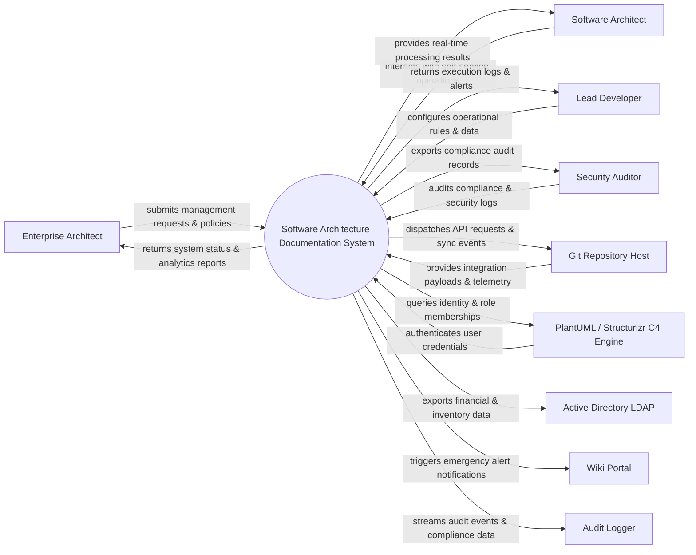

# Context Diagram — Software Architecture Documentation System

## Mermaid Code

## Actor & Interaction Table | Bảng Actor & Tương tác

| # | Actor | Actor Type | Data Sent TO System | Data Received FROM System | Notes |
|---|-------|------------|---------------------|---------------------------|-------|
| 1 | Enterprise Architect | Primary | Operational requests, policy configurations, audit queries | Status updates, performance reports, audit results | Enterprise Architect role |
| 2 | Software Architect | Primary | Operational requests, policy configurations, audit queries | Status updates, performance reports, audit results | Software Architect role |
| 3 | Lead Developer | Primary | Operational requests, policy configurations, audit queries | Status updates, performance reports, audit results | Lead Developer role |
| 4 | Security Auditor | Primary | Operational requests, policy configurations, audit queries | Status updates, performance reports, audit results | Security Auditor role |
| 5 | Git Repository Host | Supporting | Integration payloads, auth claims, event logs | API sync responses, verification tokens | Git Repository Host role |
| 6 | PlantUML / Structurizr C4 Engine | Supporting | Integration payloads, auth claims, event logs | API sync responses, verification tokens | PlantUML / Structurizr C4 Engine role |
| 7 | Active Directory LDAP | Supporting | Integration payloads, auth claims, event logs | API sync responses, verification tokens | Active Directory LDAP role |
| 8 | Wiki Portal | Supporting | Integration payloads, auth claims, event logs | API sync responses, verification tokens | Wiki Portal role |
| 9 | Audit Logger | Supporting | Integration payloads, auth claims, event logs | API sync responses, verification tokens | Audit Logger role |

## System Boundary Description | Mô tả Scope Hệ thống

Hệ thống **Software Architecture Documentation System** (Hệ thống Tài liệu hóa Kiến trúc Phần mềm) được thiết kế nhằm quản lý tập trung và tự động hóa các quy trình vận hành CNTT cốt lõi trong doanh nghiệp.

- **Phạm vi bên trong hệ thống (In-Scope)**:
  - Quản lý dữ liệu nghiệp vụ trung tâm, tự động hóa quy trình theo chính sách doanh nghiệp.
  - Phân quyền người dùng chi tiết, theo dõi lịch sử thao tác và xuất báo cáo tuân thủ (ISO/SOC2).
  - Tích hợp phát hiện sự cố, gửi cảnh báo tức thì và kết nối dữ liệu hai chiều.

- **Bên ngoài phạm vi hệ thống (Out-of-Scope)**:
  - Trực tiếp quản lý hạ tầng phần cứng máy chủ vật lý.
  - Trực tiếp xử lý xác thực mật khẩu người dùng gốc (do Identity Provider đảm nhận).
