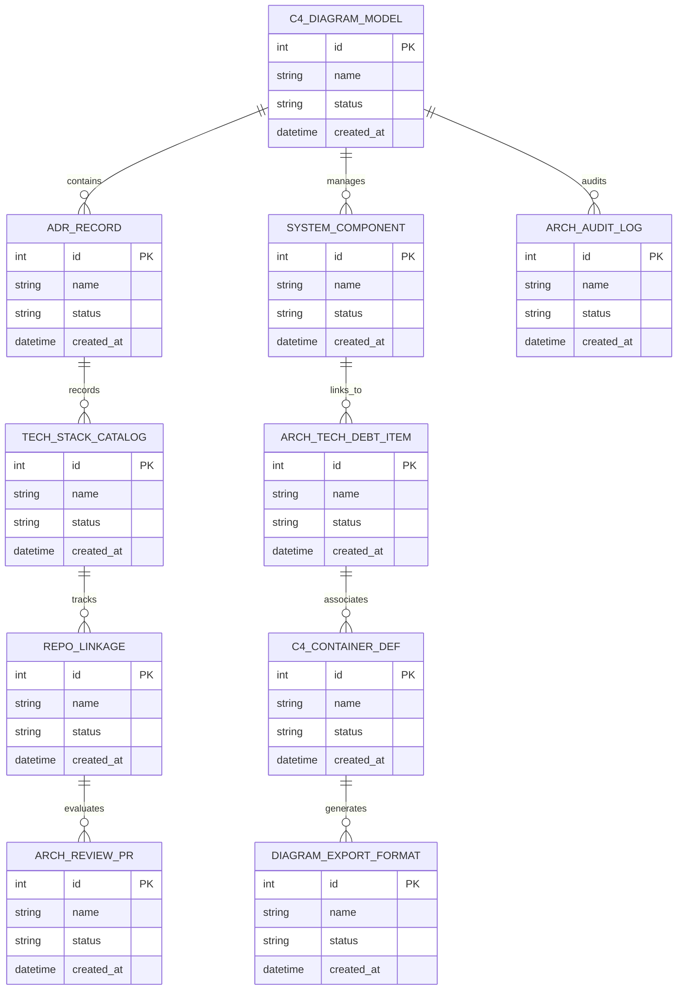

# Conceptual ERD — Software Architecture Documentation System

## Mermaid Code

## Entity Description Table | Bảng mô tả Entity

| # | Entity Name | Vietnamese Name | Description | Key Attributes | Main Relationships |
|---|-------------|-----------------|-------------|----------------|-------------------|
| 1 | C4_DIAGRAM_MODEL | Thực thể C4_DIAGRAM_MODEL | Quản lý thông tin chi tiết cho c4_diagram_model | id (PK), name, status, created_at | Links with related entities |
| 2 | ADR_RECORD | Thực thể ADR_RECORD | Quản lý thông tin chi tiết cho adr_record | id (PK), name, status, created_at | Links with related entities |
| 3 | SYSTEM_COMPONENT | Thực thể SYSTEM_COMPONENT | Quản lý thông tin chi tiết cho system_component | id (PK), name, status, created_at | Links with related entities |
| 4 | TECH_STACK_CATALOG | Thực thể TECH_STACK_CATALOG | Quản lý thông tin chi tiết cho tech_stack_catalog | id (PK), name, status, created_at | Links with related entities |
| 5 | ARCH_TECH_DEBT_ITEM | Thực thể ARCH_TECH_DEBT_ITEM | Quản lý thông tin chi tiết cho arch_tech_debt_item | id (PK), name, status, created_at | Links with related entities |
| 6 | REPO_LINKAGE | Thực thể REPO_LINKAGE | Quản lý thông tin chi tiết cho repo_linkage | id (PK), name, status, created_at | Links with related entities |
| 7 | C4_CONTAINER_DEF | Thực thể C4_CONTAINER_DEF | Quản lý thông tin chi tiết cho c4_container_def | id (PK), name, status, created_at | Links with related entities |
| 8 | ARCH_REVIEW_PR | Thực thể ARCH_REVIEW_PR | Quản lý thông tin chi tiết cho arch_review_pr | id (PK), name, status, created_at | Links with related entities |
| 9 | DIAGRAM_EXPORT_FORMAT | Thực thể DIAGRAM_EXPORT_FORMAT | Quản lý thông tin chi tiết cho diagram_export_format | id (PK), name, status, created_at | Links with related entities |
| 10 | ARCH_AUDIT_LOG | Thực thể ARCH_AUDIT_LOG | Quản lý thông tin chi tiết cho arch_audit_log | id (PK), name, status, created_at | Links with related entities |

## Relationship Description | Mô tả Quan hệ

| # | From Entity | Cardinality | To Entity | Relationship Label | Business Explanation |
|---|-------------|-------------|-----------|-------------------|----------------------|
| 1 | C4_DIAGRAM_MODEL | 1 to Many | ADR_RECORD | relates_to | Quản lý mối quan hệ giữa C4_DIAGRAM_MODEL và ADR_RECORD |
| 2 | ADR_RECORD | 1 to Many | SYSTEM_COMPONENT | relates_to | Quản lý mối quan hệ giữa ADR_RECORD và SYSTEM_COMPONENT |
| 3 | SYSTEM_COMPONENT | 1 to Many | TECH_STACK_CATALOG | relates_to | Quản lý mối quan hệ giữa SYSTEM_COMPONENT và TECH_STACK_CATALOG |
| 4 | TECH_STACK_CATALOG | 1 to Many | ARCH_TECH_DEBT_ITEM | relates_to | Quản lý mối quan hệ giữa TECH_STACK_CATALOG và ARCH_TECH_DEBT_ITEM |
| 5 | ARCH_TECH_DEBT_ITEM | 1 to Many | REPO_LINKAGE | relates_to | Quản lý mối quan hệ giữa ARCH_TECH_DEBT_ITEM và REPO_LINKAGE |
| 6 | REPO_LINKAGE | 1 to Many | C4_CONTAINER_DEF | relates_to | Quản lý mối quan hệ giữa REPO_LINKAGE và C4_CONTAINER_DEF |
| 7 | C4_CONTAINER_DEF | 1 to Many | ARCH_REVIEW_PR | relates_to | Quản lý mối quan hệ giữa C4_CONTAINER_DEF và ARCH_REVIEW_PR |
| 8 | ARCH_REVIEW_PR | 1 to Many | DIAGRAM_EXPORT_FORMAT | relates_to | Quản lý mối quan hệ giữa ARCH_REVIEW_PR và DIAGRAM_EXPORT_FORMAT |
| 9 | DIAGRAM_EXPORT_FORMAT | 1 to Many | ARCH_AUDIT_LOG | relates_to | Quản lý mối quan hệ giữa DIAGRAM_EXPORT_FORMAT và ARCH_AUDIT_LOG |
