# Action Tree — Software Architecture Documentation System

## Mermaid Code

```mermaid
graph TD
    Root["Software Architecture Documentation System"]

    Root --> M1["C4 Model Diagramming Engine"]
    Root --> M2["Architecture Decision Records (ADRs)"]
    Root --> M3["Technology Stack & Component Catalog"]
    Root --> M4["Git Version Control & PR Review"]
    Root --> M5["Tech Debt Risk Assessment"]
    Root --> M6["Architecture Inventory & Export Reporting"]

    M1 --> A11["Configure C4 Model Diagramming Engine Policies"]
    M1 --> A12["Execute C4 Model Diagramming Engine Tasks"]
    M1 --> A13["Monitor C4 Model Diagramming Engine Telemetry"]
    M1 --> A14["Export C4 Model Diagramming Engine Audit Logs"]

    M2 --> A21["Configure Architecture Decision Records (ADRs) Policies"]
    M2 --> A22["Execute Architecture Decision Records (ADRs) Tasks"]
    M2 --> A23["Monitor Architecture Decision Records (ADRs) Telemetry"]
    M2 --> A24["Export Architecture Decision Records (ADRs) Audit Logs"]

    M3 --> A31["Configure Technology Stack & Component Catalog Policies"]
    M3 --> A32["Execute Technology Stack & Component Catalog Tasks"]
    M3 --> A33["Monitor Technology Stack & Component Catalog Telemetry"]
    M3 --> A34["Export Technology Stack & Component Catalog Audit Logs"]

    M4 --> A41["Configure Git Version Control & PR Review Policies"]
    M4 --> A42["Execute Git Version Control & PR Review Tasks"]
    M4 --> A43["Monitor Git Version Control & PR Review Telemetry"]
    M4 --> A44["Export Git Version Control & PR Review Audit Logs"]

    M5 --> A51["Configure Tech Debt Risk Assessment Policies"]
    M5 --> A52["Execute Tech Debt Risk Assessment Tasks"]
    M5 --> A53["Monitor Tech Debt Risk Assessment Telemetry"]
    M5 --> A54["Export Tech Debt Risk Assessment Audit Logs"]

    M6 --> A61["Configure Architecture Inventory & Export Reporting Policies"]
    M6 --> A62["Execute Architecture Inventory & Export Reporting Tasks"]
    M6 --> A63["Monitor Architecture Inventory & Export Reporting Telemetry"]
    M6 --> A64["Export Architecture Inventory & Export Reporting Audit Logs"]
```

## Module Description | Mô tả Module

| # | Module | Description | Actions |
|---|--------|-------------|---------|
| 1 | C4 Model Diagramming Engine | Quản lý các chức năng cốt lõi thuộc phân hệ c4 model diagramming engine. | Configure C4 Model Diagramming Engine Policies, Execute C4 Model Diagramming Engine Tasks, Monitor C4 Model Diagramming Engine Telemetry, Export C4 Model Diagramming Engine Audit Logs |
| 2 | Architecture Decision Records (ADRs) | Quản lý các chức năng cốt lõi thuộc phân hệ architecture decision records (adrs). | Configure Architecture Decision Records (ADRs) Policies, Execute Architecture Decision Records (ADRs) Tasks, Monitor Architecture Decision Records (ADRs) Telemetry, Export Architecture Decision Records (ADRs) Audit Logs |
| 3 | Technology Stack & Component Catalog | Quản lý các chức năng cốt lõi thuộc phân hệ technology stack & component catalog. | Configure Technology Stack & Component Catalog Policies, Execute Technology Stack & Component Catalog Tasks, Monitor Technology Stack & Component Catalog Telemetry, Export Technology Stack & Component Catalog Audit Logs |
| 4 | Git Version Control & PR Review | Quản lý các chức năng cốt lõi thuộc phân hệ git version control & pr review. | Configure Git Version Control & PR Review Policies, Execute Git Version Control & PR Review Tasks, Monitor Git Version Control & PR Review Telemetry, Export Git Version Control & PR Review Audit Logs |
| 5 | Tech Debt Risk Assessment | Quản lý các chức năng cốt lõi thuộc phân hệ tech debt risk assessment. | Configure Tech Debt Risk Assessment Policies, Execute Tech Debt Risk Assessment Tasks, Monitor Tech Debt Risk Assessment Telemetry, Export Tech Debt Risk Assessment Audit Logs |
| 6 | Architecture Inventory & Export Reporting | Quản lý các chức năng cốt lõi thuộc phân hệ architecture inventory & export reporting. | Configure Architecture Inventory & Export Reporting Policies, Execute Architecture Inventory & Export Reporting Tasks, Monitor Architecture Inventory & Export Reporting Telemetry, Export Architecture Inventory & Export Reporting Audit Logs |
