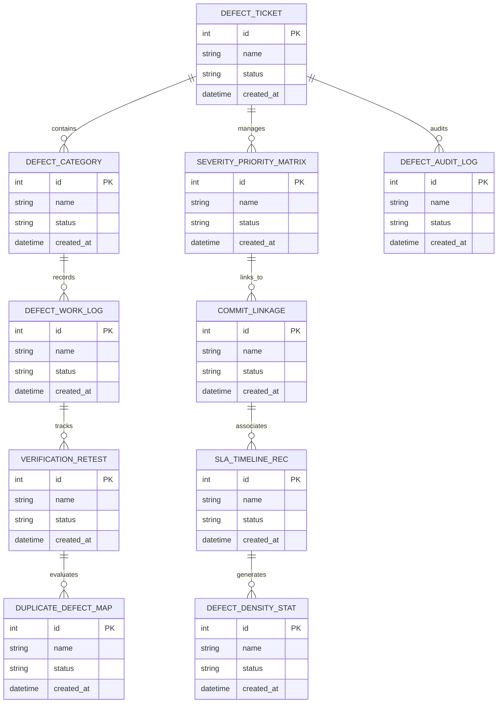

# Conceptual ERD — Software Defect Tracking System

## Mermaid Code

## Entity Description Table | Bảng mô tả Entity

| # | Entity Name | Vietnamese Name | Description | Key Attributes | Main Relationships |
|---|-------------|-----------------|-------------|----------------|-------------------|
| 1 | DEFECT_TICKET | Thực thể DEFECT_TICKET | Quản lý thông tin chi tiết cho defect_ticket | id (PK), name, status, created_at | Links with related entities |
| 2 | DEFECT_CATEGORY | Thực thể DEFECT_CATEGORY | Quản lý thông tin chi tiết cho defect_category | id (PK), name, status, created_at | Links with related entities |
| 3 | SEVERITY_PRIORITY_MATRIX | Thực thể SEVERITY_PRIORITY_MATRIX | Quản lý thông tin chi tiết cho severity_priority_matrix | id (PK), name, status, created_at | Links with related entities |
| 4 | DEFECT_WORK_LOG | Thực thể DEFECT_WORK_LOG | Quản lý thông tin chi tiết cho defect_work_log | id (PK), name, status, created_at | Links with related entities |
| 5 | COMMIT_LINKAGE | Thực thể COMMIT_LINKAGE | Quản lý thông tin chi tiết cho commit_linkage | id (PK), name, status, created_at | Links with related entities |
| 6 | VERIFICATION_RETEST | Thực thể VERIFICATION_RETEST | Quản lý thông tin chi tiết cho verification_retest | id (PK), name, status, created_at | Links with related entities |
| 7 | SLA_TIMELINE_REC | Thực thể SLA_TIMELINE_REC | Quản lý thông tin chi tiết cho sla_timeline_rec | id (PK), name, status, created_at | Links with related entities |
| 8 | DUPLICATE_DEFECT_MAP | Thực thể DUPLICATE_DEFECT_MAP | Quản lý thông tin chi tiết cho duplicate_defect_map | id (PK), name, status, created_at | Links with related entities |
| 9 | DEFECT_DENSITY_STAT | Thực thể DEFECT_DENSITY_STAT | Quản lý thông tin chi tiết cho defect_density_stat | id (PK), name, status, created_at | Links with related entities |
| 10 | DEFECT_AUDIT_LOG | Thực thể DEFECT_AUDIT_LOG | Quản lý thông tin chi tiết cho defect_audit_log | id (PK), name, status, created_at | Links with related entities |

## Relationship Description | Mô tả Quan hệ

| # | From Entity | Cardinality | To Entity | Relationship Label | Business Explanation |
|---|-------------|-------------|-----------|-------------------|----------------------|
| 1 | DEFECT_TICKET | 1 to Many | DEFECT_CATEGORY | relates_to | Quản lý mối quan hệ giữa DEFECT_TICKET và DEFECT_CATEGORY |
| 2 | DEFECT_CATEGORY | 1 to Many | SEVERITY_PRIORITY_MATRIX | relates_to | Quản lý mối quan hệ giữa DEFECT_CATEGORY và SEVERITY_PRIORITY_MATRIX |
| 3 | SEVERITY_PRIORITY_MATRIX | 1 to Many | DEFECT_WORK_LOG | relates_to | Quản lý mối quan hệ giữa SEVERITY_PRIORITY_MATRIX và DEFECT_WORK_LOG |
| 4 | DEFECT_WORK_LOG | 1 to Many | COMMIT_LINKAGE | relates_to | Quản lý mối quan hệ giữa DEFECT_WORK_LOG và COMMIT_LINKAGE |
| 5 | COMMIT_LINKAGE | 1 to Many | VERIFICATION_RETEST | relates_to | Quản lý mối quan hệ giữa COMMIT_LINKAGE và VERIFICATION_RETEST |
| 6 | VERIFICATION_RETEST | 1 to Many | SLA_TIMELINE_REC | relates_to | Quản lý mối quan hệ giữa VERIFICATION_RETEST và SLA_TIMELINE_REC |
| 7 | SLA_TIMELINE_REC | 1 to Many | DUPLICATE_DEFECT_MAP | relates_to | Quản lý mối quan hệ giữa SLA_TIMELINE_REC và DUPLICATE_DEFECT_MAP |
| 8 | DUPLICATE_DEFECT_MAP | 1 to Many | DEFECT_DENSITY_STAT | relates_to | Quản lý mối quan hệ giữa DUPLICATE_DEFECT_MAP và DEFECT_DENSITY_STAT |
| 9 | DEFECT_DENSITY_STAT | 1 to Many | DEFECT_AUDIT_LOG | relates_to | Quản lý mối quan hệ giữa DEFECT_DENSITY_STAT và DEFECT_AUDIT_LOG |
