# Action Tree — Software Defect Tracking System

## Mermaid Code

```mermaid
graph TD
    Root["Software Defect Tracking System"]

    Root --> M1["Defect Submission & Triage Workflow"]
    Root --> M2["Developer Assignment & Fix Tracking"]
    Root --> M3["Verification & Re-test Management"]
    Root --> M4["Git Commit & Code Linkage Integration"]
    Root --> M5["SLA Monitoring & Notification Alert"]
    Root --> M6["Defect Metrics & Quality Reporting"]

    M1 --> A11["Configure Defect Submission & Triage Workflow Policies"]
    M1 --> A12["Execute Defect Submission & Triage Workflow Tasks"]
    M1 --> A13["Monitor Defect Submission & Triage Workflow Telemetry"]
    M1 --> A14["Export Defect Submission & Triage Workflow Audit Logs"]

    M2 --> A21["Configure Developer Assignment & Fix Tracking Policies"]
    M2 --> A22["Execute Developer Assignment & Fix Tracking Tasks"]
    M2 --> A23["Monitor Developer Assignment & Fix Tracking Telemetry"]
    M2 --> A24["Export Developer Assignment & Fix Tracking Audit Logs"]

    M3 --> A31["Configure Verification & Re-test Management Policies"]
    M3 --> A32["Execute Verification & Re-test Management Tasks"]
    M3 --> A33["Monitor Verification & Re-test Management Telemetry"]
    M3 --> A34["Export Verification & Re-test Management Audit Logs"]

    M4 --> A41["Configure Git Commit & Code Linkage Integration Policies"]
    M4 --> A42["Execute Git Commit & Code Linkage Integration Tasks"]
    M4 --> A43["Monitor Git Commit & Code Linkage Integration Telemetry"]
    M4 --> A44["Export Git Commit & Code Linkage Integration Audit Logs"]

    M5 --> A51["Configure SLA Monitoring & Notification Alert Policies"]
    M5 --> A52["Execute SLA Monitoring & Notification Alert Tasks"]
    M5 --> A53["Monitor SLA Monitoring & Notification Alert Telemetry"]
    M5 --> A54["Export SLA Monitoring & Notification Alert Audit Logs"]

    M6 --> A61["Configure Defect Metrics & Quality Reporting Policies"]
    M6 --> A62["Execute Defect Metrics & Quality Reporting Tasks"]
    M6 --> A63["Monitor Defect Metrics & Quality Reporting Telemetry"]
    M6 --> A64["Export Defect Metrics & Quality Reporting Audit Logs"]
```

## Module Description | Mô tả Module

| # | Module | Description | Actions |
|---|--------|-------------|---------|
| 1 | Defect Submission & Triage Workflow | Quản lý các chức năng cốt lõi thuộc phân hệ defect submission & triage workflow. | Configure Defect Submission & Triage Workflow Policies, Execute Defect Submission & Triage Workflow Tasks, Monitor Defect Submission & Triage Workflow Telemetry, Export Defect Submission & Triage Workflow Audit Logs |
| 2 | Developer Assignment & Fix Tracking | Quản lý các chức năng cốt lõi thuộc phân hệ developer assignment & fix tracking. | Configure Developer Assignment & Fix Tracking Policies, Execute Developer Assignment & Fix Tracking Tasks, Monitor Developer Assignment & Fix Tracking Telemetry, Export Developer Assignment & Fix Tracking Audit Logs |
| 3 | Verification & Re-test Management | Quản lý các chức năng cốt lõi thuộc phân hệ verification & re-test management. | Configure Verification & Re-test Management Policies, Execute Verification & Re-test Management Tasks, Monitor Verification & Re-test Management Telemetry, Export Verification & Re-test Management Audit Logs |
| 4 | Git Commit & Code Linkage Integration | Quản lý các chức năng cốt lõi thuộc phân hệ git commit & code linkage integration. | Configure Git Commit & Code Linkage Integration Policies, Execute Git Commit & Code Linkage Integration Tasks, Monitor Git Commit & Code Linkage Integration Telemetry, Export Git Commit & Code Linkage Integration Audit Logs |
| 5 | SLA Monitoring & Notification Alert | Quản lý các chức năng cốt lõi thuộc phân hệ sla monitoring & notification alert. | Configure SLA Monitoring & Notification Alert Policies, Execute SLA Monitoring & Notification Alert Tasks, Monitor SLA Monitoring & Notification Alert Telemetry, Export SLA Monitoring & Notification Alert Audit Logs |
| 6 | Defect Metrics & Quality Reporting | Quản lý các chức năng cốt lõi thuộc phân hệ defect metrics & quality reporting. | Configure Defect Metrics & Quality Reporting Policies, Execute Defect Metrics & Quality Reporting Tasks, Monitor Defect Metrics & Quality Reporting Telemetry, Export Defect Metrics & Quality Reporting Audit Logs |
