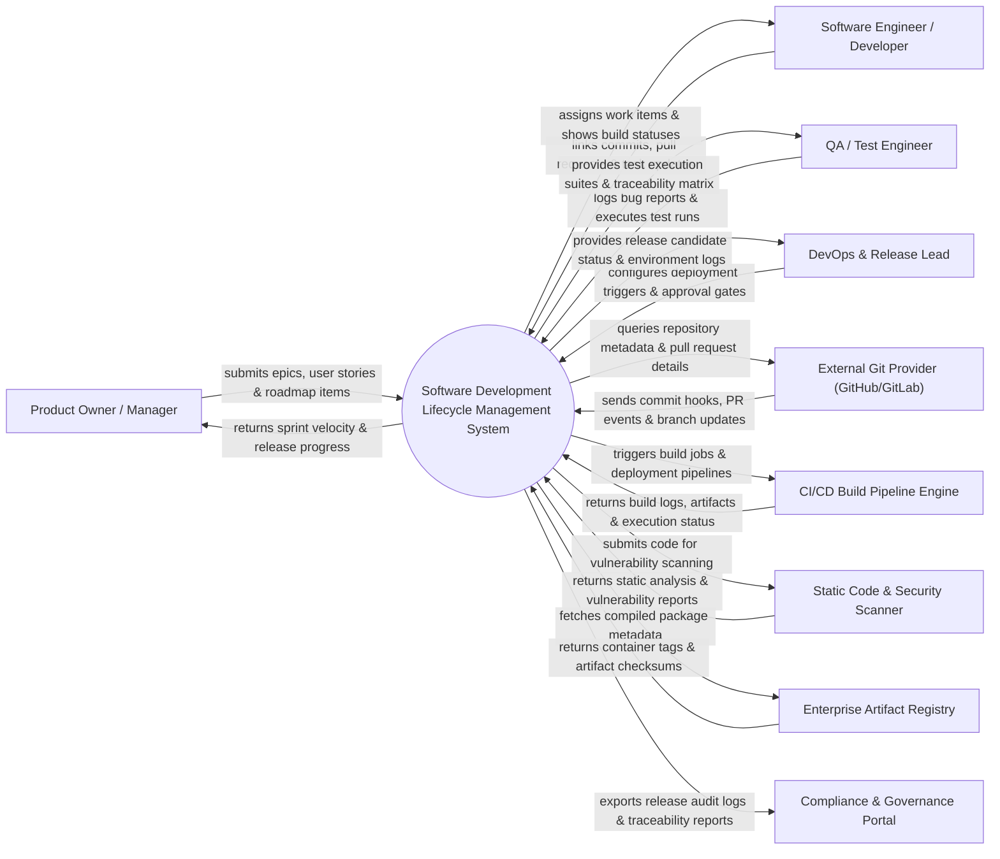

# Context Diagram — Software Development Lifecycle Management System

## Mermaid Code

## Actor & Interaction Table | Bảng Actor & Tương tác

| # | Actor | Actor Type | Data Sent TO System | Data Received FROM System | Notes |
|---|-------|------------|---------------------|---------------------------|-------|
| 1 | Product Owner / Manager | Primary | Epics, user stories, acceptance criteria, priority ranks | Sprint velocity charts, burndown metrics, release roadmaps | Defines project scope and business requirements |
| 2 | Software Engineer / Developer | Primary | Work item updates, commit IDs, pull request links, code review approvals | Task assignments, branch build status, code review requests | Implements software features and bug fixes |
| 3 | QA / Test Engineer | Primary | Defect bug reports, test cases, test execution logs, verification status | Requirements traceability matrix, test suite assignments | Ensures software quality and tests deliverables |
| 4 | DevOps & Release Lead | Primary | Release schedules, environment configurations, gate approval decisions | Build success status, deployment progress, release candidate status | Manages deployments, pipelines, and release readiness |
| 5 | External Git Provider | Supporting | Git push Webhooks, pull request status events, branch creation webhooks | Repository sync requests, commit status API updates | Version control host (e.g., GitHub, GitLab, Bitbucket) |
| 6 | CI/CD Build Pipeline Engine | Supporting | Job completion status, build logs, execution timestamps | Automated pipeline triggers, environment parameters | Automation build engine (e.g., Jenkins, GitHub Actions) |
| 7 | Static Code & Security Scanner | Supporting | Code coverage metrics, SAST/DAST vulnerability alerts | Code scanning trigger requests, repository links | Security tools (e.g., SonarQube, Snyk, Veracode) |
| 8 | Enterprise Artifact Registry | Supporting | Package tags, Docker image digests, download URIs | Artifact lookup queries, release package metadata | Registry hosting built binaries (e.g., Nexus, JFrog) |
| 9 | Compliance & Governance Portal | Supporting | Compliance mandates, audit requirements | Traceability reports, release sign-off logs, security audits | Internal governance and ISO/SOC2 audit systems |

## System Boundary Description | Mô tả Scope Hệ thống

Hệ thống **Software Development Lifecycle Management System (SDLC System)** giúp doanh nghiệp quản lý quy trình phát triển phần mềm end-to-end từ lúc lên ý tưởng yêu cầu (Requirement) đến khi phát hành sản phẩm (Release).

- **Phạm vi bên trong hệ thống (In-Scope)**:
  - Quản lý danh mục dự án, Epic, User Story, Task và lỗi (Defect/Bug) theo mô hình Agile/Scrum.
  - Quản lý các chu kỳ Sprint, kế hoạch phát hành (Release Plan) và bảng phân công công việc (Kanban/Scrum Board).
  - Tích hợp liên kết hai chiều giữa mã nguồn (Commits/PRs) với Work Items và kết quả kiểm thử.
  - Theo dõi ma trận truy vết yêu cầu (Requirements Traceability Matrix - RTM), đo lường vận tốc (Velocity) và báo cáo tuân thủ quy trình SDLC.

- **Bên ngoài phạm vi hệ thống (Out-of-Scope)**:
  - Trực tiếp lưu trữ toàn bộ cây mã nguồn Git (nhiệm vụ của Git Server như GitHub/GitLab).
  - Trực tiếp biên dịch (Compile) hoặc thực thi kịch bản build/deployment (do CI/CD Engine xử lý).
  - Trực tiếp chạy các công cụ quét lỗ hổng bảo mật tĩnh (do SonarQube/Security Scanner đảm nhận).
