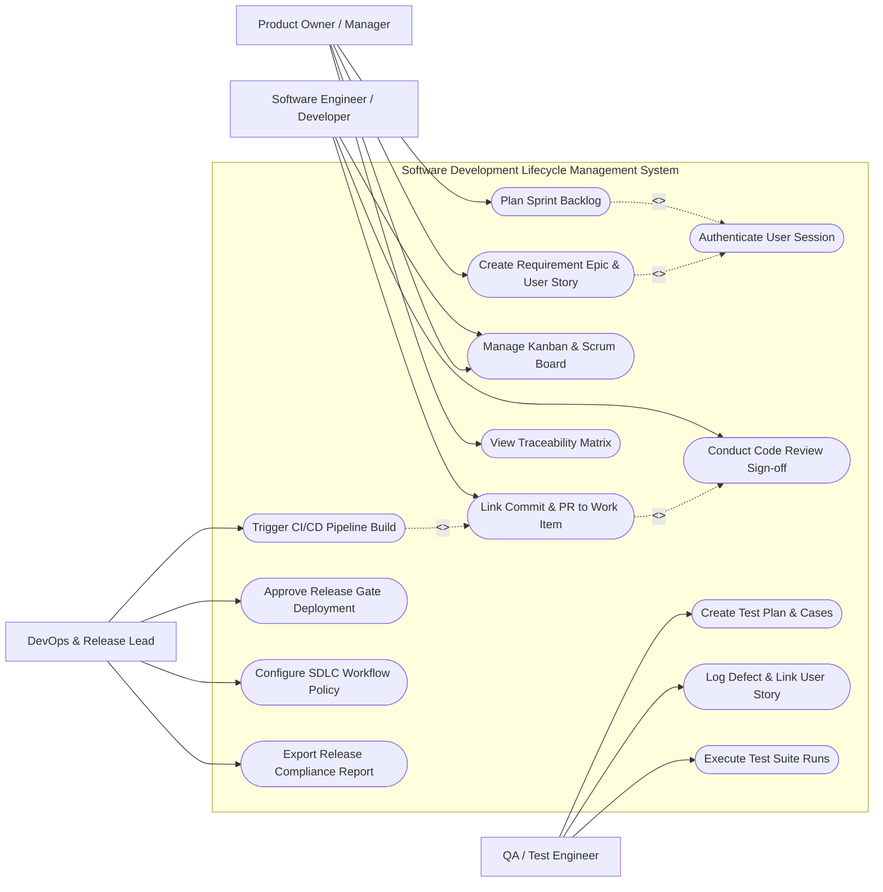

# Use Case Diagram — Software Development Lifecycle Management System

## Mermaid Code

## Actor Table | Bảng Actor

| # | Actor | Actor Type | Role Description | Related Use Cases |
|---|-------|------------|------------------|-------------------|
| 1 | Product Owner / Manager | Primary | Manages requirement backlog, defines epics, prioritizes stories, plans sprint targets | UC01, UC02, UC03, UC04, UC12 |
| 2 | Software Engineer / Developer | Primary | Updates task progress, links git commits/pull requests to tasks, conducts peer code reviews | UC03, UC05, UC06 |
| 3 | QA / Test Engineer | Primary | Authors test plans, logs defects linked to stories, executes automated/manual test runs | UC08, UC09, UC10 |
| 4 | DevOps & Release Lead | Primary | Oversees build automation, configures release approval gates, exports compliance audit reports | UC07, UC11, UC13, UC14 |

## Use Case Table | Bảng Use Case

| # | UC ID | Use Case Name | Primary Actor | Secondary Actor | Description | Priority |
|---|-------|---------------|---------------|-----------------|-------------|----------|
| 1 | UC01 | Create Requirement Epic & User Story | Product Owner | None | Captures business requirements, acceptance criteria, and story points | High |
| 2 | UC02 | Plan Sprint Backlog | Product Owner | Developer | Assigns backlog stories into time-boxed sprint iterations | High |
| 3 | UC03 | Manage Kanban & Scrum Board | Developer | Product Owner | Drag-and-drops work items across To-Do, In-Progress, Code Review, Done states | High |
| 4 | UC04 | Authenticate User Session | System | SSO Provider | Verifies developer credentials and role-based permissions | High |
| 5 | UC05 | Link Commit & PR to Work Item | Developer | Git Provider | Automatically associates Git commit hashes and Pull Requests to ticket IDs | High |
| 6 | UC06 | Conduct Code Review Sign-off | Developer | None | Reviews pull request changes, adds inline review comments, approves PR merge | Medium |
| 7 | UC07 | Trigger CI/CD Pipeline Build | DevOps Lead | CI/CD Engine | Triggers automated build compilation and test suite execution upon PR merge | High |
| 8 | UC08 | Create Test Plan & Cases | QA Test Engineer | None | Authors structured test steps, preconditions, and expected results | Medium |
| 9 | UC09 | Log Defect & Link User Story | QA Test Engineer | Developer | Reports bugs discovered during testing and links them to parent requirement stories | High |
| 10 | UC10 | Execute Test Suite Runs | QA Test Engineer | CI/CD Engine | Executes manual or automated test suites and records pass/fail metrics | High |
| 11 | UC11 | Approve Release Gate Deployment | DevOps Lead | Security Scanner | Evaluates release readiness metrics and approves deployment to Production | High |
| 12 | UC12 | View Traceability Matrix | Product Owner | Audit System | Displays 100% end-to-end mapping from Requirement -> Commit -> Test -> Release | Medium |
| 13 | UC13 | Configure SDLC Workflow Policy | DevOps Lead | None | Sets mandatory code review approvals, branch protection, and SLA rules | Medium |
| 14 | UC14 | Export Release Compliance Report | DevOps Lead | Audit System | Generates SOC2/ISO audit evidence documentation for release deployments | Low |

## Use Case Specification | Đặc tả Use Case

---

### UC01 — Create Requirement Epic & User Story

| Field | Detail |
|-------|--------|
| **UC ID** | UC01 |
| **Use Case Name** | Create Requirement Epic & User Story |
| **Actor(s)** | Primary: Product Owner / Manager |
| **Description** | Allows product owners to define high-level feature Epics, breakdown requirements into actionable User Stories, and assign estimate points. |
| **Precondition** | 1. Product Owner must be logged in with Product Management permissions.   2. The target Project workspace must exist. |
| **Main Flow** | 1. Product Owner clicks "Create New Item" on the Project Requirement view.   2. System prompts for Item Type (Epic, User Story, Task, Feature).   3. Product Owner enters Title, Description (formatted in As a... I want... So that...), Acceptance Criteria, and Business Priority.   4. Product Owner assigns Story Points (e.g., 5 points) and links to parent Epic (if Story).   5. Product Owner clicks "Save Item".   6. System generates unique Item ID (e.g., SDLC-EPIC-102), stores record in Backlog repository, and updates Product Roadmap view. |
| **Alternative Flow** | **AF1** — Bulk Import: Product Owner uploads a CSV/Excel file containing multiple requirements; System parses and creates backlog items in bulk.   **AF2** — AI Acceptance Criteria Generator: System suggests standard acceptance criteria bullets based on title text. |
| **Exception Flow** | **EX1** — Title Empty: If title is omitted, System highlights field with alert "Title is mandatory".   **EX2** — Circular Parent Link: If user attempts to link an Epic as a child of its own Story, System blocks operation with error "Invalid hierarchy link". |
| **Postcondition** | Requirement item is saved into Product Backlog in status "New / Backlog", ready for sprint planning. |
| **Business Rule** | **BR1**: Every User Story must belong to an active Project and have non-negative Story Points. |

---

### UC02 — Plan Sprint Backlog

| Field | Detail |
|-------|--------|
| **UC ID** | UC02 |
| **Use Case Name** | Plan Sprint Backlog |
| **Actor(s)** | Primary: Product Owner / Manager   Secondary: Software Engineer / Developer |
| **Description** | Organizes backlog items into time-boxed Sprint iterations (e.g., 2-week sprints) based on team capacity and priority. |
| **Precondition** | 1. Active backlog items must exist in the project repository.   2. Team velocity capacity must be calculated or estimated. |
| **Main Flow** | 1. Product Owner opens the "Sprint Planning Board".   2. System displays Backlog column (left) and New Sprint column (right) with capacity progress bar.   3. Product Owner defines Sprint Name (e.g., Sprint 24), Start Date, and End Date.   4. Product Owner drags user stories from Backlog into the Sprint column.   5. System dynamically updates total committed Story Points against team capacity limit.   6. Product Owner clicks "Start Sprint", System locks sprint scope and changes status to "Active". |
| **Alternative Flow** | **AF1** — Unfinished Story Carryover: System prompts to automatically move incomplete stories from previous sprint into new sprint.   **AF2** — Auto-Fill Capacity: System suggests top priority backlog items fitting exact team velocity target. |
| **Exception Flow** | **EX1** — Over-Capacity Warning: If total story points exceed team capacity by >20%, System displays alert warning "Sprint exceeds recommended capacity".   **EX2** — Invalid Date Range: If End Date is prior to Start Date, System highlights date field. |
| **Postcondition** | Sprint status changes to "Active", selected items are assigned to Sprint ID, and Burndown Chart is initialized. |
| **Business Rule** | **BR1**: Active Sprints cannot exceed 4 weeks in duration per Scrum standards. |

---

### UC05 — Link Commit & PR to Work Item

| Field | Detail |
|-------|--------|
| **UC ID** | UC05 |
| **Use Case Name** | Link Commit & PR to Work Item |
| **Actor(s)** | Primary: Software Engineer / Developer   Secondary: External Git Provider (GitHub/GitLab) |
| **Description** | Automatically links Git code commits and Pull Requests to SDLC work items when developer references ticket ID in commit message or branch name. |
| **Precondition** | 1. Git Webhook integration must be active between SDLC platform and Git Provider.   2. Target Work Item ID must exist in system. |
| **Main Flow** | 1. Developer pushes code commit or creates Pull Request in Git containing ticket ID (e.g., git commit -m "fix(auth): resolve login bug [SDLC-893]").   2. Git Provider sends Webhook event payload to SDLC platform API.   3. SDLC platform parses payload, extracts ticket ID "SDLC-893" and commit hash / PR link.   4. System verifies ticket ID existence in database.   5. System attaches Git Commit link, branch name, and PR status to the Development tab of the ticket.   6. System automatically updates ticket status from "In Progress" to "Code Review" when PR is opened. |
| **Alternative Flow** | **AF1** — Manual Linking: Developer manually pastes PR URL into work item detail page and clicks "Attach PR".   **AF2** — Auto-Close Ticket on Merge: System automatically updates ticket status to "Done" when linked PR is merged to main branch. |
| **Exception Flow** | **EX1** — Invalid Ticket Key: If commit message references non-existent ticket key "SDLC-9999", System logs webhook notice and ignores link.   **EX2** — Webhook Authentication Failure: If webhook secret token signature fails, System rejects payload with 401 Unauthorized. |
| **Postcondition** | Work item Development panel displays clickable links to Git commits/PRs and syncs code review status. |
| **Business Rule** | **BR1**: Merging to Production branch requires at least 1 linked approved Pull Request and zero open critical defects. |

---

### UC07 — Trigger CI/CD Pipeline Build

| Field | Detail |
|-------|--------|
| **UC ID** | UC07 |
| **Use Case Name** | Trigger CI/CD Pipeline Build |
| **Actor(s)** | Primary: DevOps & Release Lead   Secondary: CI/CD Build Pipeline Engine |
| **Description** | Triggers automated compilation, unit testing, static code analysis, and container image creation for a release candidate branch. |
| **Precondition** | 1. CI/CD integration endpoint must be configured.   2. Pull Request must be merged or release trigger event fired. |
| **Main Flow** | 1. DevOps Lead clicks "Trigger Release Build" or PR merge event automatically fires trigger.   2. System compiles pipeline execution payload (Branch name, Commit Hash, Target Environment).   3. System dispatches REST API call to CI/CD Engine (Jenkins/GitHub Actions).   4. CI/CD Engine executes pipeline steps (Compile -> Unit Test -> Sonar Scan -> Docker Build).   5. System polls CI/CD engine status and displays real-time execution progress bar on Release Dashboard.   6. Upon pipeline completion, System records build status (Success/Failed), build log URL, and compiled artifact Docker tag. |
| **Alternative Flow** | **AF1** — Automated Rollback: If build fails at unit test stage, System alerts DevOps lead and marks build status "Failed - Unit Test Error".   **AF2** — Nightly Scheduled Build: System triggers automated regression build every midnight. |
| **Exception Flow** | **EX1** — Pipeline Connection Timeout: If CI/CD engine does not respond within 30 seconds, System marks trigger as "Engine Unavailable".   **EX2** — Security Gate Failed: If SonarQube scan returns critical security flaws, System fails the build gate automatically. |
| **Postcondition** | Build record is saved with status, compiled artifact tag is linked to Release Candidate, and notification is sent. |
| **Business Rule** | **BR1**: Code cannot be deployed to Staging/Production without a 100% successful CI build execution. |

---

### UC11 — Approve Release Gate Deployment

| Field | Detail |
|-------|--------|
| **UC ID** | UC11 |
| **Use Case Name** | Approve Release Gate Deployment |
| **Actor(s)** | Primary: DevOps & Release Lead   Secondary: Security Scanner / QA Lead |
| **Description** | Evaluates release compliance prerequisites (All Stories Done, 0 Critical Defects, 100% Test Pass Rate) and approves production deployment. |
| **Precondition** | 1. Release Candidate package must have passed successful CI build.   2. User must possess Release Manager approval role. |
| **Main Flow** | 1. DevOps Lead opens "Release Readiness Gate" dashboard for target version (e.g., v2.4.0).   2. System automatically checks 4 Gate Criteria: (a) 100% Stories in Done state, (b) 0 Open Critical Bugs, (c) QA Test Pass Rate >= 95%, (d) Security Scan Passed.   3. System presents Green Checkmarks for satisfied criteria and displays "Release Eligible".   4. DevOps Lead enters release sign-off notes and clicks "Approve Production Release".   5. System requests 2FA verification token from DevOps Lead.   6. Upon token validation, System locks release manifest, sets status to "Approved for Deployment", and dispatches deployment signal. |
| **Alternative Flow** | **AF1** — Manager Emergency Override: If non-critical QA tests are pending, Release Lead requests manager override note to bypass gate.   **AF2** — Automated Scheduled Deployment: System queues approved release for automated deployment at 02:00 AM maintenance window. |
| **Exception Flow** | **EX1** — Unresolved Critical Bug Gate Block: If 1 unresolved Critical Bug exists, System disables "Approve" button and displays "Gate Blocked by BUG-104".   **EX2** — Invalid 2FA Code: If 2FA token fails, System denies release approval. |
| **Postcondition** | Release Candidate status changes to "Approved", immutable audit trail is logged, and production deployment job is triggered. |
| **Business Rule** | **BR1**: Production release approvals require 2FA authentication and mandatory digital sign-off. |
