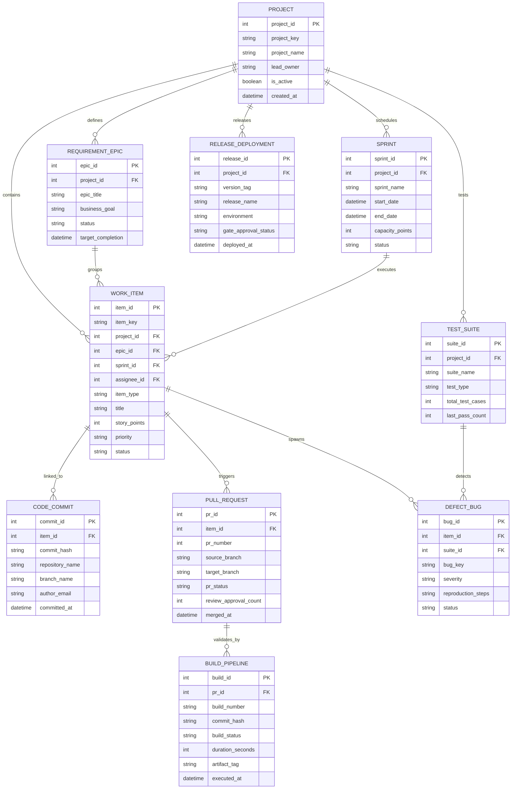

# Conceptual ERD — Software Development Lifecycle Management System

## Mermaid Code

## Entity Description Table | Bảng mô tả Entity

| # | Entity Name | Vietnamese Name | Description | Key Attributes | Main Relationships |
|---|-------------|-----------------|-------------|----------------|-------------------|
| 1 | PROJECT | Dự án Phần mềm | Đại diện cho dự án phần mềm tổng thể, chứa toàn bộ epic, sprint và work items | project_id (PK), project_key, project_name, lead_owner | Defines REQUIREMENT_EPIC, schedules SPRINT, releases DEPLOYMENT |
| 2 | REQUIREMENT_EPIC | Epic Yêu cầu Nghiệp vụ | Tính năng lớn cấp Epic gom nhóm các User Story liên quan | epic_id (PK), project_id (FK), epic_title, business_goal | Belongs to PROJECT, groups WORK_ITEM |
| 3 | SPRINT | Chu kỳ Phát triển (Sprint) | Vòng lặp thời gian (thường 2-4 tuần) để hoàn thành các mục tiêu phát triển | sprint_id (PK), project_id (FK), sprint_name, capacity_points | Belongs to PROJECT, executes WORK_ITEM |
| 4 | WORK_ITEM | Mục Công việc (Story/Task) | Đơn vị công việc chi tiết (User Story, Task, Sub-task) | item_id (PK), item_key, project_id (FK), epic_id (FK), sprint_id (FK) | Belongs to PROJECT/EPIC/SPRINT, linked to COMMIT/PR, spawns DEFECT_BUG |
| 5 | CODE_COMMIT | Git Commit Mã nguồn | Ghi nhận lượt commit mã nguồn từ Git được liên kết với ticket ID | commit_id (PK), item_id (FK), commit_hash, repository_name, branch_name | Linked to WORK_ITEM |
| 6 | PULL_REQUEST | Yêu cầu Merge Code (PR) | Yêu cầu review và merge mã nguồn từ branch phát triển vào branch chính | pr_id (PK), item_id (FK), pr_number, source_branch, target_branch | Triggered by WORK_ITEM, validated by BUILD_PIPELINE |
| 7 | BUILD_PIPELINE | Đường ống Build CI/CD | Ghi nhận thông tin thực thi build tự động, biên dịch code và đóng gói artifact | build_id (PK), pr_id (FK), build_number, build_status, artifact_tag | Validates PULL_REQUEST |
| 8 | TEST_SUITE | Bộ Kịch bản Kiểm thử | Tập hợp các test case kiểm thử tự động hoặc thủ công cho dự án | suite_id (PK), project_id (FK), suite_name, test_type, total_test_cases | Belongs to PROJECT, detects DEFECT_BUG |
| 9 | DEFECT_BUG | Lỗi Phần mềm (Defect/Bug) | Ghi nhận báo cáo lỗi phát sinh trong quá trình kiểm thử hoặc sản xuất | bug_id (PK), item_id (FK), suite_id (FK), bug_key, severity | Spawned by WORK_ITEM, detected by TEST_SUITE |
| 10 | RELEASE_DEPLOYMENT | Đợt Phát hành & Triển khai | Ghi nhận thông tin phiên bản phần mềm phát hành và trạng thái duyệt cổng release | release_id (PK), project_id (FK), version_tag, release_name, environment | Belongs to PROJECT |

## Relationship Description | Mô tả Quan hệ

| # | From Entity | Cardinality | To Entity | Relationship Label | Business Explanation |
|---|-------------|-------------|-----------|-------------------|----------------------|
| 1 | PROJECT | 1 to Many | REQUIREMENT_EPIC | defines | Một dự án định nghĩa nhiều Epic yêu cầu lớn. |
| 2 | PROJECT | 1 to Many | SPRINT | schedules | Một dự án lập kế hoạch cho nhiều chu kỳ Sprint phát triển. |
| 3 | PROJECT | 1 to Many | WORK_ITEM | contains | Một dự án chứa danh mục các Work Item (User Story/Task). |
| 4 | REQUIREMENT_EPIC | 1 to Many | WORK_ITEM | groups | Một Epic gom nhóm nhiều User Story chi tiết. |
| 5 | SPRINT | 1 to Many | WORK_ITEM | executes | Một Sprint thực thi một danh sách các Work Item đã cam kết. |
| 6 | WORK_ITEM | 1 to Many | CODE_COMMIT | linked_to | Một công việc có thể liên quan tới nhiều lượt Commit mã nguồn. |
| 7 | WORK_ITEM | 1 to Many | PULL_REQUEST | triggers | Một công việc mở ra một hoặc nhiều Pull Request để review code. |
| 8 | PULL_REQUEST | 1 to Many | BUILD_PIPELINE | validates_by | Mỗi Pull Request kích hoạt các đợt Build kiểm tra tự động. |
| 9 | PROJECT | 1 to Many | TEST_SUITE | tests | Một dự án có nhiều bộ kịch bản kiểm thử (Test Suites). |
| 10 | WORK_ITEM | 1 to Many | DEFECT_BUG | spawns | Một tính năng/User Story có thể phát sinh các Bug lỗi cần sửa. |
| 11 | TEST_SUITE | 1 to Many | DEFECT_BUG | detects | Một bộ kịch bản kiểm thử phát hiện các Bug lỗi phần mềm. |
| 12 | PROJECT | 1 to Many | RELEASE_DEPLOYMENT | releases | Một dự án thực hiện nhiều đợt đóng gói và phát hành (Release). |
