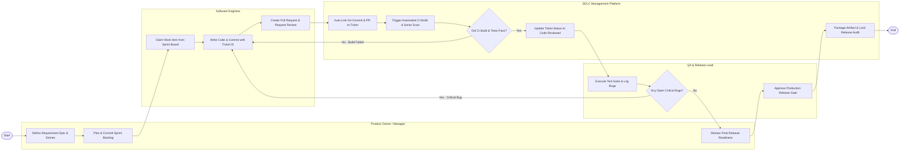

# Swimlane Diagram — Software Development Lifecycle Management System

## Mermaid Code

## Flow Description | Mô tả luồng xử lý

| Lane | Actor | Role in Flow |
|------|-------|-------------|
| 1 | Product Owner / Manager | Định nghĩa các Epic và User Story, lập kế hoạch cho chu kỳ Sprint, kiểm tra ma trận truy vết yêu cầu và xác nhận hoàn thành mục tiêu phát hành. |
| 2 | Software Engineer | Tiếp nhận công việc từ bảng Kanban/Scrum, thực hiện lập trình, commit mã nguồn đính kèm ID ticket, tạo Pull Request và tham gia review code đồng nghiệp. |
| 3 | SDLC Management Platform | Tự động bắt sự kiện Git để liên kết Commit/PR vào ticket, kích hoạt đường ống CI Build và kiểm tra bảo mật, cập nhật trạng thái công việc và đóng gói release. |
| 4 | QA & Release Lead | Thiết lập kịch bản kiểm thử, thực thi test suite, ghi nhận bug nếu có lỗi, và thực hiện duyệt cổng phát hành (Release Gate) lên môi trường Production. |
