# Action Tree — Software Development Lifecycle Management System

## Mermaid Code

```mermaid
graph TD
    Root["Software Development Lifecycle Management System"]

    Root --> M1["Requirements & Roadmap Planning"]
    Root --> M2["Agile Sprint & Issue Management"]
    Root --> M3["Source Code & Git Integration"]
    Root --> M4["CI/CD & Build Automation"]
    Root --> M5["Quality Assurance & Bug Tracking"]
    Root --> M6["Release Governance & Compliance"]

    M1 --> A11["Create Epic & User Story"]
    M1 --> A12["Define Acceptance Criteria"]
    M1 --> A13["Estimate Story Points"]
    M1 --> A14["Build Product Roadmap"]

    M2 --> A21["Create Sprint Iteration"]
    M2 --> A22["Assign Backlog to Sprint"]
    M2 --> A23["Manage Kanban / Scrum Board"]
    M2 --> A24["Track Burndown Velocity"]

    M3 --> A31["Configure Git Webhook Sync"]
    M3 --> A32["Auto-Link Commit to Ticket ID"]
    M3 --> A33["View Pull Request Status"]
    M3 --> A34["Enforce Branch Protection Rules"]

    M4 --> A41["Trigger Automated CI Build"]
    M4 --> A42["Execute Unit & SAST Scan"]
    M4 --> A43["Store Container Build Digest"]
    M4 --> A44["Monitor Real-time Pipeline Logs"]

    M5 --> A51["Create Test Plan & Test Cases"]
    M5 --> A52["Execute Manual & Automated Runs"]
    M5 --> A53["Log Defect Bug & Link Story"]
    M5 --> A54["Generate Requirements Traceability Matrix"]

    M6 --> A61["Evaluate Release Gate Readiness"]
    M6 --> A62["Sign-off Deployment Approval"]
    M6 --> A63["Export SOC2 / ISO Audit Logs"]
    M6 --> A64["Track Version Release Notes"]
```

## Module Description | Mô tả Module

| # | Module | Description | Actions |
|---|--------|-------------|---------|
| 1 | Requirements & Roadmap Planning | Quản lý các yêu cầu nghiệp vụ cấp cao (Epic, User Story), thiết lập tiêu chí nghiệm thu và lộ trình sản phẩm. | Create Epic & User Story, Define Acceptance Criteria, Estimate Story Points, Build Product Roadmap |
| 2 | Agile Sprint & Issue Management | Tổ chức các chu kỳ phát triển Sprint, điều phối bảng công việc Kanban/Scrum và theo dõi vận tốc đội ngũ. | Create Sprint Iteration, Assign Backlog to Sprint, Manage Kanban / Scrum Board, Track Burndown Velocity |
| 3 | Source Code & Git Integration | Đổi nối tự động với hệ thống Git (GitHub/GitLab), liên kết commit/PR vào ticket và thiết lập quy tắc bảo vệ branch. | Configure Git Webhook Sync, Auto-Link Commit to Ticket ID, View Pull Request Status, Enforce Branch Protection Rules |
| 4 | CI/CD & Build Automation | Kích hoạt đường ống tự động biên dịch, quét mã tĩnh SonarQube, lưu vết Docker image và giám sát tiến độ build. | Trigger Automated CI Build, Execute Unit & SAST Scan, Store Container Build Digest, Monitor Real-time Pipeline Logs |
| 5 | Quality Assurance & Bug Tracking | Quản lý kịch bản kiểm thử, ghi nhận bug lỗi liên kết với yêu cầu và tạo ma trận truy vết (RTM). | Create Test Plan & Test Cases, Execute Manual & Automated Runs, Log Defect Bug & Link Story, Generate Requirements Traceability Matrix |
| 6 | Release Governance & Compliance | Đánh giá điều kiện phát hành, phê duyệt cổng phát hành lên Production và xuất báo cáo kiểm toán tuân thủ (SOC2/ISO). | Evaluate Release Gate Readiness, Sign-off Deployment Approval, Export SOC2 / ISO Audit Logs, Track Version Release Notes |
