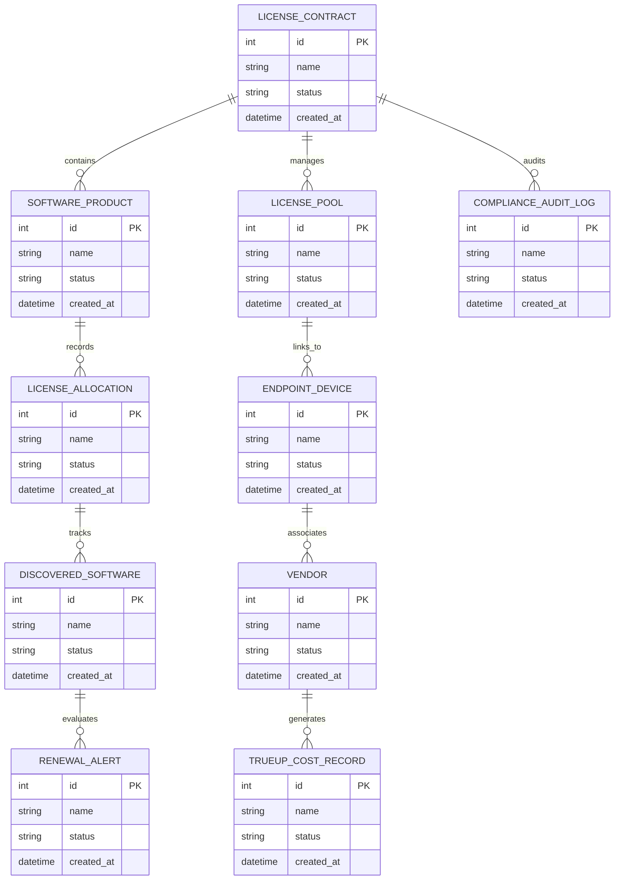

# Conceptual ERD — Software License Management System

## Mermaid Code

## Entity Description Table | Bảng mô tả Entity

| # | Entity Name | Vietnamese Name | Description | Key Attributes | Main Relationships |
|---|-------------|-----------------|-------------|----------------|-------------------|
| 1 | LICENSE_CONTRACT | Thực thể LICENSE_CONTRACT | Quản lý thông tin chi tiết cho license_contract | id (PK), name, status, created_at | Links with related entities |
| 2 | SOFTWARE_PRODUCT | Thực thể SOFTWARE_PRODUCT | Quản lý thông tin chi tiết cho software_product | id (PK), name, status, created_at | Links with related entities |
| 3 | LICENSE_POOL | Thực thể LICENSE_POOL | Quản lý thông tin chi tiết cho license_pool | id (PK), name, status, created_at | Links with related entities |
| 4 | LICENSE_ALLOCATION | Thực thể LICENSE_ALLOCATION | Quản lý thông tin chi tiết cho license_allocation | id (PK), name, status, created_at | Links with related entities |
| 5 | ENDPOINT_DEVICE | Thực thể ENDPOINT_DEVICE | Quản lý thông tin chi tiết cho endpoint_device | id (PK), name, status, created_at | Links with related entities |
| 6 | DISCOVERED_SOFTWARE | Thực thể DISCOVERED_SOFTWARE | Quản lý thông tin chi tiết cho discovered_software | id (PK), name, status, created_at | Links with related entities |
| 7 | VENDOR | Thực thể VENDOR | Quản lý thông tin chi tiết cho vendor | id (PK), name, status, created_at | Links with related entities |
| 8 | RENEWAL_ALERT | Thực thể RENEWAL_ALERT | Quản lý thông tin chi tiết cho renewal_alert | id (PK), name, status, created_at | Links with related entities |
| 9 | TRUEUP_COST_RECORD | Thực thể TRUEUP_COST_RECORD | Quản lý thông tin chi tiết cho trueup_cost_record | id (PK), name, status, created_at | Links with related entities |
| 10 | COMPLIANCE_AUDIT_LOG | Thực thể COMPLIANCE_AUDIT_LOG | Quản lý thông tin chi tiết cho compliance_audit_log | id (PK), name, status, created_at | Links with related entities |

## Relationship Description | Mô tả Quan hệ

| # | From Entity | Cardinality | To Entity | Relationship Label | Business Explanation |
|---|-------------|-------------|-----------|-------------------|----------------------|
| 1 | LICENSE_CONTRACT | 1 to Many | SOFTWARE_PRODUCT | relates_to | Quản lý mối quan hệ giữa LICENSE_CONTRACT và SOFTWARE_PRODUCT |
| 2 | SOFTWARE_PRODUCT | 1 to Many | LICENSE_POOL | relates_to | Quản lý mối quan hệ giữa SOFTWARE_PRODUCT và LICENSE_POOL |
| 3 | LICENSE_POOL | 1 to Many | LICENSE_ALLOCATION | relates_to | Quản lý mối quan hệ giữa LICENSE_POOL và LICENSE_ALLOCATION |
| 4 | LICENSE_ALLOCATION | 1 to Many | ENDPOINT_DEVICE | relates_to | Quản lý mối quan hệ giữa LICENSE_ALLOCATION và ENDPOINT_DEVICE |
| 5 | ENDPOINT_DEVICE | 1 to Many | DISCOVERED_SOFTWARE | relates_to | Quản lý mối quan hệ giữa ENDPOINT_DEVICE và DISCOVERED_SOFTWARE |
| 6 | DISCOVERED_SOFTWARE | 1 to Many | VENDOR | relates_to | Quản lý mối quan hệ giữa DISCOVERED_SOFTWARE và VENDOR |
| 7 | VENDOR | 1 to Many | RENEWAL_ALERT | relates_to | Quản lý mối quan hệ giữa VENDOR và RENEWAL_ALERT |
| 8 | RENEWAL_ALERT | 1 to Many | TRUEUP_COST_RECORD | relates_to | Quản lý mối quan hệ giữa RENEWAL_ALERT và TRUEUP_COST_RECORD |
| 9 | TRUEUP_COST_RECORD | 1 to Many | COMPLIANCE_AUDIT_LOG | relates_to | Quản lý mối quan hệ giữa TRUEUP_COST_RECORD và COMPLIANCE_AUDIT_LOG |
