# Action Tree — Software License Management System

## Mermaid Code

```mermaid
graph TD
    Root["Software License Management System"]

    Root --> M1["License Contract & Catalog Management"]
    Root --> M2["License Allocation & Reclaim Engine"]
    Root --> M3["Endpoint Software Discovery Scan"]
    Root --> M4["Software Compliance & Over-Allocation Audit"]
    Root --> M5["Vendor Agreement & Renewal Management"]
    Root --> M6["License Financials & True-Up Reporting"]

    M1 --> A11["Configure License Contract & Catalog Management Policies"]
    M1 --> A12["Execute License Contract & Catalog Management Tasks"]
    M1 --> A13["Monitor License Contract & Catalog Management Telemetry"]
    M1 --> A14["Export License Contract & Catalog Management Audit Logs"]

    M2 --> A21["Configure License Allocation & Reclaim Engine Policies"]
    M2 --> A22["Execute License Allocation & Reclaim Engine Tasks"]
    M2 --> A23["Monitor License Allocation & Reclaim Engine Telemetry"]
    M2 --> A24["Export License Allocation & Reclaim Engine Audit Logs"]

    M3 --> A31["Configure Endpoint Software Discovery Scan Policies"]
    M3 --> A32["Execute Endpoint Software Discovery Scan Tasks"]
    M3 --> A33["Monitor Endpoint Software Discovery Scan Telemetry"]
    M3 --> A34["Export Endpoint Software Discovery Scan Audit Logs"]

    M4 --> A41["Configure Software Compliance & Over-Allocation Audit Policies"]
    M4 --> A42["Execute Software Compliance & Over-Allocation Audit Tasks"]
    M4 --> A43["Monitor Software Compliance & Over-Allocation Audit Telemetry"]
    M4 --> A44["Export Software Compliance & Over-Allocation Audit Audit Logs"]

    M5 --> A51["Configure Vendor Agreement & Renewal Management Policies"]
    M5 --> A52["Execute Vendor Agreement & Renewal Management Tasks"]
    M5 --> A53["Monitor Vendor Agreement & Renewal Management Telemetry"]
    M5 --> A54["Export Vendor Agreement & Renewal Management Audit Logs"]

    M6 --> A61["Configure License Financials & True-Up Reporting Policies"]
    M6 --> A62["Execute License Financials & True-Up Reporting Tasks"]
    M6 --> A63["Monitor License Financials & True-Up Reporting Telemetry"]
    M6 --> A64["Export License Financials & True-Up Reporting Audit Logs"]
```

## Module Description | Mô tả Module

| # | Module | Description | Actions |
|---|--------|-------------|---------|
| 1 | License Contract & Catalog Management | Quản lý các chức năng cốt lõi thuộc phân hệ license contract & catalog management. | Configure License Contract & Catalog Management Policies, Execute License Contract & Catalog Management Tasks, Monitor License Contract & Catalog Management Telemetry, Export License Contract & Catalog Management Audit Logs |
| 2 | License Allocation & Reclaim Engine | Quản lý các chức năng cốt lõi thuộc phân hệ license allocation & reclaim engine. | Configure License Allocation & Reclaim Engine Policies, Execute License Allocation & Reclaim Engine Tasks, Monitor License Allocation & Reclaim Engine Telemetry, Export License Allocation & Reclaim Engine Audit Logs |
| 3 | Endpoint Software Discovery Scan | Quản lý các chức năng cốt lõi thuộc phân hệ endpoint software discovery scan. | Configure Endpoint Software Discovery Scan Policies, Execute Endpoint Software Discovery Scan Tasks, Monitor Endpoint Software Discovery Scan Telemetry, Export Endpoint Software Discovery Scan Audit Logs |
| 4 | Software Compliance & Over-Allocation Audit | Quản lý các chức năng cốt lõi thuộc phân hệ software compliance & over-allocation audit. | Configure Software Compliance & Over-Allocation Audit Policies, Execute Software Compliance & Over-Allocation Audit Tasks, Monitor Software Compliance & Over-Allocation Audit Telemetry, Export Software Compliance & Over-Allocation Audit Audit Logs |
| 5 | Vendor Agreement & Renewal Management | Quản lý các chức năng cốt lõi thuộc phân hệ vendor agreement & renewal management. | Configure Vendor Agreement & Renewal Management Policies, Execute Vendor Agreement & Renewal Management Tasks, Monitor Vendor Agreement & Renewal Management Telemetry, Export Vendor Agreement & Renewal Management Audit Logs |
| 6 | License Financials & True-Up Reporting | Quản lý các chức năng cốt lõi thuộc phân hệ license financials & true-up reporting. | Configure License Financials & True-Up Reporting Policies, Execute License Financials & True-Up Reporting Tasks, Monitor License Financials & True-Up Reporting Telemetry, Export License Financials & True-Up Reporting Audit Logs |
