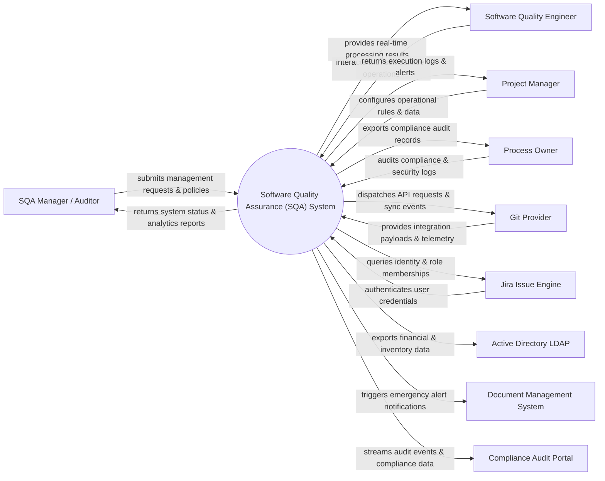

# Context Diagram — Software Quality Assurance (SQA) System

## Mermaid Code

## Actor & Interaction Table | Bảng Actor & Tương tác

| # | Actor | Actor Type | Data Sent TO System | Data Received FROM System | Notes |
|---|-------|------------|---------------------|---------------------------|-------|
| 1 | SQA Manager / Auditor | Primary | Operational requests, policy configurations, audit queries | Status updates, performance reports, audit results | SQA Manager / Auditor role |
| 2 | Software Quality Engineer | Primary | Operational requests, policy configurations, audit queries | Status updates, performance reports, audit results | Software Quality Engineer role |
| 3 | Project Manager | Primary | Operational requests, policy configurations, audit queries | Status updates, performance reports, audit results | Project Manager role |
| 4 | Process Owner | Primary | Operational requests, policy configurations, audit queries | Status updates, performance reports, audit results | Process Owner role |
| 5 | Git Provider | Supporting | Integration payloads, auth claims, event logs | API sync responses, verification tokens | Git Provider role |
| 6 | Jira Issue Engine | Supporting | Integration payloads, auth claims, event logs | API sync responses, verification tokens | Jira Issue Engine role |
| 7 | Active Directory LDAP | Supporting | Integration payloads, auth claims, event logs | API sync responses, verification tokens | Active Directory LDAP role |
| 8 | Document Management System | Supporting | Integration payloads, auth claims, event logs | API sync responses, verification tokens | Document Management System role |
| 9 | Compliance Audit Portal | Supporting | Integration payloads, auth claims, event logs | API sync responses, verification tokens | Compliance Audit Portal role |

## System Boundary Description | Mô tả Scope Hệ thống

Hệ thống **Software Quality Assurance (SQA) System** (Hệ thống Đảm bảo Chất lượng Phần mềm (SQA)) được thiết kế nhằm quản lý tập trung và tự động hóa các quy trình vận hành CNTT cốt lõi trong doanh nghiệp.

- **Phạm vi bên trong hệ thống (In-Scope)**:
  - Quản lý dữ liệu nghiệp vụ trung tâm, tự động hóa quy trình theo chính sách doanh nghiệp.
  - Phân quyền người dùng chi tiết, theo dõi lịch sử thao tác và xuất báo cáo tuân thủ (ISO/SOC2).
  - Tích hợp phát hiện sự cố, gửi cảnh báo tức thì và kết nối dữ liệu hai chiều.

- **Bên ngoài phạm vi hệ thống (Out-of-Scope)**:
  - Trực tiếp quản lý hạ tầng phần cứng máy chủ vật lý.
  - Trực tiếp xử lý xác thực mật khẩu người dùng gốc (do Identity Provider đảm nhận).
