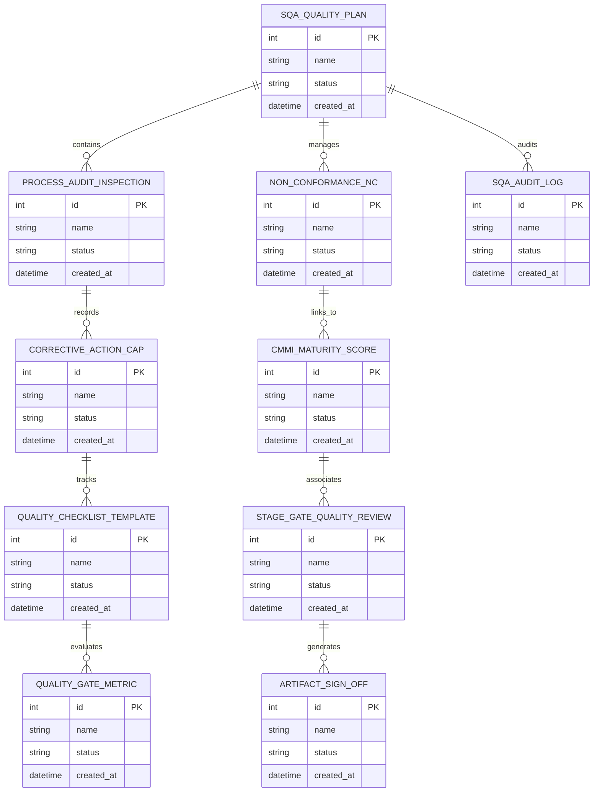

# Conceptual ERD — Software Quality Assurance (SQA) System

## Mermaid Code

## Entity Description Table | Bảng mô tả Entity

| # | Entity Name | Vietnamese Name | Description | Key Attributes | Main Relationships |
|---|-------------|-----------------|-------------|----------------|-------------------|
| 1 | SQA_QUALITY_PLAN | Thực thể SQA_QUALITY_PLAN | Quản lý thông tin chi tiết cho sqa_quality_plan | id (PK), name, status, created_at | Links with related entities |
| 2 | PROCESS_AUDIT_INSPECTION | Thực thể PROCESS_AUDIT_INSPECTION | Quản lý thông tin chi tiết cho process_audit_inspection | id (PK), name, status, created_at | Links with related entities |
| 3 | NON_CONFORMANCE_NC | Thực thể NON_CONFORMANCE_NC | Quản lý thông tin chi tiết cho non_conformance_nc | id (PK), name, status, created_at | Links with related entities |
| 4 | CORRECTIVE_ACTION_CAP | Thực thể CORRECTIVE_ACTION_CAP | Quản lý thông tin chi tiết cho corrective_action_cap | id (PK), name, status, created_at | Links with related entities |
| 5 | CMMI_MATURITY_SCORE | Thực thể CMMI_MATURITY_SCORE | Quản lý thông tin chi tiết cho cmmi_maturity_score | id (PK), name, status, created_at | Links with related entities |
| 6 | QUALITY_CHECKLIST_TEMPLATE | Thực thể QUALITY_CHECKLIST_TEMPLATE | Quản lý thông tin chi tiết cho quality_checklist_template | id (PK), name, status, created_at | Links with related entities |
| 7 | STAGE_GATE_QUALITY_REVIEW | Thực thể STAGE_GATE_QUALITY_REVIEW | Quản lý thông tin chi tiết cho stage_gate_quality_review | id (PK), name, status, created_at | Links with related entities |
| 8 | QUALITY_GATE_METRIC | Thực thể QUALITY_GATE_METRIC | Quản lý thông tin chi tiết cho quality_gate_metric | id (PK), name, status, created_at | Links with related entities |
| 9 | ARTIFACT_SIGN_OFF | Thực thể ARTIFACT_SIGN_OFF | Quản lý thông tin chi tiết cho artifact_sign_off | id (PK), name, status, created_at | Links with related entities |
| 10 | SQA_AUDIT_LOG | Thực thể SQA_AUDIT_LOG | Quản lý thông tin chi tiết cho sqa_audit_log | id (PK), name, status, created_at | Links with related entities |

## Relationship Description | Mô tả Quan hệ

| # | From Entity | Cardinality | To Entity | Relationship Label | Business Explanation |
|---|-------------|-------------|-----------|-------------------|----------------------|
| 1 | SQA_QUALITY_PLAN | 1 to Many | PROCESS_AUDIT_INSPECTION | relates_to | Quản lý mối quan hệ giữa SQA_QUALITY_PLAN và PROCESS_AUDIT_INSPECTION |
| 2 | PROCESS_AUDIT_INSPECTION | 1 to Many | NON_CONFORMANCE_NC | relates_to | Quản lý mối quan hệ giữa PROCESS_AUDIT_INSPECTION và NON_CONFORMANCE_NC |
| 3 | NON_CONFORMANCE_NC | 1 to Many | CORRECTIVE_ACTION_CAP | relates_to | Quản lý mối quan hệ giữa NON_CONFORMANCE_NC và CORRECTIVE_ACTION_CAP |
| 4 | CORRECTIVE_ACTION_CAP | 1 to Many | CMMI_MATURITY_SCORE | relates_to | Quản lý mối quan hệ giữa CORRECTIVE_ACTION_CAP và CMMI_MATURITY_SCORE |
| 5 | CMMI_MATURITY_SCORE | 1 to Many | QUALITY_CHECKLIST_TEMPLATE | relates_to | Quản lý mối quan hệ giữa CMMI_MATURITY_SCORE và QUALITY_CHECKLIST_TEMPLATE |
| 6 | QUALITY_CHECKLIST_TEMPLATE | 1 to Many | STAGE_GATE_QUALITY_REVIEW | relates_to | Quản lý mối quan hệ giữa QUALITY_CHECKLIST_TEMPLATE và STAGE_GATE_QUALITY_REVIEW |
| 7 | STAGE_GATE_QUALITY_REVIEW | 1 to Many | QUALITY_GATE_METRIC | relates_to | Quản lý mối quan hệ giữa STAGE_GATE_QUALITY_REVIEW và QUALITY_GATE_METRIC |
| 8 | QUALITY_GATE_METRIC | 1 to Many | ARTIFACT_SIGN_OFF | relates_to | Quản lý mối quan hệ giữa QUALITY_GATE_METRIC và ARTIFACT_SIGN_OFF |
| 9 | ARTIFACT_SIGN_OFF | 1 to Many | SQA_AUDIT_LOG | relates_to | Quản lý mối quan hệ giữa ARTIFACT_SIGN_OFF và SQA_AUDIT_LOG |
