# Action Tree — Software Quality Assurance (SQA) System

## Mermaid Code

```mermaid
graph TD
    Root["Software Quality Assurance (SQA) System"]

    Root --> M1["SQA Plan & Process Inspection"]
    Root --> M2["Non-Conformance (NC) & Corrective Action (CAP)"]
    Root --> M3["CMMI Maturity & Quality Gate Governance"]
    Root --> M4["Phase-End Stage-Gate Review Control"]
    Root --> M5["Software Artifact Sign-off Verification"]
    Root --> M6["SQA Compliance & Executive Dashboard"]

    M1 --> A11["Configure SQA Plan & Process Inspection Policies"]
    M1 --> A12["Execute SQA Plan & Process Inspection Tasks"]
    M1 --> A13["Monitor SQA Plan & Process Inspection Telemetry"]
    M1 --> A14["Export SQA Plan & Process Inspection Audit Logs"]

    M2 --> A21["Configure Non-Conformance (NC) & Corrective Action (CAP) Policies"]
    M2 --> A22["Execute Non-Conformance (NC) & Corrective Action (CAP) Tasks"]
    M2 --> A23["Monitor Non-Conformance (NC) & Corrective Action (CAP) Telemetry"]
    M2 --> A24["Export Non-Conformance (NC) & Corrective Action (CAP) Audit Logs"]

    M3 --> A31["Configure CMMI Maturity & Quality Gate Governance Policies"]
    M3 --> A32["Execute CMMI Maturity & Quality Gate Governance Tasks"]
    M3 --> A33["Monitor CMMI Maturity & Quality Gate Governance Telemetry"]
    M3 --> A34["Export CMMI Maturity & Quality Gate Governance Audit Logs"]

    M4 --> A41["Configure Phase-End Stage-Gate Review Control Policies"]
    M4 --> A42["Execute Phase-End Stage-Gate Review Control Tasks"]
    M4 --> A43["Monitor Phase-End Stage-Gate Review Control Telemetry"]
    M4 --> A44["Export Phase-End Stage-Gate Review Control Audit Logs"]

    M5 --> A51["Configure Software Artifact Sign-off Verification Policies"]
    M5 --> A52["Execute Software Artifact Sign-off Verification Tasks"]
    M5 --> A53["Monitor Software Artifact Sign-off Verification Telemetry"]
    M5 --> A54["Export Software Artifact Sign-off Verification Audit Logs"]

    M6 --> A61["Configure SQA Compliance & Executive Dashboard Policies"]
    M6 --> A62["Execute SQA Compliance & Executive Dashboard Tasks"]
    M6 --> A63["Monitor SQA Compliance & Executive Dashboard Telemetry"]
    M6 --> A64["Export SQA Compliance & Executive Dashboard Audit Logs"]
```

## Module Description | Mô tả Module

| # | Module | Description | Actions |
|---|--------|-------------|---------|
| 1 | SQA Plan & Process Inspection | Quản lý các chức năng cốt lõi thuộc phân hệ sqa plan & process inspection. | Configure SQA Plan & Process Inspection Policies, Execute SQA Plan & Process Inspection Tasks, Monitor SQA Plan & Process Inspection Telemetry, Export SQA Plan & Process Inspection Audit Logs |
| 2 | Non-Conformance (NC) & Corrective Action (CAP) | Quản lý các chức năng cốt lõi thuộc phân hệ non-conformance (nc) & corrective action (cap). | Configure Non-Conformance (NC) & Corrective Action (CAP) Policies, Execute Non-Conformance (NC) & Corrective Action (CAP) Tasks, Monitor Non-Conformance (NC) & Corrective Action (CAP) Telemetry, Export Non-Conformance (NC) & Corrective Action (CAP) Audit Logs |
| 3 | CMMI Maturity & Quality Gate Governance | Quản lý các chức năng cốt lõi thuộc phân hệ cmmi maturity & quality gate governance. | Configure CMMI Maturity & Quality Gate Governance Policies, Execute CMMI Maturity & Quality Gate Governance Tasks, Monitor CMMI Maturity & Quality Gate Governance Telemetry, Export CMMI Maturity & Quality Gate Governance Audit Logs |
| 4 | Phase-End Stage-Gate Review Control | Quản lý các chức năng cốt lõi thuộc phân hệ phase-end stage-gate review control. | Configure Phase-End Stage-Gate Review Control Policies, Execute Phase-End Stage-Gate Review Control Tasks, Monitor Phase-End Stage-Gate Review Control Telemetry, Export Phase-End Stage-Gate Review Control Audit Logs |
| 5 | Software Artifact Sign-off Verification | Quản lý các chức năng cốt lõi thuộc phân hệ software artifact sign-off verification. | Configure Software Artifact Sign-off Verification Policies, Execute Software Artifact Sign-off Verification Tasks, Monitor Software Artifact Sign-off Verification Telemetry, Export Software Artifact Sign-off Verification Audit Logs |
| 6 | SQA Compliance & Executive Dashboard | Quản lý các chức năng cốt lõi thuộc phân hệ sqa compliance & executive dashboard. | Configure SQA Compliance & Executive Dashboard Policies, Execute SQA Compliance & Executive Dashboard Tasks, Monitor SQA Compliance & Executive Dashboard Telemetry, Export SQA Compliance & Executive Dashboard Audit Logs |
