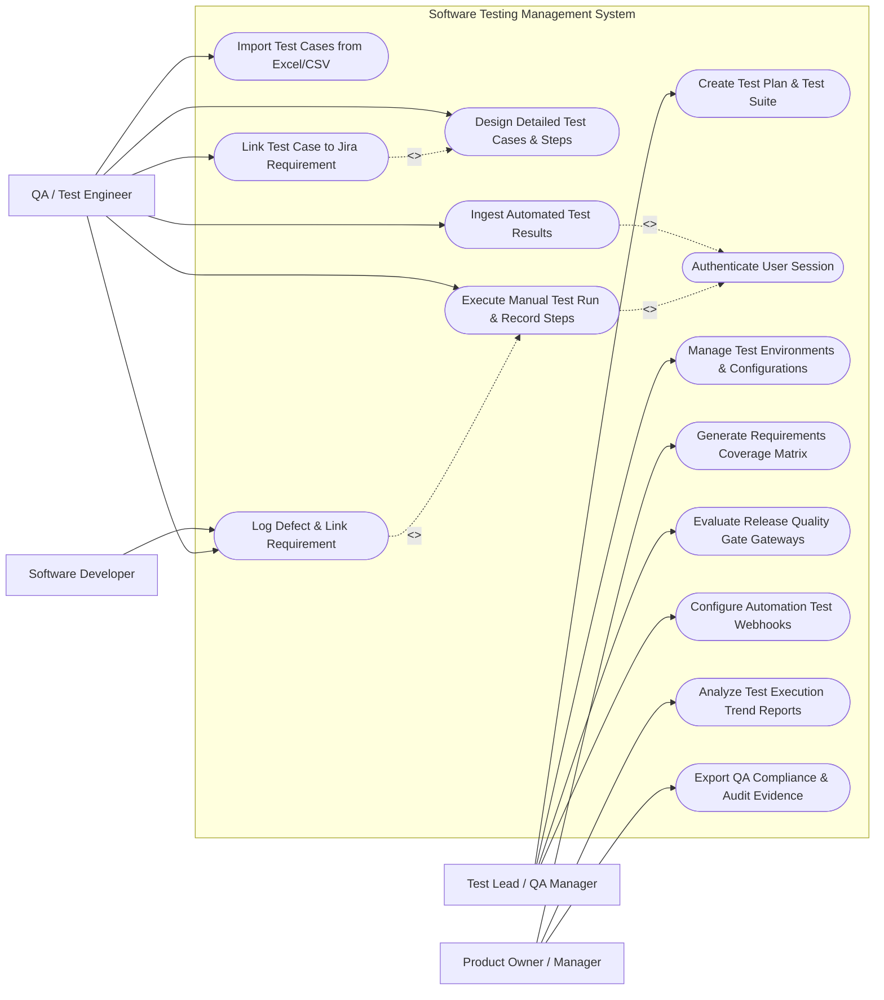

# Use Case Diagram — Software Testing Management System

## Mermaid Code

## Actor Table | Bảng Actor

| # | Actor | Actor Type | Role Description | Related Use Cases |
|---|-------|------------|------------------|-------------------|
| 1 | Test Lead / QA Manager | Primary | Defines test plans, configures quality gates, manages test environments and automation webhooks | UC01, UC09, UC11, UC12 |
| 2 | QA / Test Engineer | Primary | Authors test cases, executes test runs, ingests automated test logs, links defects to requirements | UC02, UC03, UC05, UC06, UC07, UC08 |
| 3 | Software Developer | Primary | Receives linked defect logs, verifies bug fixes, updates defect status | UC06 |
| 4 | Product Owner / Manager | Primary | Analyzes requirement test coverage, monitors execution trends, exports QA compliance reports | UC10, UC13, UC14 |

## Use Case Table | Bảng Use Case

| # | UC ID | Use Case Name | Primary Actor | Secondary Actor | Description | Priority |
|---|-------|---------------|---------------|-----------------|-------------|----------|
| 1 | UC01 | Create Test Plan & Test Suite | QA Manager | None | Establishes test scope, target build versions, and organizes test suites | High |
| 2 | UC02 | Design Detailed Test Cases & Steps | QA Test Engineer | None | Authors structured test cases with preconditions, test steps, and expected results | High |
| 3 | UC03 | Import Test Cases from Excel/CSV | QA Test Engineer | None | Bulk uploads test cases from external spreadsheets into test repository | Medium |
| 4 | UC04 | Authenticate User Session | System | Identity Provider | Validates QA team member login and role permissions | High |
| 5 | UC05 | Execute Manual Test Run & Record Steps | QA Test Engineer | None | Records step-by-step Pass/Fail/Blocked status during manual testing | High |
| 6 | UC06 | Log Defect & Link Requirement | QA Test Engineer | Defect Tracker | Automatically logs bug ticket in defect tracker when a test step fails | High |
| 7 | UC07 | Ingest Automated Test Results | QA Test Engineer | Automation Engine | Parses JUnit XML/JSON test result files from CI/CD automation runs | High |
| 8 | UC08 | Link Test Case to Jira Requirement | QA Test Engineer | Requirement Tracker | Connects test cases to user story IDs for 100% requirement traceability | High |
| 9 | UC09 | Manage Test Environments & Configurations | QA Manager | None | Defines test environments (QA, Staging, Mobile OS versions, Browsers) | Medium |
| 10 | UC10 | Generate Requirements Coverage Matrix | Product Owner | Audit System | Generates 1-to-1 mapping report showing requirement test coverage and status | High |
| 11 | UC11 | Evaluate Release Quality Gateways | QA Manager | CI/CD Engine | Evaluates test pass percentage threshold to approve or block build releases | High |
| 12 | UC12 | Configure Automation Test Webhooks | QA Manager | Automation Engine | Sets up Webhook listeners to auto-create test execution runs upon build finish | Medium |
| 13 | UC13 | Analyze Test Execution Trend Reports | Product Owner | None | Displays execution velocity, pass/fail ratios, and defect distribution charts | Medium |
| 14 | UC14 | Export QA Compliance & Audit Evidence | Product Owner | Audit System | Exports PDF/Excel test sign-off documentation for ISO/SOC2 audits | Low |

## Use Case Specification | Đặc tả Use Case

---

### UC01 — Create Test Plan & Test Suite

| Field | Detail |
|-------|--------|
| **UC ID** | UC01 |
| **Use Case Name** | Create Test Plan & Test Suite |
| **Actor(s)** | Primary: Test Lead / QA Manager |
| **Description** | Establishes a structured Test Plan for a target release version and organizes test cases into logical Test Suites. |
| **Precondition** | 1. QA Manager must be logged in with Test Manager permissions.   2. The target Project workspace must exist. |
| **Main Flow** | 1. QA Manager accesses "Test Planning" module and clicks "Create New Test Plan".   2. Manager inputs Plan Name (e.g., `Release 2.4 Regression Test Plan`), Target Build Version (e.g., `v2.4.0-RC1`), Start Date, and End Date.   3. Manager defines Test Strategy scope (Functional, Regression, Security, Smoke).   4. Manager creates Test Suites hierarchy (e.g., `Suite 1: User Authentication`, `Suite 2: Payment Gateway`).   5. Manager assigns QA Engineers to respective suites.   6. Manager clicks "Publish Test Plan". System validates inputs, initializes plan status "Active", and dispatches assignment notifications. |
| **Alternative Flow** | **AF1** — Clone Previous Test Plan: Manager clones an existing test plan from a previous release to reuse test suites.   **AF2** — Auto-Generate Test Suite from Milestone: System auto-populates suites from milestone user stories. |
| **Exception Flow** | **EX1** — End Date Prior to Start Date: System flags error "End date cannot be earlier than start date".   **EX2** — Duplicate Plan Name: If plan name exists in project, System alerts "Test plan name must be unique". |
| **Postcondition** | Test Plan and Test Suites are published, active in repository, and ready for test case assignment. |
| **Business Rule** | **BR1**: Every Test Plan must be linked to a specific release target version. |

---

### UC05 — Execute Manual Test Run & Record Steps

| Field | Detail |
|-------|--------|
| **UC ID** | UC05 |
| **Use Case Name** | Execute Manual Test Run & Record Steps |
| **Actor(s)** | Primary: QA / Test Engineer |
| **Description** | Allows QA engineers to execute test cases step-by-step, recording Pass, Fail, Blocked, or N/A status for each step along with evidence screenshots. |
| **Precondition** | 1. An active Test Execution Run must be assigned to the QA Engineer.   2. Target test environment must be accessible. |
| **Main Flow** | 1. QA Engineer opens "My Active Test Runs" and selects assigned test run.   2. System presents list of test cases in execution order.   3. Engineer selects Test Case 1 (`TC-104: Verify User Login with Valid Credentials`).   4. System displays preconditions, test steps (Step 1: Enter Username, Step 2: Enter Password, Step 3: Click Login), and expected results.   5. Engineer performs step 1, clicks "Pass" icon. Engineer performs step 2, clicks "Pass" icon. Engineer performs step 3, observes expected home page, clicks "Pass" icon.   6. System marks Test Case overall status as "Passed", records timestamp, and auto-advances to next test case. |
| **Alternative Flow** | **AF1** — Step Failure & Evidence Upload: Engineer encounters error on Step 3, attaches screenshot image, types actual result, clicks "Fail", and triggers Defect Logging (UC06).   **AF2** — Mark as Blocked: Engineer marks test case "Blocked" due to environment server downtime. |
| **Exception Flow** | **EX1** — Session Timeout During Run: System saves current step execution state locally in browser storage so no progress is lost.   **EX2** — Attachment File Size Exceeded: System alerts if screenshot exceeds 10MB limit. |
| **Postcondition** | Test Case execution status and step logs are saved, updating real-time Test Plan execution progress bar. |
| **Business Rule** | **BR1**: Marking a test case as "Passed" requires all mandatory test steps to be in "Pass" status. |

---

### UC06 — Log Defect & Link Requirement

| Field | Detail |
|-------|--------|
| **UC ID** | UC06 |
| **Use Case Name** | Log Defect & Link Requirement |
| **Actor(s)** | Primary: QA / Test Engineer   Secondary: Software Developer / Defect Tracker (Jira) |
| **Description** | Automatically generates a defect bug ticket in the tracking system when a test step fails, linking it to the test case and parent user story. |
| **Precondition** | 1. A test case step must be marked in "Fail" status during execution.   2. Defect tracker integration (Jira/Azure DevOps) must be connected. |
| **Main Flow** | 1. Upon test step failure, QA Engineer clicks "Create & Link Bug Ticket" button.   2. System auto-populates Defect Creation Form with: Defect Summary (`[Bug] Failed at Step 3 in TC-104`), Preconditions, Step-by-Step Reproduction Steps, Expected vs. Actual Result, Environment Config, and Attached Screenshots.   3. Engineer selects Severity (Critical, High, Medium, Low) and assigns to Lead Developer.   4. Engineer clicks "Submit Defect".   5. System dispatches REST API call to Jira/Defect Tracker, creates ticket (e.g., `BUG-898`), receives Bug ID, and links `BUG-898` bidirectionally to Test Case `TC-104` and Requirement `STORY-45`.   6. System updates test run status to "Failed (Bug Linked)". |
| **Alternative Flow** | **AF1** — Link Existing Bug: Engineer links an already existing bug ticket (`BUG-850`) instead of creating a new one.   **AF2** — Auto-Assignment by Module: System auto-assigns bug to the developer owning the component module. |
| **Exception Flow** | **EX1** — Defect Tracker API Offline: If Jira API fails to respond, System saves defect draft locally and queues for background retry.   **EX2** — Mandatory Severity Missing: System alerts "Please select bug severity level". |
| **Postcondition** | Bug ticket is created in Jira, linked to Test Case and User Story, and developer receives notification. |
| **Business Rule** | **BR1**: All Critical/Blocker severity bugs must block release quality gate approval. |

---

### UC07 — Ingest Automated Test Results

| Field | Detail |
|-------|--------|
| **UC ID** | UC07 |
| **Use Case Name** | Ingest Automated Test Results |
| **Actor(s)** | Primary: QA / Test Engineer   Secondary: Automation Test Runner (Selenium/Cypress) |
| **Description** | Ingests and parses XML/JSON test execution report files generated by automated test frameworks (JUnit, TestNG, PyTest). |
| **Precondition** | 1. Automated test framework must output standard JUnit XML or JSON report format.   2. Test case method names must contain matching Test Case IDs (e.g., `@Test @TestCase("TC-104")`). |
| **Main Flow** | 1. Automated test run finishes in CI/CD pipeline.   2. Automation script posts report file (`testng-results.xml`) to System API endpoint.   3. System XML Parser ingests file, extracts total test count, passed count, failed count, skipped count, and duration.   4. System matches XML test cases to repository Test Case IDs via regex mapping.   5. System automatically updates test execution run statuses, logs stack traces for failed automated tests, and attaches execution logs.   6. System generates automated test run execution summary dashboard. |
| **Alternative Flow** | **AF1** — CLI Upload Tool: QA Engineer uses command-line tool `test-uploader --file report.xml` to manually push results.   **AF2** — Auto-Create Unmatched Test Cases: System automatically creates new test case records for unmapped automated test methods. |
| **Exception Flow** | **EX1** — Malformed XML Report: If XML file is corrupted, System flags error "XML parsing failed at line 12" and rejects file.   **EX2** — Report Size Limit Exceeded: If report file > 50MB, System processes file via background chunk parser. |
| **Postcondition** | Automated test results are merged into Test Plan metrics, updating overall test pass rate percentages. |
| **Business Rule** | **BR1**: Automated test result ingestion must process within 30 seconds of file upload. |

---

### UC10 — Generate Requirements Coverage Matrix

| Field | Detail |
|-------|--------|
| **UC ID** | UC10 |
| **Use Case Name** | Generate Requirements Coverage Matrix |
| **Actor(s)** | Primary: Product Owner / Manager   Secondary: Compliance Auditor |
| **Description** | Generates a 1-to-1 Requirements Traceability Matrix (RTM) mapping User Stories to Test Cases, Execution Statuses, and Defects. |
| **Precondition** | 1. Requirements must be linked to Test Cases (UC08).   2. Test execution runs must be completed or in progress. |
| **Main Flow** | 1. Product Owner accesses "Traceability & Coverage" module.   2. Owner selects Target Release Version (e.g., `Release 2.4`) and Target Project.   3. Owner clicks "Generate Traceability Matrix".   4. System queries database and compiles RTM table containing columns: `Requirement ID`, `Requirement Title`, `Linked Test Case ID`, `Execution Status (Pass/Fail/Un-tested)`, `Open Defects`, and `Coverage %`.   5. System highlights uncovered requirements (User Stories with 0 linked test cases) in red warning color.   6. System calculates overall Requirement Test Coverage (e.g., 94.5% Covered, 88% Passed) and displays interactive matrix. |
| **Alternative Flow** | **AF1** — Export Matrix to Excel/PDF: Owner clicks "Export RTM to Excel" for distribution to stakeholders or auditors.   **AF2** — Filter Uncovered Requirements: Owner applies filter to view only requirements lacking test coverage. |
| **Exception Flow** | **EX1** — Zero Linked Requirements Found: System alerts "No requirement linkages found for this project version".   **EX2** — Large Matrix Render Timeout: System renders matrix in paginated views for datasets > 5,000 requirements. |
| **Postcondition** | RTM matrix is generated, providing complete visibility into requirement verification status for release readiness. |
| **Business Rule** | **BR1**: Production release requires 100% requirement coverage with zero un-tested high-priority user stories. |
