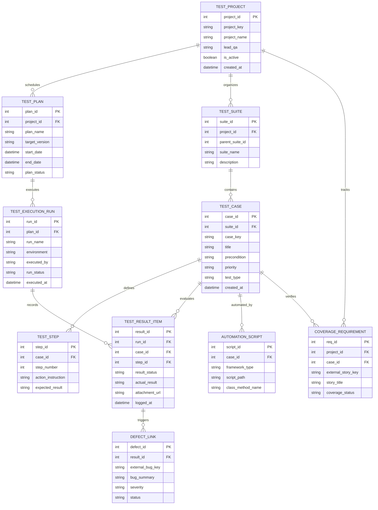

# Conceptual ERD — Software Testing Management System

## Mermaid Code

## Entity Description Table | Bảng mô tả Entity

| # | Entity Name | Vietnamese Name | Description | Key Attributes | Main Relationships |
|---|-------------|-----------------|-------------|----------------|-------------------|
| 1 | TEST_PROJECT | Dự án Kiểm thử | Quản lý thông tin dự án QA tổng thể, liên kết với các kế hoạch và kịch bản | project_id (PK), project_key, project_name, lead_qa | Schedules TEST_PLAN, organizes TEST_SUITE, tracks COVERAGE |
| 2 | TEST_PLAN | Kế hoạch Kiểm thử | Gói kế hoạch kiểm thử đặt mục tiêu cho một phiên bản phần mềm (Release version) | plan_id (PK), project_id (FK), plan_name, target_version, plan_status | Belongs to TEST_PROJECT, executes TEST_EXECUTION_RUN |
| 3 | TEST_SUITE | Bộ Kịch bản Kiểm thử | Thư mục/Nhóm kịch bản kiểm thử phân cấp theo module hoặc tính năng | suite_id (PK), project_id (FK), parent_suite_id, suite_name | Belongs to TEST_PROJECT, contains TEST_CASE |
| 4 | TEST_CASE | Kịch bản Kiểm thử | Chi tiết một trường hợp kiểm thử (tiêu đề, điều kiện tiên quyết, loại test) | case_id (PK), suite_id (FK), case_key, title, priority, test_type | Belongs to TEST_SUITE, defines TEST_STEP, automated by SCRIPT, verifies COVERAGE |
| 5 | TEST_STEP | Bước Thực thi Kiểm thử | Các thao tác hành động chi tiết và kết quả kỳ vọng cho từng bước trong test case | step_id (PK), case_id (FK), step_number, action_instruction, expected_result | Belongs to TEST_CASE |
| 6 | TEST_EXECUTION_RUN | Lượt Thực thi Kiểm thử | Ghi nhận một đợt chạy test (manual hoặc automation) trên môi trường cụ thể | run_id (PK), plan_id (FK), run_name, environment, run_status | Belongs to TEST_PLAN, records TEST_RESULT_ITEM |
| 7 | TEST_RESULT_ITEM | Kết quả Bước Kiểm thử | Kết quả thực tế (Pass/Fail/Blocked), hình ảnh bằng chứng cho từng bước | result_id (PK), run_id (FK), case_id (FK), step_id (FK), result_status | Belongs to EXECUTION_RUN & TEST_CASE, triggers DEFECT_LINK |
| 8 | DEFECT_LINK | Liên kết Lỗi Bug | Thông tin liên kết hai chiều tới mã bug trên hệ thống tracking bên ngoài (Jira) | defect_id (PK), result_id (FK), external_bug_key, bug_summary, severity | Triggered by TEST_RESULT_ITEM |
| 9 | AUTOMATION_SCRIPT | Kịch bản Tự động hóa | Thông tin mã kịch bản test tự động (Selenium/Cypress method) liên kết với test case | script_id (PK), case_id (FK), framework_type, script_path, class_method_name | Automates TEST_CASE |
| 10 | COVERAGE_REQUIREMENT | Yêu cầu Nghiệp vụ (Story) | Thông tin User Story từ hệ thống quản lý yêu cầu được phủ bởi test case | req_id (PK), project_id (FK), case_id (FK), external_story_key, story_title | Tracks by TEST_PROJECT, verified by TEST_CASE |

## Relationship Description | Mô tả Quan hệ

| # | From Entity | Cardinality | To Entity | Relationship Label | Business Explanation |
|---|-------------|-------------|-----------|-------------------|----------------------|
| 1 | TEST_PROJECT | 1 to Many | TEST_PLAN | schedules | Một dự án lập kế hoạch cho nhiều đợt Test Plan theo từng release. |
| 2 | TEST_PROJECT | 1 to Many | TEST_SUITE | organizes | Một dự án phân chia tổ chức thành nhiều bộ kịch bản Test Suite. |
| 3 | TEST_SUITE | 1 to Many | TEST_CASE | contains | Một bộ kịch bản chứa nhiều kịch bản kiểm thử (Test Case) chi tiết. |
| 4 | TEST_CASE | 1 to Many | TEST_STEP | defines | Một kịch bản kiểm thử định nghĩa chuỗi các bước (Test Steps) thao tác. |
| 5 | TEST_PLAN | 1 to Many | TEST_EXECUTION_RUN | executes | Một kế hoạch kiểm thử thực thi qua nhiều lượt chạy test (Execution Runs). |
| 6 | TEST_EXECUTION_RUN | 1 to Many | TEST_RESULT_ITEM | records | Một lượt chạy test ghi nhận nhiều kết quả thực thi chi tiết. |
| 7 | TEST_CASE | 1 to Many | TEST_RESULT_ITEM | evaluates | Một kịch bản test được đánh giá kết quả qua nhiều lượt chạy test khác nhau. |
| 8 | TEST_RESULT_ITEM | 1 to Many | DEFECT_LINK | triggers | Một kết quả bước test bị "Fail" có thể kích hoạt tạo và liên kết tới nhiều lỗi Bug. |
| 9 | TEST_CASE | 1 to Many | AUTOMATION_SCRIPT | automated_by | Một kịch bản test có thể được tự động hóa bởi các script kịch bản code. |
| 10 | TEST_CASE | 1 to Many | COVERAGE_REQUIREMENT | verifies | Một kịch bản test kiểm chứng cho một hoặc nhiều yêu cầu nghiệp vụ (User Story). |
