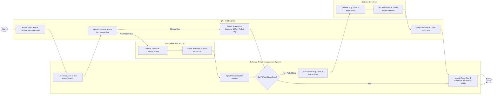

# Swimlane Diagram — Software Testing Management System

## Mermaid Code

## Flow Description | Mô tả luồng xử lý

| Lane | Actor | Role in Flow |
|------|-------|-------------|
| 1 | QA / Test Engineer | Thiết kế kịch bản test và kết quả mong đợi, kích hoạt lượt chạy test thủ công/tự động, đính kèm bằng chứng ảnh lỗi và xác nhận đóng bug sau khi dev đã sửa. |
| 2 | Software Testing Management System | Liên kết kịch bản test với yêu cầu Jira, tiếp nhận file kết quả tự động, tự động mở ticket bug khi test thất bại và cập nhật tỷ lệ pass rate/ma trận RTM. |
| 3 | Automation Test Runner | Thực thi kịch bản mã lệnh tự động (Selenium/Cypress), kiểm tra các bước giao diện/API và trích xuất file báo cáo định dạng chuẩn XML/JSON. |
| 4 | Software Developer | Tiếp nhận thông báo bug kèm các bước tái hiện và bằng chứng ảnh, tiến hành sửa lỗi trong mã nguồn và yêu cầu QA kiểm thử lại. |
