# Action Tree — Software Testing Management System

## Mermaid Code

```mermaid
graph TD
    Root["Software Testing Management System"]

    Root --> M1["Test Planning & Strategy"]
    Root --> M2["Test Case Design & Repository"]
    Root --> M3["Test Execution & Execution Runs"]
    Root --> M4["Test Automation Integration"]
    Root --> M5["Defect & Requirement Traceability"]
    Root --> M6["Quality Metrics & Compliance"]

    M1 --> A11["Create Release Test Plan"]
    M1 --> A12["Define Test Strategy Scope"]
    M1 --> A13["Set Up Test Environments Config"]
    M1 --> A14["Assign QA Team Member Resources"]

    M2 --> A21["Author Test Case & Preconditions"]
    M2 --> A22["Define Step Actions & Expected Results"]
    M2 --> A23["Organize Hierarchical Test Suites"]
    M2 --> A24["Import Test Cases from Excel CSV"]

    M3 --> A31["Create Test Execution Run Batch"]
    M3 --> A32["Execute Manual Step-by-Step Test"]
    M3 --> A33["Record Step Pass Fail Blocked Status"]
    M3 --> A34["Attach Evidence Screenshot Images"]

    M4 --> A41["Configure Automation Ingestion Webhooks"]
    M4 --> A42["Parse JUnit TestNG XML Reports"]
    M4 --> A43["Map Automation Methods to Test IDs"]
    M4 --> A44["Trigger CI/CD Quality Gate Pipeline"]

    M5 --> A51["Link Test Case to Jira Story ID"]
    M5 --> A52["Auto-Create Bug Ticket on Step Fail"]
    M5 --> A53["Track Defect Re-test & Resolution"]
    M5 --> A54["Generate Requirements Coverage Matrix RTM"]

    M6 --> A61["View Test Execution Pass Rate Dashboard"]
    M6 --> A62["Analyze Defect Severity Distribution"]
    M6 --> A63["Evaluate Release Quality Gate Readiness"]
    M6 --> A64["Export ISO SOC2 Compliance Test Reports"]
```

## Module Description | Mô tả Module

| # | Module | Description | Actions |
|---|--------|-------------|---------|
| 1 | Test Planning & Strategy | Thiết lập kế hoạch kiểm thử cho phiên bản phát hành, định nghĩa phạm vi chiến lược, cấu hình môi trường và phân công nhân sự. | Create Release Test Plan, Define Test Strategy Scope, Set Up Test Environments Config, Assign QA Team Member Resources |
| 2 | Test Case Design & Repository | Quản lý kho kịch bản kiểm thử, soạn thảo chi tiết các bước thực hiện và kết quả kỳ vọng, hỗ trợ nhập dữ liệu hàng loạt từ Excel. | Author Test Case & Preconditions, Define Step Actions & Expected Results, Organize Hierarchical Test Suites, Import Test Cases from Excel CSV |
| 3 | Test Execution & Execution Runs | Tổ chức các đợt chạy test, hỗ trợ kỹ thuật viên thực thi kiểm thử thủ công từng bước, ghi nhận trạng thái và đính kèm bằng chứng ảnh lỗi. | Create Test Execution Run Batch, Execute Manual Step-by-Step Test, Record Step Pass Fail Blocked Status, Attach Evidence Screenshot Images |
| 4 | Test Automation Integration | Tích hợp nhận file kết quả báo cáo từ các framework tự động (Selenium/Cypress), tự động khớp với test ID và đánh giá cổng chất lượng CI/CD. | Configure Automation Ingestion Webhooks, Parse JUnit TestNG XML Reports, Map Automation Methods to Test IDs, Trigger CI/CD Quality Gate Pipeline |
| 5 | Defect & Requirement Traceability | Đổi nối liên kết test case với User Story trên Jira, tự động sinh ticket bug khi test thất bại và lập ma trận truy vết yêu cầu (RTM). | Link Test Case to Jira Story ID, Auto-Create Bug Ticket on Step Fail, Track Defect Re-test & Resolution, Generate Requirements Coverage Matrix RTM |
| 6 | Quality Metrics & Compliance | Theo dõi chỉ số tỷ lệ pass/fail, phân tích mật độ lỗi, đánh giá điều kiện phát hành và xuất báo cáo kiểm toán tuân thủ (ISO/SOC2). | View Test Execution Pass Rate Dashboard, Analyze Defect Severity Distribution, Evaluate Release Quality Gate Readiness, Export ISO SOC2 Compliance Test Reports |
