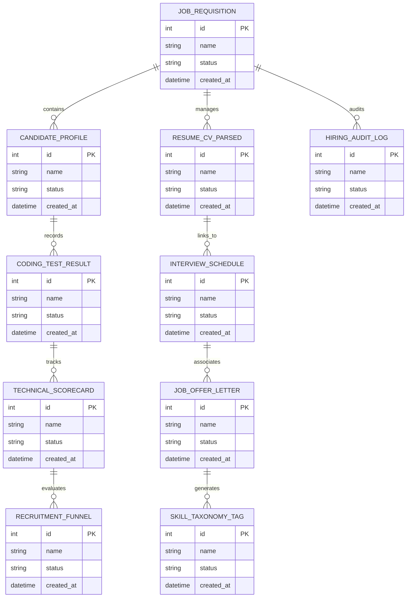

# Conceptual ERD — Tech Talent Acquisition System

## Mermaid Code

## Entity Description Table | Bảng mô tả Entity

| # | Entity Name | Vietnamese Name | Description | Key Attributes | Main Relationships |
|---|-------------|-----------------|-------------|----------------|-------------------|
| 1 | JOB_REQUISITION | Thực thể JOB_REQUISITION | Quản lý thông tin chi tiết cho job_requisition | id (PK), name, status, created_at | Links with related entities |
| 2 | CANDIDATE_PROFILE | Thực thể CANDIDATE_PROFILE | Quản lý thông tin chi tiết cho candidate_profile | id (PK), name, status, created_at | Links with related entities |
| 3 | RESUME_CV_PARSED | Thực thể RESUME_CV_PARSED | Quản lý thông tin chi tiết cho resume_cv_parsed | id (PK), name, status, created_at | Links with related entities |
| 4 | CODING_TEST_RESULT | Thực thể CODING_TEST_RESULT | Quản lý thông tin chi tiết cho coding_test_result | id (PK), name, status, created_at | Links with related entities |
| 5 | INTERVIEW_SCHEDULE | Thực thể INTERVIEW_SCHEDULE | Quản lý thông tin chi tiết cho interview_schedule | id (PK), name, status, created_at | Links with related entities |
| 6 | TECHNICAL_SCORECARD | Thực thể TECHNICAL_SCORECARD | Quản lý thông tin chi tiết cho technical_scorecard | id (PK), name, status, created_at | Links with related entities |
| 7 | JOB_OFFER_LETTER | Thực thể JOB_OFFER_LETTER | Quản lý thông tin chi tiết cho job_offer_letter | id (PK), name, status, created_at | Links with related entities |
| 8 | RECRUITMENT_FUNNEL | Thực thể RECRUITMENT_FUNNEL | Quản lý thông tin chi tiết cho recruitment_funnel | id (PK), name, status, created_at | Links with related entities |
| 9 | SKILL_TAXONOMY_TAG | Thực thể SKILL_TAXONOMY_TAG | Quản lý thông tin chi tiết cho skill_taxonomy_tag | id (PK), name, status, created_at | Links with related entities |
| 10 | HIRING_AUDIT_LOG | Thực thể HIRING_AUDIT_LOG | Quản lý thông tin chi tiết cho hiring_audit_log | id (PK), name, status, created_at | Links with related entities |

## Relationship Description | Mô tả Quan hệ

| # | From Entity | Cardinality | To Entity | Relationship Label | Business Explanation |
|---|-------------|-------------|-----------|-------------------|----------------------|
| 1 | JOB_REQUISITION | 1 to Many | CANDIDATE_PROFILE | relates_to | Quản lý mối quan hệ giữa JOB_REQUISITION và CANDIDATE_PROFILE |
| 2 | CANDIDATE_PROFILE | 1 to Many | RESUME_CV_PARSED | relates_to | Quản lý mối quan hệ giữa CANDIDATE_PROFILE và RESUME_CV_PARSED |
| 3 | RESUME_CV_PARSED | 1 to Many | CODING_TEST_RESULT | relates_to | Quản lý mối quan hệ giữa RESUME_CV_PARSED và CODING_TEST_RESULT |
| 4 | CODING_TEST_RESULT | 1 to Many | INTERVIEW_SCHEDULE | relates_to | Quản lý mối quan hệ giữa CODING_TEST_RESULT và INTERVIEW_SCHEDULE |
| 5 | INTERVIEW_SCHEDULE | 1 to Many | TECHNICAL_SCORECARD | relates_to | Quản lý mối quan hệ giữa INTERVIEW_SCHEDULE và TECHNICAL_SCORECARD |
| 6 | TECHNICAL_SCORECARD | 1 to Many | JOB_OFFER_LETTER | relates_to | Quản lý mối quan hệ giữa TECHNICAL_SCORECARD và JOB_OFFER_LETTER |
| 7 | JOB_OFFER_LETTER | 1 to Many | RECRUITMENT_FUNNEL | relates_to | Quản lý mối quan hệ giữa JOB_OFFER_LETTER và RECRUITMENT_FUNNEL |
| 8 | RECRUITMENT_FUNNEL | 1 to Many | SKILL_TAXONOMY_TAG | relates_to | Quản lý mối quan hệ giữa RECRUITMENT_FUNNEL và SKILL_TAXONOMY_TAG |
| 9 | SKILL_TAXONOMY_TAG | 1 to Many | HIRING_AUDIT_LOG | relates_to | Quản lý mối quan hệ giữa SKILL_TAXONOMY_TAG và HIRING_AUDIT_LOG |
