# Action Tree — Tech Talent Acquisition System

## Mermaid Code

```mermaid
graph TD
    Root["Tech Talent Acquisition System"]

    Root --> M1["Job Requisition & Candidate Sourcing"]
    Root --> M2["Resume Parsing & Tech Skill Taxonomy"]
    Root --> M3["Automated Coding Assessment Integration"]
    Root --> M4["Technical Interview & Scorecard Evaluation"]
    Root --> M5["Job Offer Management & Candidate Onboarding"]
    Root --> M6["Recruitment Funnel & Efficiency Analytics"]

    M1 --> A11["Configure Job Requisition & Candidate Sourcing Policies"]
    M1 --> A12["Execute Job Requisition & Candidate Sourcing Tasks"]
    M1 --> A13["Monitor Job Requisition & Candidate Sourcing Telemetry"]
    M1 --> A14["Export Job Requisition & Candidate Sourcing Audit Logs"]

    M2 --> A21["Configure Resume Parsing & Tech Skill Taxonomy Policies"]
    M2 --> A22["Execute Resume Parsing & Tech Skill Taxonomy Tasks"]
    M2 --> A23["Monitor Resume Parsing & Tech Skill Taxonomy Telemetry"]
    M2 --> A24["Export Resume Parsing & Tech Skill Taxonomy Audit Logs"]

    M3 --> A31["Configure Automated Coding Assessment Integration Policies"]
    M3 --> A32["Execute Automated Coding Assessment Integration Tasks"]
    M3 --> A33["Monitor Automated Coding Assessment Integration Telemetry"]
    M3 --> A34["Export Automated Coding Assessment Integration Audit Logs"]

    M4 --> A41["Configure Technical Interview & Scorecard Evaluation Policies"]
    M4 --> A42["Execute Technical Interview & Scorecard Evaluation Tasks"]
    M4 --> A43["Monitor Technical Interview & Scorecard Evaluation Telemetry"]
    M4 --> A44["Export Technical Interview & Scorecard Evaluation Audit Logs"]

    M5 --> A51["Configure Job Offer Management & Candidate Onboarding Policies"]
    M5 --> A52["Execute Job Offer Management & Candidate Onboarding Tasks"]
    M5 --> A53["Monitor Job Offer Management & Candidate Onboarding Telemetry"]
    M5 --> A54["Export Job Offer Management & Candidate Onboarding Audit Logs"]

    M6 --> A61["Configure Recruitment Funnel & Efficiency Analytics Policies"]
    M6 --> A62["Execute Recruitment Funnel & Efficiency Analytics Tasks"]
    M6 --> A63["Monitor Recruitment Funnel & Efficiency Analytics Telemetry"]
    M6 --> A64["Export Recruitment Funnel & Efficiency Analytics Audit Logs"]
```

## Module Description | Mô tả Module

| # | Module | Description | Actions |
|---|--------|-------------|---------|
| 1 | Job Requisition & Candidate Sourcing | Quản lý các chức năng cốt lõi thuộc phân hệ job requisition & candidate sourcing. | Configure Job Requisition & Candidate Sourcing Policies, Execute Job Requisition & Candidate Sourcing Tasks, Monitor Job Requisition & Candidate Sourcing Telemetry, Export Job Requisition & Candidate Sourcing Audit Logs |
| 2 | Resume Parsing & Tech Skill Taxonomy | Quản lý các chức năng cốt lõi thuộc phân hệ resume parsing & tech skill taxonomy. | Configure Resume Parsing & Tech Skill Taxonomy Policies, Execute Resume Parsing & Tech Skill Taxonomy Tasks, Monitor Resume Parsing & Tech Skill Taxonomy Telemetry, Export Resume Parsing & Tech Skill Taxonomy Audit Logs |
| 3 | Automated Coding Assessment Integration | Quản lý các chức năng cốt lõi thuộc phân hệ automated coding assessment integration. | Configure Automated Coding Assessment Integration Policies, Execute Automated Coding Assessment Integration Tasks, Monitor Automated Coding Assessment Integration Telemetry, Export Automated Coding Assessment Integration Audit Logs |
| 4 | Technical Interview & Scorecard Evaluation | Quản lý các chức năng cốt lõi thuộc phân hệ technical interview & scorecard evaluation. | Configure Technical Interview & Scorecard Evaluation Policies, Execute Technical Interview & Scorecard Evaluation Tasks, Monitor Technical Interview & Scorecard Evaluation Telemetry, Export Technical Interview & Scorecard Evaluation Audit Logs |
| 5 | Job Offer Management & Candidate Onboarding | Quản lý các chức năng cốt lõi thuộc phân hệ job offer management & candidate onboarding. | Configure Job Offer Management & Candidate Onboarding Policies, Execute Job Offer Management & Candidate Onboarding Tasks, Monitor Job Offer Management & Candidate Onboarding Telemetry, Export Job Offer Management & Candidate Onboarding Audit Logs |
| 6 | Recruitment Funnel & Efficiency Analytics | Quản lý các chức năng cốt lõi thuộc phân hệ recruitment funnel & efficiency analytics. | Configure Recruitment Funnel & Efficiency Analytics Policies, Execute Recruitment Funnel & Efficiency Analytics Tasks, Monitor Recruitment Funnel & Efficiency Analytics Telemetry, Export Recruitment Funnel & Efficiency Analytics Audit Logs |
