# Conceptual ERD — Technical Documentation Management System

## Mermaid Code

```mermaid
erDiagram
    TECH_DOC_PAGE {
        int id PK
        string name
        string status
        datetime created_at
    }
    DOCS_REPOSITORY {
        int id PK
        string name
        string status
        datetime created_at
    }
    DOCS_VERSION_RELEASE {
        int id PK
        string name
        string status
        datetime created_at
    }
    MARKDOWN_AST_TREE {
        int id PK
        string name
        string status
        datetime created_at
    }
    SEARCH_INDEX_RECORD {
        int id PK
        string name
        string status
        datetime created_at
    }
    API_REF_SPEC {
        int id PK
        string name
        string status
        datetime created_at
    }
    BROKEN_LINK_REPORT {
        int id PK
        string name
        string status
        datetime created_at
    }
    READER_ANALYTICS_METRIC {
        int id PK
        string name
        string status
        datetime created_at
    }
    DOCS_ACCESS_POLICY {
        int id PK
        string name
        string status
        datetime created_at
    }
    DOCS_AUDIT_LOG {
        int id PK
        string name
        string status
        datetime created_at
    }

    TECH_DOC_PAGE ||--o{ DOCS_REPOSITORY : "contains"
    TECH_DOC_PAGE ||--o{ DOCS_VERSION_RELEASE : "manages"
    DOCS_REPOSITORY ||--o{ MARKDOWN_AST_TREE : "records"
    DOCS_VERSION_RELEASE ||--o{ SEARCH_INDEX_RECORD : "links_to"
    MARKDOWN_AST_TREE ||--o{ API_REF_SPEC : "tracks"
    SEARCH_INDEX_RECORD ||--o{ BROKEN_LINK_REPORT : "associates"
    API_REF_SPEC ||--o{ READER_ANALYTICS_METRIC : "evaluates"
    BROKEN_LINK_REPORT ||--o{ DOCS_ACCESS_POLICY : "generates"
    TECH_DOC_PAGE ||--o{ DOCS_AUDIT_LOG : "audits"
```

## Entity Description Table | Bảng mô tả Entity

| # | Entity Name | Vietnamese Name | Description | Key Attributes | Main Relationships |
|---|-------------|-----------------|-------------|----------------|-------------------|
| 1 | TECH_DOC_PAGE | Thực thể TECH_DOC_PAGE | Quản lý thông tin chi tiết cho tech_doc_page | id (PK), name, status, created_at | Links with related entities |
| 2 | DOCS_REPOSITORY | Thực thể DOCS_REPOSITORY | Quản lý thông tin chi tiết cho docs_repository | id (PK), name, status, created_at | Links with related entities |
| 3 | DOCS_VERSION_RELEASE | Thực thể DOCS_VERSION_RELEASE | Quản lý thông tin chi tiết cho docs_version_release | id (PK), name, status, created_at | Links with related entities |
| 4 | MARKDOWN_AST_TREE | Thực thể MARKDOWN_AST_TREE | Quản lý thông tin chi tiết cho markdown_ast_tree | id (PK), name, status, created_at | Links with related entities |
| 5 | SEARCH_INDEX_RECORD | Thực thể SEARCH_INDEX_RECORD | Quản lý thông tin chi tiết cho search_index_record | id (PK), name, status, created_at | Links with related entities |
| 6 | API_REF_SPEC | Thực thể API_REF_SPEC | Quản lý thông tin chi tiết cho api_ref_spec | id (PK), name, status, created_at | Links with related entities |
| 7 | BROKEN_LINK_REPORT | Thực thể BROKEN_LINK_REPORT | Quản lý thông tin chi tiết cho broken_link_report | id (PK), name, status, created_at | Links with related entities |
| 8 | READER_ANALYTICS_METRIC | Thực thể READER_ANALYTICS_METRIC | Quản lý thông tin chi tiết cho reader_analytics_metric | id (PK), name, status, created_at | Links with related entities |
| 9 | DOCS_ACCESS_POLICY | Thực thể DOCS_ACCESS_POLICY | Quản lý thông tin chi tiết cho docs_access_policy | id (PK), name, status, created_at | Links with related entities |
| 10 | DOCS_AUDIT_LOG | Thực thể DOCS_AUDIT_LOG | Quản lý thông tin chi tiết cho docs_audit_log | id (PK), name, status, created_at | Links with related entities |

## Relationship Description | Mô tả Quan hệ

| # | From Entity | Cardinality | To Entity | Relationship Label | Business Explanation |
|---|-------------|-------------|-----------|-------------------|----------------------|
| 1 | TECH_DOC_PAGE | 1 to Many | DOCS_REPOSITORY | relates_to | Quản lý mối quan hệ giữa TECH_DOC_PAGE và DOCS_REPOSITORY |
| 2 | DOCS_REPOSITORY | 1 to Many | DOCS_VERSION_RELEASE | relates_to | Quản lý mối quan hệ giữa DOCS_REPOSITORY và DOCS_VERSION_RELEASE |
| 3 | DOCS_VERSION_RELEASE | 1 to Many | MARKDOWN_AST_TREE | relates_to | Quản lý mối quan hệ giữa DOCS_VERSION_RELEASE và MARKDOWN_AST_TREE |
| 4 | MARKDOWN_AST_TREE | 1 to Many | SEARCH_INDEX_RECORD | relates_to | Quản lý mối quan hệ giữa MARKDOWN_AST_TREE và SEARCH_INDEX_RECORD |
| 5 | SEARCH_INDEX_RECORD | 1 to Many | API_REF_SPEC | relates_to | Quản lý mối quan hệ giữa SEARCH_INDEX_RECORD và API_REF_SPEC |
| 6 | API_REF_SPEC | 1 to Many | BROKEN_LINK_REPORT | relates_to | Quản lý mối quan hệ giữa API_REF_SPEC và BROKEN_LINK_REPORT |
| 7 | BROKEN_LINK_REPORT | 1 to Many | READER_ANALYTICS_METRIC | relates_to | Quản lý mối quan hệ giữa BROKEN_LINK_REPORT và READER_ANALYTICS_METRIC |
| 8 | READER_ANALYTICS_METRIC | 1 to Many | DOCS_ACCESS_POLICY | relates_to | Quản lý mối quan hệ giữa READER_ANALYTICS_METRIC và DOCS_ACCESS_POLICY |
| 9 | DOCS_ACCESS_POLICY | 1 to Many | DOCS_AUDIT_LOG | relates_to | Quản lý mối quan hệ giữa DOCS_ACCESS_POLICY và DOCS_AUDIT_LOG |
