# Action Tree — Technical Documentation Management System

## Mermaid Code

```mermaid
graph TD
    Root["Technical Documentation Management System"]

    Root --> M1["Docs-as-Code Authoring & Markdown Engine"]
    Root --> M2["Versioning & Git Branch Integration"]
    Root --> M3["Static Site Building & Publishing"]
    Root --> M4["API Reference & Code Snippet Generator"]
    Root --> M5["Full-Text Search & Broken Link Detection"]
    Root --> M6["Reader Engagement Analytics & Reporting"]

    M1 --> A11["Configure Docs-as-Code Authoring & Markdown Engine Policies"]
    M1 --> A12["Execute Docs-as-Code Authoring & Markdown Engine Tasks"]
    M1 --> A13["Monitor Docs-as-Code Authoring & Markdown Engine Telemetry"]
    M1 --> A14["Export Docs-as-Code Authoring & Markdown Engine Audit Logs"]

    M2 --> A21["Configure Versioning & Git Branch Integration Policies"]
    M2 --> A22["Execute Versioning & Git Branch Integration Tasks"]
    M2 --> A23["Monitor Versioning & Git Branch Integration Telemetry"]
    M2 --> A24["Export Versioning & Git Branch Integration Audit Logs"]

    M3 --> A31["Configure Static Site Building & Publishing Policies"]
    M3 --> A32["Execute Static Site Building & Publishing Tasks"]
    M3 --> A33["Monitor Static Site Building & Publishing Telemetry"]
    M3 --> A34["Export Static Site Building & Publishing Audit Logs"]

    M4 --> A41["Configure API Reference & Code Snippet Generator Policies"]
    M4 --> A42["Execute API Reference & Code Snippet Generator Tasks"]
    M4 --> A43["Monitor API Reference & Code Snippet Generator Telemetry"]
    M4 --> A44["Export API Reference & Code Snippet Generator Audit Logs"]

    M5 --> A51["Configure Full-Text Search & Broken Link Detection Policies"]
    M5 --> A52["Execute Full-Text Search & Broken Link Detection Tasks"]
    M5 --> A53["Monitor Full-Text Search & Broken Link Detection Telemetry"]
    M5 --> A54["Export Full-Text Search & Broken Link Detection Audit Logs"]

    M6 --> A61["Configure Reader Engagement Analytics & Reporting Policies"]
    M6 --> A62["Execute Reader Engagement Analytics & Reporting Tasks"]
    M6 --> A63["Monitor Reader Engagement Analytics & Reporting Telemetry"]
    M6 --> A64["Export Reader Engagement Analytics & Reporting Audit Logs"]
```

## Module Description | Mô tả Module

| # | Module | Description | Actions |
|---|--------|-------------|---------|
| 1 | Docs-as-Code Authoring & Markdown Engine | Quản lý các chức năng cốt lõi thuộc phân hệ docs-as-code authoring & markdown engine. | Configure Docs-as-Code Authoring & Markdown Engine Policies, Execute Docs-as-Code Authoring & Markdown Engine Tasks, Monitor Docs-as-Code Authoring & Markdown Engine Telemetry, Export Docs-as-Code Authoring & Markdown Engine Audit Logs |
| 2 | Versioning & Git Branch Integration | Quản lý các chức năng cốt lõi thuộc phân hệ versioning & git branch integration. | Configure Versioning & Git Branch Integration Policies, Execute Versioning & Git Branch Integration Tasks, Monitor Versioning & Git Branch Integration Telemetry, Export Versioning & Git Branch Integration Audit Logs |
| 3 | Static Site Building & Publishing | Quản lý các chức năng cốt lõi thuộc phân hệ static site building & publishing. | Configure Static Site Building & Publishing Policies, Execute Static Site Building & Publishing Tasks, Monitor Static Site Building & Publishing Telemetry, Export Static Site Building & Publishing Audit Logs |
| 4 | API Reference & Code Snippet Generator | Quản lý các chức năng cốt lõi thuộc phân hệ api reference & code snippet generator. | Configure API Reference & Code Snippet Generator Policies, Execute API Reference & Code Snippet Generator Tasks, Monitor API Reference & Code Snippet Generator Telemetry, Export API Reference & Code Snippet Generator Audit Logs |
| 5 | Full-Text Search & Broken Link Detection | Quản lý các chức năng cốt lõi thuộc phân hệ full-text search & broken link detection. | Configure Full-Text Search & Broken Link Detection Policies, Execute Full-Text Search & Broken Link Detection Tasks, Monitor Full-Text Search & Broken Link Detection Telemetry, Export Full-Text Search & Broken Link Detection Audit Logs |
| 6 | Reader Engagement Analytics & Reporting | Quản lý các chức năng cốt lõi thuộc phân hệ reader engagement analytics & reporting. | Configure Reader Engagement Analytics & Reporting Policies, Execute Reader Engagement Analytics & Reporting Tasks, Monitor Reader Engagement Analytics & Reporting Telemetry, Export Reader Engagement Analytics & Reporting Audit Logs |
