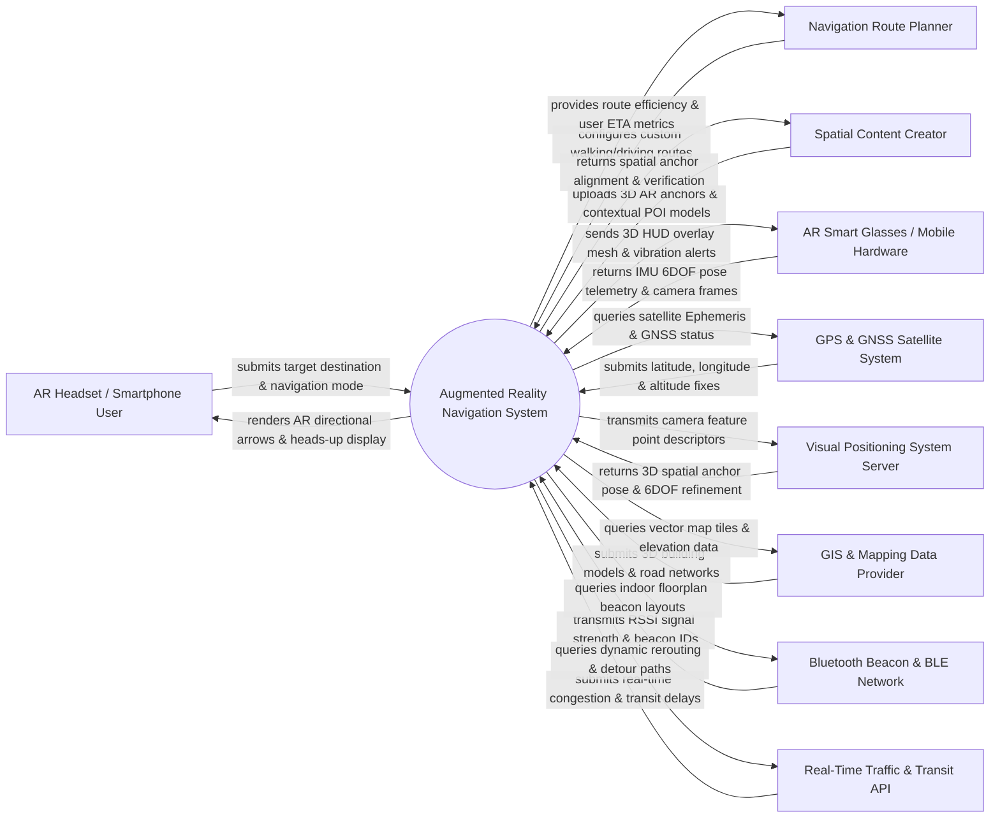

# Context Diagram — Augmented Reality Navigation System

## Mermaid Code

## Actor & Interaction Table | Bảng Actor & Tương tác

| # | Actor | Actor Type | Data Sent TO System | Data Received FROM System | Notes |
|---|-------|------------|---------------------|---------------------------|-------|
| 1 | AR Headset / Smartphone User | Primary | Target destination searches, navigation preference (Pedestrian, Driver, Indoor Mall), haptic feedback approval | 3D AR pathway arrows, Heads-Up Display (HUD) distance overlay, POI business cards, turn-by-turn voice | End user wearing AR smart glasses (Apple Vision Pro, Meta Ray-Ban) or holding AR smartphones. |
| 2 | Navigation Route Planner | Primary | Custom route waypoints, temporary pedestrian detours, preferred elevation paths, accessibility ramps | Route completion telemetry, user foot traffic heatmaps, navigation ETA accuracy metrics | City transit authority or facility manager configuring optimal walking and driving routes. |
| 3 | Spatial Content Creator | Primary | 3D GLTF models, spatial text billboards, sponsored POI pins, localized audio guidance files | Spatial anchor alignment feedback, rendering performance logs, user engagement stats | 3D designers and advertisers pinning AR virtual objects and business cards to physical coordinates. |
| 4 | AR Smart Glasses / Mobile Hardware | Primary / Hardware | 6 Degrees of Freedom (6DOF) pose telemetry, IMU gyroscope/accelerometer data, camera video frames | Rendered AR overlay graphics mesh, haptic vibration triggers, spatial audio channel streams | Hardware sensors (LiDAR, camera, IMU) tracking user head pose and displaying AR graphics. |
| 5 | GPS & GNSS Satellite System | Supporting System | NMEA latitude/longitude coordinates, altitude data, dilution of precision (DOP) metrics | Satellite ephemeris requests, GNSS signal quality queries | Satellite positioning networks (GPS, GLONASS, Galileo) providing global outdoor coordinates. |
| 6 | Visual Positioning System (VPS) Server | Supporting System | 3D spatial anchor matches, camera feature point localization, 6DOF pose correction vectors | Camera visual feature descriptors, local image frames, spatial anchor query IDs | Cloud VPS server (e.g. Google Geospatial API, Niantic Lightship) matching camera frames to 3D maps. |
| 7 | GIS & Mapping Data Provider | Supporting System | Vector map tiles, 3D building mesh models, road network topologies, terrain elevation profiles | Map tile requests, coordinate geocoding queries, elevation lookup payloads | GIS mapping providers (Mapbox, OpenStreetMap, Google Maps) supplying background map data. |
| 8 | Bluetooth Beacon & BLE Network | Supporting System | Bluetooth RSSI signal strength metrics, major/minor beacon IDs, battery status | Indoor floorplan beacon mapping queries, beacon proximity lookup requests | Low-power BLE beacons deployed inside shopping malls, airports, and subway stations for indoor positioning. |
| 9 | Real-Time Traffic & Transit API | Supporting System | Live traffic congestion alerts, road construction blockages, bus/subway arrival schedules | Route congestion queries, dynamic detour recalculation requests | Traffic intelligence APIs (TomTom, Waze, Transit API) updating real-time travel conditions. |

## System Boundary Description | Mô tả Phạm vi Hệ thống

The **Augmented Reality Navigation System (ARNS)** is a spatial computing navigation platform that superimposes 3D directional guidance graphics directly onto a user's real-world field of view. Inside the system boundary, ARNS manages destination searching, 3D route calculation, camera visual feature extraction, 6DOF head pose tracking, VPS visual localization, BLE indoor beacon triangulation, 3D AR pathway overlay rendering, POI spatial anchoring, and hazard alert notification. External to the system boundary are physical smart glasses hardware (AR Smart Glasses), satellite arrays (GPS & GNSS), cloud visual positioning servers (VPS Server), vector map databases (GIS Mapping Provider), indoor Bluetooth infrastructure (BLE Network), and live traffic services (Real-Time Traffic & Transit API).
