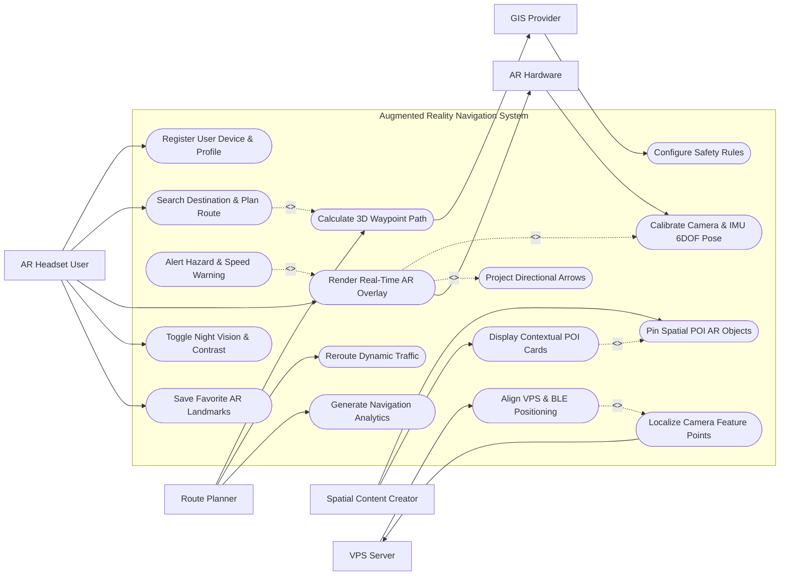

# Use Case Diagram — Augmented Reality Navigation System

## Mermaid Code

## Actor Table | Bảng Actor

| # | Actor | Actor Type | Role Description | Related Use Cases |
|---|-------|------------|------------------|-------------------|
| 1 | AR Headset User | Primary | Pedestrian or driver wearing AR glasses or using smartphone seeking real-world AR navigation overlays. | UC01, UC03, UC05, UC13, UC14 |
| 2 | Route Planner | Primary | City manager or navigation operator configuring optimal walking/driving paths and analyzing traffic flow. | UC04, UC12, UC15 |
| 3 | Spatial Content Creator | Primary | 3D developer anchoring AR virtual objects, sponsored POI pins, and digital signage onto spatial coordinates. | UC09, UC10 |
| 4 | AR Hardware | Hardware | Mobile or smart glasses sensors (IMU, camera, display) tracking head orientation and rendering graphics. | UC02, UC05 |
| 5 | VPS Server | System | Visual Positioning System server matching camera feature descriptors to 3D spatial anchor maps. | UC07, UC08 |
| 6 | GIS Provider | System | Mapping server supplying 3D building meshes, terrain elevations, and vector road networks. | UC04, UC16 |

## Use Case Table | Bảng Use Case

| # | UC ID | Use Case Name | Primary Actor | Secondary Actor | Description | Priority |
|---|-------|---------------|---------------|-----------------|-------------|----------|
| 1 | UC01 | Register User Device & Profile | AR Headset User | None | Registers user device, sets navigation mode (Pedestrian, Driver, Transit), and configures display preferences. | High |
| 2 | UC02 | Calibrate Camera & IMU 6DOF Pose | AR Hardware | None | Calibrates camera lens distortion, IMU gyroscope drift, and establishes 6 Degrees of Freedom (6DOF) tracking. | High |
| 3 | UC03 | Search Destination & Plan Route | AR Headset User | GIS Provider | Searches address or POI and calculates optimal 3D navigation route combining outdoor GPS and indoor VPS. | High |
| 4 | UC04 | Calculate 3D Waypoint Path | Route Planner | GIS Provider | Generates 3D spatial spline path including elevation gradients, stairs, ramps, and crosswalks. | High |
| 5 | UC05 | Render Real-Time AR Overlay | AR Headset User | AR Hardware | Renders 3D virtual directional pathway mesh and turn arrows anchored onto physical roads/floors. | High |
| 6 | UC06 | Project Directional Arrows | AR Headset User | None | Displays heads-up floating 3D turn arrows, distance-to-next-turn indicators, and lane guidance ribbons. | High |
| 7 | UC07 | Localize Camera Feature Points | VPS Server | None | Extracts visual ORB/SIFT feature points from live camera stream and matches against cloud 3D map database. | High |
| 8 | UC08 | Align VPS & BLE Positioning | VPS Server | AR Hardware | Combines GPS, Visual Positioning System (VPS), and indoor BLE beacons to achieve sub-meter positioning accuracy. | High |
| 9 | UC09 | Pin Spatial POI AR Objects | Spatial Content Creator | None | Anchors 3D virtual objects, historical landmark models, and business logos onto real-world spatial coordinates. | Medium |
| 10 | UC10 | Display Contextual POI Cards | Spatial Content Creator | None | Displays floating AR info cards (ratings, opening hours, menus) when user looks at physical storefronts. | Medium |
| 11 | UC11 | Alert Hazard & Speed Warning | AR Headset User | AR Hardware | Flashes high-visibility AR warning overlays and triggers haptics when detecting pedestrian obstacles or speeding. | High |
| 12 | UC12 | Reroute Dynamic Traffic | Route Planner | None | Recalculates AR navigation route in real-time upon detecting road closures, accidents, or pedestrian crowds. | Medium |
| 13 | UC13 | Toggle Night Vision & Contrast | AR Headset User | None | Adjusts AR HUD color contrast, brightness, and enables high-contrast thermal night vision mode. | Low |
| 14 | UC14 | Save Favorite AR Landmarks | AR Headset User | None | Saves custom AR spatial pins (e.g. "Parked Car", "Meeting Point") for quick return navigation. | Low |
| 15 | UC15 | Generate Navigation Analytics | Route Planner | None | Exports user pedestrian route usage heatmaps, ETA accuracy metrics, and VPS localization success rates. | Medium |
| 16 | UC16 | Configure Safety Rules | GIS Provider | None | Configures field-of-view occlusion limits and speed-triggered AR display dimming to prevent driver distraction. | Low |

## Use Case Specification | Đặc tả Use Case

---

### UC01 — Register User Device & Profile

| Field | Detail |
|-------|--------|
| **UC ID** | UC01 |
| **Use Case Name** | Register User Device & Profile |
| **Actor(s)** | Primary: AR Headset User / Secondary: None |
| **Description** | Onboards a new user, pairs AR smart glasses or mobile device, selects primary navigation mode (Pedestrian Walking, Driving HUD, Indoor Mall/Airport), and sets AR display preferences. |
| **Precondition** | 1. App is installed on smart glasses (Apple Vision Pro, Meta Ray-Ban, Magic Leap) or smartphone (iOS ARKit / Android ARCore).   2. Camera, Location, and Bluetooth permissions are granted. |
| **Main Flow** | 1. User launches AR Navigation application.   2. System prompts user registration: Full Name, Email, and Preferred Language.   3. User selects Primary Navigation Mode: Pedestrian Walking, Driver Heads-Up Display (HUD), or Indoor Airport/Transit Guide.   4. System queries device capabilities: checks camera resolution, LiDAR sensor presence, IMU sampling rate, and screen refresh rate (e.g. 90 Hz).   5. User configures AR Visual Preferences: Pathway Mesh Color (Cyan, Magenta, High-Vis Yellow), Text Font Size, Voice Guidance Volume, and Haptic Feedback intensity.   6. System validates device requirements, creates Nav_User and User_Device entities, and completes onboarding setup. |
| **Alternative Flow** | **AF1** — Accessibility Profile Setup: User selects "Wheelchair / Mobility Assistance"; System configures route planner (UC03) to prioritize elevators, ramps, and step-free paths.   **AF2** — Driver HUD Mode: User mounts device on car dashboard; System switches UI to simplified high-contrast Heads-Up Display (HUD) projected onto windshield. |
| **Exception Flow** | **EX1** — Camera Permission Denied: If user denies camera access, System blocks AR mode with alert "Camera permission required for Visual Positioning and AR rendering."   **EX2** — Unsupported Hardware: If device lacks 6DOF AR tracking support, System falls back to standard 2D map view mode. |
| **Postcondition** | Nav_User and User_Device profiles are saved, establishing baseline AR rendering parameters. |
| **Business Rule** | **BR1**: Pedestrian AR modes must automatically prompt user safety warnings regarding situational awareness before enabling navigation. |

---

### UC03 — Search Destination & Plan AR Route

| Field | Detail |
|-------|--------|
| **UC ID** | UC03 |
| **Use Case Name** | Search Destination & Plan AR Route |
| **Actor(s)** | Primary: AR Headset User / Secondary: GIS Provider |
| **Description** | Accepts destination queries (address, business name, airport gate, landmark), queries GIS maps (UC04), and calculates a continuous 3D AR navigation path. |
| **Precondition** | 1. User profile (UC01) is active and current location is resolved via GPS/VPS.   2. GIS map database is online. |
| **Main Flow** | 1. User types or speaks target destination (e.g. "Gate B22, Terminal 2" or "Starbucks Coffee Main St").   2. System queries GIS Mapping Provider API to geocode destination coordinates (Latitude, Longitude, Altitude, Floor level).   3. System checks user location and calculates optimal multi-segment 3D route: Outdoor Segment (GPS/GIS) + Indoor Segment (VPS/BLE).   4. System analyzes elevation profiles, stairs, crosswalks, and turn complexity to compute 3D Waypoint Path (UC04).   5. System displays route summary card: Distance (e.g. 450 meters), Estimated Time of Arrival (ETA: 6 mins), Calories Burned, and Route Preview.   6. User selects "Start AR Navigation".   7. System launches camera viewfinder and initiates real-time AR overlay rendering (UC05). |
| **Alternative Flow** | **AF1** — Multi-Stop AR Tour Route: User selects "Sightseeing Tour"; System plans 5-stop sequential AR walking route connecting historic landmarks.   **AF2** — Transit Transfer Guide: User navigates subway station; System calculates step-by-step route from train platform to bus bay. |
| **Exception Flow** | **EX1** — Destination Unreachable: If target destination is blocked by construction, System alerts "Destination unreachable due to active road closure."   **EX2** — No Indoor Map Available: If indoor floorplan is unmapped, System navigates to building entrance and switches to 2D directional compass. |
| **Postcondition** | An AR_Route_Path entity is generated, loading 3D waypoints for active AR navigation. |
| **Business Rule** | **BR1**: Route calculations must prioritize pedestrian-only walkways and designated crosswalks over active roadway lanes for walking navigation. |

---

### UC05 — Render Real-Time AR Navigation Overlay

| Field | Detail |
|-------|--------|
| **UC ID** | UC05 |
| **Use Case Name** | Render Real-Time AR Navigation Overlay |
| **Actor(s)** | Primary: AR Headset User / Secondary: AR Hardware |
| **Description** | Renders 3D virtual pathway meshes, directional turn arrows, floating distance markers, and lane guidance ribbons directly superimposed on live camera feeds or AR smart glasses displays. |
| **Precondition** | 1. Active AR Route Path (UC03) is loaded.   2. Camera IMU 6DOF pose tracking (UC02) and spatial localization (UC08) are active. |
| **Main Flow** | 1. System captures 60 FPS live video frame and 6DOF head pose matrix `(X, Y, Z, Roll, Pitch, Yaw)` from AR Hardware.   2. System queries active route 3D waypoints and projects 3D spatial coordinates onto 2D camera screen projection matrix.   3. System renders a 3D virtual glowing pathway mesh (e.g. blue ribbon) hugging the physical sidewalk surface.   4. System renders floating 3D animated directional turn arrows (UC06) 10 meters ahead of user at approaching turns.   5. System displays floating Heads-Up HUD element showing Next Turn Command ("Turn Right in 25m onto Elm St"), Total Distance Remaining, and ETA.   6. As user walks, System continuously updates pathway rendering, anchoring graphics to physical floor planes using surface detection.   7. When user arrives within 3 meters of target destination, System renders a 3D glowing "Destination Pin" object and plays arrival chime. |
| **Alternative Flow** | **AF1** — Driver HUD Windshield Projection: For driving mode, System projects minimalist high-contrast green lane arrows on car windshield HUD.   **AF2** — Low Light AR Mode: Ambient light drops (<10 lux); System enables high-contrast neon yellow pathway lines and brightens UI. |
| **Exception Flow** | **EX1** — 6DOF Tracking Lost: If user covers camera or experiences rapid motion blur, System displays "Tracking Lost: Tilt device down to scan floor" and pauses AR rendering.   **EX2** — Severe Drift Detected: If virtual arrow drifts >2 meters from physical road, System triggers automatic VPS re-alignment (UC08). |
| **Postcondition** | Real-time 3D AR pathway overlay is rendered at 60 FPS, guiding user along designated navigation path. |
| **Business Rule** | **BR1**: AR overlays must maintain a minimum rendering frame rate of 60 FPS to prevent user motion sickness and visual lag. |

---

### UC08 — Align VPS & BLE Indoor Positioning

| Field | Detail |
|-------|--------|
| **UC ID** | UC08 |
| **Use Case Name** | Align VPS & BLE Indoor Positioning |
| **Actor(s)** | Primary: VPS Server / Secondary: AR Hardware |
| **Description** | Combines Visual Positioning System (VPS) 3D camera feature matching with indoor Bluetooth BLE beacon triangulation to achieve sub-meter localization accuracy in GPS-denied environments. |
| **Precondition** | 1. User enters GPS-denied environment (e.g. Shopping Mall, Subway Station, Airport Terminal).   2. Mobile device camera is active and scanning physical environment. |
| **Main Flow** | 1. System detects GPS signal degradation (DOP > 5.0) upon entering indoor facility.   2. System activates BLE scanner, capturing RSSI signal strength metrics from nearby Bluetooth Beacons (UC08).   3. System calculates initial coarse indoor position (approx 3-5 meter accuracy) via BLE trilateration.   4. System extracts visual feature descriptors (ORB/SIFT keypoints) from live camera video frames (UC07).   5. System transmits feature descriptor payload to Visual Positioning System (VPS) Server.   6. VPS Server matches camera keypoints against pre-mapped 3D point-cloud spatial anchor database.   7. VPS Server returns refined 6DOF camera pose matrix `(X, Y, Z, Rotation)` with sub-meter accuracy (<0.5m error).   8. System updates local AR coordinate origin, correcting visual drift and aligning AR floor arrows perfectly with indoor hallways. |
| **Alternative Flow** | **AF1** — QR Code Anchor Resync: In unmapped indoor areas, user scans a physical "AR Waypoint QR Code" mounted on wall; System instantly resets AR pose origin to code's exact spatial coordinates.   **AF2** — Wi-Fi RTT Round-Trip Timing: Device uses Wi-Fi 6 RTT (802.11mc) distance measurements to supplement BLE positioning. |
| **Exception Flow** | **EX1** — VPS Server Unreachable: If internet connectivity drops indoors, System relies on BLE beacon RSSI trilateration and IMU step-counting dead reckoning.   **EX2** — Featureless Feature Matching: If user points camera at plain white wall lacking visual features, System prompts "Point camera toward storefronts or signage for VPS alignment." |
| **Postcondition** | User 6DOF pose is localized to sub-meter accuracy, seamlessly continuing AR navigation inside indoor facilities. |
| **Business Rule** | **BR1**: VPS spatial anchor matching must achieve sub-meter (<50cm) accuracy to ensure indoor turn guidance correctly aligns with specific store entrances and gate doors. |

---

### UC11 — Alert Hazard Obstacle & Speed Warning

| Field | Detail |
|-------|--------|
| **UC ID** | UC11 |
| **Use Case Name** | Alert Hazard Obstacle & Speed Warning |
| **Actor(s)** | Primary: AR Headset User / Secondary: AR Hardware |
| **Description** | Detects physical obstacles (construction barriers, approaching vehicles, steps) or excessive vehicle speed, displaying high-visibility AR hazard overlays and triggering haptic warnings. |
| **Precondition** | 1. Real-time AR navigation overlay (UC05) is actively rendering.   2. Depth sensors (LiDAR/ToF camera) or real-time traffic feed are active. |
| **Main Flow** | 1. System monitors forward depth sensor (LiDAR / Stereo Cameras) or incoming Real-Time Traffic alerts (UC12).   2. System detects physical hazard in user path: e.g. pedestrian construction trench 3 meters ahead (OR driver speed exceeding posted speed limit by >15 km/h).   3. System immediately overrides standard navigation display and projects a bright red 3D AR "HAZARD / STOP" box directly over the physical obstacle.   4. System triggers urgent haptic vibration pattern on smart glasses frame or mobile phone.   5. System plays audible alert chime: "Caution: Construction Hazard Ahead".   6. System calculates immediate detour path around obstacle (UC12) and highlights new green AR pathway ribbon.   7. Once user navigates safely past hazard, System clears warning overlay and resumes standard navigation guidance. |
| **Alternative Flow** | **AF1** — Pedestrian Crosswalk Vehicle Alert: Camera AI detects fast approaching car while user is crossing street; System flashes full-screen red warning border "LOOK LEFT: Vehicle Approaching!".   **AF2** — Low Headroom Warning: For tall users or cyclists, LiDAR detects low-hanging branch or sign; System flashes AR "Low Clearance" alert. |
| **Exception Flow** | **EX1** — False Positive Depth Sensor Spike: If sensor detects temporary dust cloud as obstacle, System filters out transient reading after 300ms verification window.   **EX2** — Speed Limit Data Unavailable: If road speed limit is missing from GIS database, System defaults to vehicle deceleration alerts based on forward distance to stopped traffic. |
| **Postcondition** | High-visibility hazard warnings are displayed in AR and haptics triggered, preventing collisions and guiding user around obstacles. |
| **Business Rule** | **BR1**: Hazard detection alerts must execute with zero-latency (<100ms) to ensure pedestrian and driver safety. |
