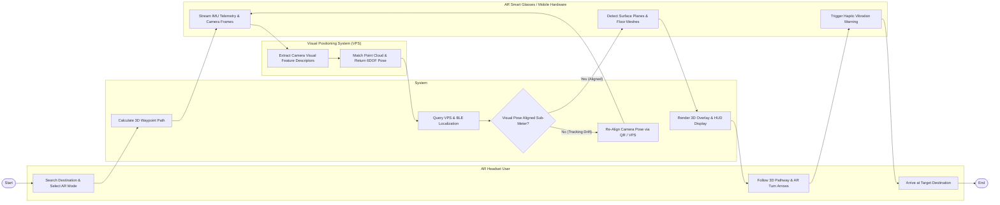

# Swimlane Diagram — Augmented Reality Navigation System

## Mermaid Code

## Flow Description | Mô tả luồng

| Lane | Actor | Role in Flow |
|------|-------|-------------|
| 1 | AR Headset User | Searches for navigation destinations, selects walking/driving mode, follows 3D AR pathway ribbons and turn arrows, and arrives at the target. |
| 2 | System | Computes 3D spatial routes, queries cloud VPS and BLE beacon positioning, checks pose alignment precision, handles re-alignment, and renders 3D graphics. |
| 3 | Visual Positioning System (VPS) | Extracts visual feature point descriptors (ORB/SIFT) from camera frames, matches them against 3D spatial maps, and returns 6DOF pose correction matrices. |
| 4 | AR Smart Glasses / Mobile Hardware | Streams live camera frames and IMU 6DOF telemetry, detects physical floor surface planes via LiDAR, and triggers haptic vibration alerts. |
