# Action Tree — Augmented Reality Navigation System

## Mermaid Code

```mermaid
graph TD
    Root["Augmented Reality Navigation System"]

    Root --> M1["User Profile & Device Calibration"]
    Root --> M2["Route Planning & Waypoint Engine"]
    Root --> M3["Spatial Localization & VPS Alignment"]
    Root --> M4["AR Rendering & Heads-Up Overlay"]
    Root --> M5["POI & Contextual Spatial Content"]
    Root --> M6["Safety Alerts & Obstacle Warning"]

    M1 --> A11["Register User AR Navigation Profile"]
    M1 --> A12["Calibrate Camera Lens & IMU 6DOF"]
    M1 --> A13["Set High-Contrast Visual Preferences"]
    M1 --> A14["Configure Wheelchair Accessibility"]

    M2 --> A21["Search Multi-Modal Destinations"]
    M2 --> A22["Calculate 3D Spline Waypoint Path"]
    M2 --> A23["Recalculate Dynamic Traffic Rerouting"]
    M2 --> A24["Generate Multi-Floor Elevation Paths"]

    M3 --> A31["Query GPS Satellite Coordinates"]
    M3 --> A32["Match Camera Features to VPS Cloud"]
    M3 --> A33["Triangulate Indoor BLE Beacons"]
    M3 --> A34["Scan Physical QR Code Pose Origin"]

    M4 --> A41["Render 3D Glowing Pathway Mesh"]
    M4 --> A42["Project 3D Heads-Up Turn Arrows"]
    M4 --> A43["Detect Floor Surface Planes via LiDAR"]
    M4 --> A44["Toggle Night Vision & HUD Contrast"]

    M5 --> A51["Pin 3D Virtual POI Objects"]
    M5 --> A52["Display Storefront Business Cards"]
    M5 --> A53["Anchor Historic Landmark Models"]
    M5 --> A54["Save Custom AR Spatial Pins"]

    M6 --> A61["Detect LiDAR Physical Obstacles"]
    M6 --> A62["Trigger Haptic Frame Vibration Alerts"]
    M6 --> A63["Display Speed Limit Hazard Warnings"]
    M6 --> A64["Dim AR Display for Driver Safety"]
```

## Module Description | Mô tả Module

| # | Module | Description | Actions |
|---|--------|-------------|---------|
| 1 | User Profile & Device Calibration | Manages user AR onboarding, 6DOF camera/IMU calibration, accessibility ramp settings, and HUD color preferences. | Register User AR Navigation Profile, Calibrate Camera Lens & IMU 6DOF, Set High-Contrast Visual Preferences, Configure Wheelchair Accessibility |
| 2 | Route Planning & Waypoint Engine | Computes 3D spatial spline paths, multi-floor stair/elevator transitions, geocoded destinations, and dynamic traffic rerouting. | Search Multi-Modal Destinations, Calculate 3D Spline Waypoint Path, Recalculate Dynamic Traffic Rerouting, Generate Multi-Floor Elevation Paths |
| 3 | Spatial Localization & VPS Alignment | Combines outdoor GPS satellites, cloud VPS visual feature point matching, indoor BLE beacon triangulation, and QR code pose resyncing. | Query GPS Satellite Coordinates, Match Camera Features to VPS Cloud, Triangulate Indoor BLE Beacons, Scan Physical QR Code Pose Origin |
| 4 | AR Rendering & Heads-Up Overlay | Renders glowing 3D AR pathway ribbons, heads-up floating turn arrows, floor surface plane detection via LiDAR, and night vision modes. | Render 3D Glowing Pathway Mesh, Project 3D Heads-Up Turn Arrows, Detect Floor Surface Planes via LiDAR, Toggle Night Vision & HUD Contrast |
| 5 | POI & Contextual Spatial Content | Anchors 3D virtual objects onto spatial coordinates, renders floating business info cards, displays landmark models, and saves AR pins. | Pin 3D Virtual POI Objects, Display Storefront Business Cards, Anchor Historic Landmark Models, Save Custom AR Spatial Pins |
| 6 | Safety Alerts & Obstacle Warning | Monitors forward LiDAR depth sensors, flashes high-visibility AR hazard warning overlays, triggers haptics, and dims AR HUD for driver safety. | Detect LiDAR Physical Obstacles, Trigger Haptic Frame Vibration Alerts, Display Speed Limit Hazard Warnings, Dim AR Display for Driver Safety |
