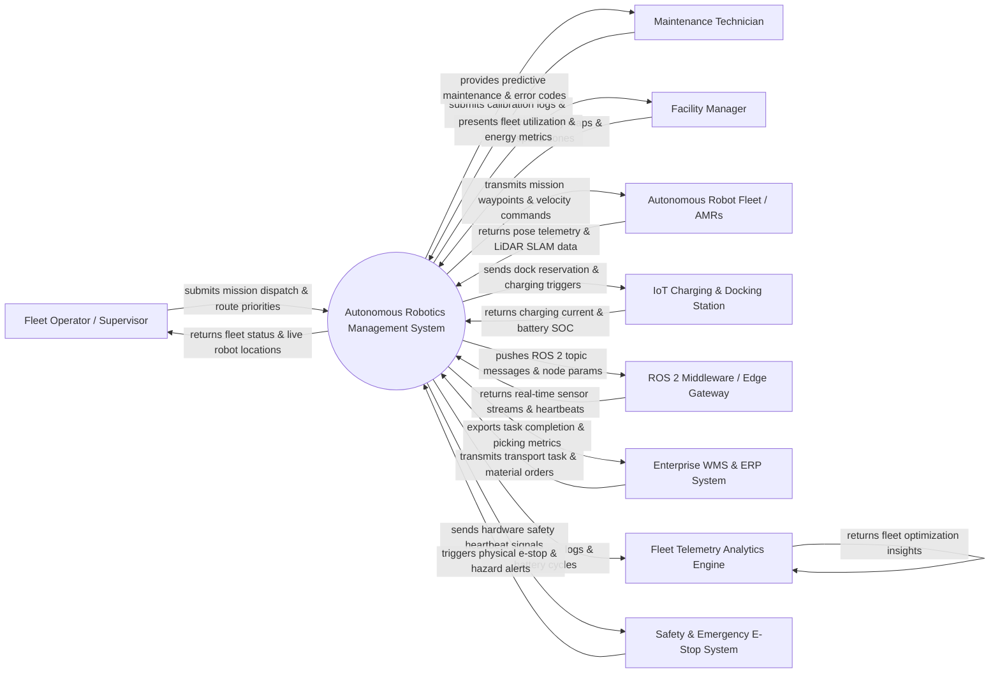

# Context Diagram — Autonomous Robotics Management System

## Mermaid Code

## Actor & Interaction Table | Bảng Actor & Tương tác

| # | Actor | Actor Type | Data Sent TO System | Data Received FROM System | Notes |
|---|-------|------------|---------------------|---------------------------|-------|
| 1 | Fleet Operator / Supervisor | Primary | Mission dispatch requests, priority overrides, manual joystick control commands, route waypoints | Live fleet location maps, mission progress bars, active alert notifications, robot status | Human supervisors monitoring and controlling autonomous mobile robots (AMRs). |
| 2 | Maintenance Technician | Primary | Calibration logs, sensor alignment checks, motor repair records, component replacements | Error fault codes, predictive maintenance alerts, battery health metrics, diagnostic logs | Engineering staff responsible for physical repair, wheel replacement, and sensor tuning. |
| 3 | Facility Manager | Primary | Digital CAD floor plans, restricted keep-out zones, speed limit zones, operating shift schedules | Facility heatmaps, fleet utilization percentages, energy consumption reports | Operations manager defining facility spatial boundaries and safety compliance rules. |
| 4 | Autonomous Robot Fleet / AMRs | Primary / Hardware | LiDAR point clouds, wheel encoder Odometry, IMU orientation data, battery State of Charge (SOC), obstacle alerts | Navigation waypoints, target velocity vectors, pathing costmaps, LED/buzzer indicator commands | Autonomous Mobile Robots (AMRs), AGVs, or robotic arms operating on facility floors. |
| 5 | IoT Charging & Docking Station | Supporting System | Dock occupancy status, charging current (Amps), battery temperature, dock lock mechanism state | Automated dock reservation calls, charge initiation commands, unlock signals | Smart inductive or contact charging stations managing robot battery replenishment. |
| 6 | ROS 2 Middleware / Edge Gateway | Supporting System | ROS 2 topic streams (`/cmd_vel`, `/odom`, `/scan`), DDS node heartbeats, sensor payload frames | Topic publication commands, parameter server configurations, action goal calls | Robotics Operating System (ROS 2) edge middleware bridging hardware and cloud. |
| 7 | Enterprise WMS & ERP System | Supporting System | Material transport orders, warehouse picking tasks, pallet dropoff locations | Task execution receipts, material transport timestamps, inventory movement logs | Enterprise Warehouse Management System (WMS) or ERP assigning material transport tasks. |
| 8 | Fleet Telemetry Analytics Engine | Supporting System | Fleet efficiency benchmarks, optimal path recommendations, anomaly detection alerts | High-frequency sensor telemetry logs, wheel slip data, battery discharge curves | Cloud analytics engine crunching big data for fleet optimization and AI route planning. |
| 9 | Safety & Emergency E-Stop System | Safety System | Physical Emergency Stop button presses, laser scanner safety field breaches, collision alerts | Hardware safety heartbeat signals, emergency motor power cut commands | Certified safety relays and SIL-2/3 hardware interlocks overriding software for safety. |

## System Boundary Description | Mô tả Phạm vi Hệ thống

The **Autonomous Robotics Management System (ARMS)** is an industrial-grade robotics fleet management and mission orchestration platform. Inside the system boundary, ARMS handles robot onboarding, SLAM map management, dynamic path planning, fleet task allocation, automated charging dispatch, ROS 2 topic bridging, predictive maintenance, and real-time 2D/3D fleet tracking. External to the system boundary are physical Autonomous Mobile Robots (Robot Fleet), smart docking hardware (IoT Charging & Docking Station), edge robotics middleware (ROS 2 Middleware), enterprise warehouse software (Enterprise WMS/ERP), big data analytics engines (Fleet Telemetry Analytics), and certified hardware safety relays (Safety & Emergency E-Stop System).
