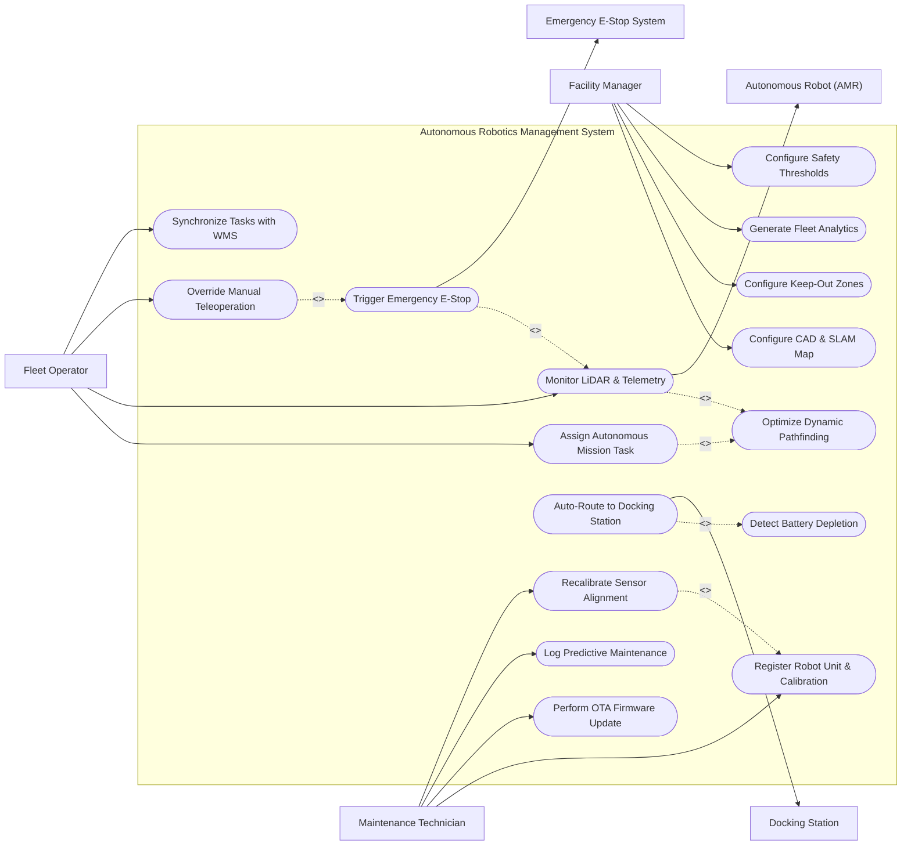

# Use Case Diagram — Autonomous Robotics Management System

## Mermaid Code

## Actor Table | Bảng Actor

| # | Actor | Actor Type | Role Description | Related Use Cases |
|---|-------|------------|------------------|-------------------|
| 1 | Fleet Operator | Primary | Human supervisor dispatching mission tasks, monitoring real-time fleet movement, and teleoperating AMRs. | UC03, UC05, UC06, UC13 |
| 2 | Maintenance Technician | Primary | Robotics engineer onboarding units, updating firmware, calibrating sensors, and logging repairs. | UC01, UC09, UC10, UC14 |
| 3 | Facility Manager | Primary | Operations manager defining facility SLAM maps, keep-out zones, safety thresholds, and analyzing performance. | UC02, UC12, UC15, UC16 |
| 4 | Autonomous Robot (AMR) | Hardware | Physical mobile robot executing missions, streaming sensor LiDAR telemetry, and navigating waypoints. | UC05 |
| 5 | Docking Station | System | Automated charging station communicating power status and locking robot chargers. | UC08 |
| 6 | Emergency E-Stop System | Safety System | Hardware safety relay executing immediate motor power cutoffs upon hazard detection. | UC11 |

## Use Case Table | Bảng Use Case

| # | UC ID | Use Case Name | Primary Actor | Secondary Actor | Description | Priority |
|---|-------|---------------|---------------|-----------------|-------------|----------|
| 1 | UC01 | Register Robot Unit & Calibration | Maintenance Technician | None | Registers new robot unit, pairs ROS 2 edge gateway, configures wheel base, and calibrates IMU/LiDAR. | High |
| 2 | UC02 | Configure CAD & SLAM Map | Facility Manager | None | Imports facility CAD floor plans, processes LiDAR SLAM occupancy grid maps, and sets coordinate anchors. | High |
| 3 | UC03 | Assign Autonomous Mission Task | Fleet Operator | Autonomous Robot | Dispatches material transport or inspection mission task to the most optimal available robot. | High |
| 4 | UC04 | Optimize Dynamic Pathfinding | Fleet Operator | Autonomous Robot | Calculates shortest collision-free path using A*/D* pathfinding algorithms and dynamic costmaps. | High |
| 5 | UC05 | Monitor LiDAR & Telemetry | Fleet Operator | Autonomous Robot | Streams real-time 2D/3D LiDAR point clouds, wheel Odometry, battery voltage, and robot velocity. | High |
| 6 | UC06 | Override Manual Teleoperation | Fleet Operator | Autonomous Robot | Takes over manual joystick control of a robot via WebRTC video and low-latency velocity commands. | High |
| 7 | UC07 | Detect Battery Depletion | Fleet Operator | None | Monitors battery State of Charge (SOC) and triggers automated low-power threshold warnings (<20%). | High |
| 8 | UC08 | Auto-Route to Docking Station | Fleet Operator | Docking Station | Interrupts low-priority tasks, navigates AMR to nearest open charging dock, and initiates auto-charging. | High |
| 9 | UC09 | Perform OTA Firmware Update | Maintenance Technician | None | Deploys Over-The-Air (OTA) firmware packages and ROS 2 node container updates across the fleet. | Medium |
| 10 | UC10 | Log Predictive Maintenance | Maintenance Technician | None | Tracks motor operating hours, wheel wear, battery degradation cycles, and predicts maintenance needs. | Medium |
| 11 | UC11 | Trigger Emergency E-Stop | Fleet Operator | Emergency E-Stop System | Activates physical or software E-Stop, cutting motor power instantly upon safety field breach or obstacle collision. | High |
| 12 | UC12 | Configure Keep-Out Zones | Facility Manager | None | Draws virtual keep-out polygons, one-way aisles, and speed-restricted zones on the digital facility map. | Medium |
| 13 | UC13 | Synchronize Tasks with WMS | Fleet Operator | None | Connects to enterprise WMS/ERP via REST/MQTT APIs to auto-generate transport missions from pick orders. | Medium |
| 14 | UC14 | Recalibrate Sensor Alignment | Maintenance Technician | None | Executes automated wheel encoder and camera-LiDAR extrinsic calibration routines. | Medium |
| 15 | UC15 | Generate Fleet Analytics | Facility Manager | None | Exports fleet overall equipment effectiveness (OEE), mission completion rates, and energy usage metrics. | Medium |
| 16 | UC16 | Configure Safety Thresholds | Facility Manager | None | Defines laser scanner safety field distances, maximum acceleration limits, and obstacle deceleration rules. | Low |

## Use Case Specification | Đặc tả Use Case

---

### UC01 — Register Robot Unit & Calibration

| Field | Detail |
|-------|--------|
| **UC ID** | UC01 |
| **Use Case Name** | Register Robot Unit & Calibration |
| **Actor(s)** | Primary: Maintenance Technician / Secondary: None |
| **Description** | Registers a new Autonomous Mobile Robot (AMR) into the fleet system, pairs its ROS 2 edge gateway, configures kinematic parameters, and performs sensor calibration. |
| **Precondition** | 1. Technician has administrator access to the robotics management dashboard.   2. The AMR is powered on and connected to the local industrial Wi-Fi network. |
| **Main Flow** | 1. Actor selects "Add New Robot Unit".   2. System presents registration form requesting Robot Name, Serial Number, Model Type (e.g. Differential Drive AMR, Ackerman Steering AGV), and MAC/IP Address.   3. Actor inputs ROS 2 Domain ID, MQTT broker authentication credentials, and robot payload capacity (e.g. 500 kg).   4. System initiates connection handshake with robot ROS 2 edge gateway and verifies heartbeat signals.   5. Actor triggers automated calibration routine: spins wheels to measure encoder ticks per revolution, tests IMU gyro offsets, and verifies LiDAR sensor transformation matrix (`tf2`).   6. System validates sensor streams, stores Robot_Unit entity, and sets initial status to "Calibrated - Ready for Deployment". |
| **Alternative Flow** | **AF1** — Import Robot Configuration Profile: Technician uploads pre-configured JSON configuration file; System auto-populates kinematic parameters and sensor topics.   **AF2** — Dual-LiDAR Calibration: Robot possesses front and rear 2D LiDARs; System executes dual-laser extrinsic alignment calibration. |
| **Exception Flow** | **EX1** — ROS 2 Handshake Timeout: If edge gateway fails to respond within 30 seconds, System alerts "Edge gateway unreachable. Verify ROS_DOMAIN_ID and Wi-Fi connection."   **EX2** — Encoder Calibration Mismatch: If wheel encoder test detects >3% variance from factory spec, System halts registration with error "Wheel encoder calibration failed. Inspect wheel wear or motor driver." |
| **Postcondition** | A Robot_Unit record is created, ROS 2 topics are mapped, and the robot is registered in status "Standby". |
| **Business Rule** | **BR1**: Every robot unit must undergo mandatory sensor calibration verification before being assigned to active production mission tasks. |

---

### UC03 — Assign Autonomous Mission Task

| Field | Detail |
|-------|--------|
| **UC ID** | UC03 |
| **Use Case Name** | Assign Autonomous Mission Task |
| **Actor(s)** | Primary: Fleet Operator / Secondary: Autonomous Robot |
| **Description** | Assigns a material transport, floor sanitization, or inspection mission task to the most suitable available robot based on proximity, battery level, and payload capacity. |
| **Precondition** | 1. Mission task details (Pickup Waypoint, Dropoff Waypoint, Priority) are defined.   2. At least one AMR is in "Standby" status with sufficient battery charge. |
| **Main Flow** | 1. Actor (or automated WMS API trigger UC13) selects "Dispatch New Mission".   2. System displays mission creation form requesting Task Name, Pickup Location, Dropoff Location, Payload Weight, and Task Priority (Low, Normal, Urgent).   3. System executes fleet assignment algorithm evaluating candidate robots' current locations, battery SOC, status, and payload ratings.   4. System selects optimal robot unit (e.g. AMR-04) and generates navigation goal waypoints.   5. System sends mission action goal payload (`nav2_msgs/NavigateToPose`) to the assigned robot's ROS 2 edge controller.   6. Assigned robot accepts action goal, updates status to "Mission Active", and begins navigation using dynamic pathfinding (UC04).   7. System displays real-time mission status bar on operator dashboard. |
| **Alternative Flow** | **AF1** — High-Priority Preemption: Urgent task arrives; System pauses a low-priority inspection mission, reroutes AMR-02 to the urgent transport task, and queues the low-priority task for later.   **AF2** — Multi-Stop Mission Route: Task involves 4 sequential picking stops; System generates multi-waypoint navigation route. |
| **Exception Flow** | **EX1** — No Available Robots: If all fleet units are busy or low battery, System queues mission in "Pending Dispatch Queue" and alerts operator.   **EX2** — Target Waypoint Unreachable: If target pickup location is blocked by temporary barrier, System alerts "Path planning failed: Pickup location unreachable." |
| **Postcondition** | A Mission_Task entity is assigned to a Robot_Unit, changing robot status to "In Mission" and initiating navigation. |
| **Business Rule** | **BR1**: Robots with battery State of Charge (SOC) below 25% cannot be assigned to new mission tasks. |

---

### UC05 — Monitor Real-Time LiDAR & Telemetry

| Field | Detail |
|-------|--------|
| **UC ID** | UC05 |
| **Use Case Name** | Monitor Real-Time LiDAR & Telemetry |
| **Actor(s)** | Primary: Fleet Operator / Secondary: Autonomous Robot |
| **Description** | Streams high-frequency sensor telemetry (LiDAR point clouds, Odometry, IMU, battery voltage, motor temperatures, linear/angular velocity) to the operator dashboard. |
| **Precondition** | 1. Robot is active and streaming telemetry over Wi-Fi/5G edge gateway.   2. Operator has opened Fleet Live View map. |
| **Main Flow** | 1. Actor selects a robot unit (or all fleet units) on the digital facility SLAM map (UC02).   2. System establishes WebRTC / WebSocket telemetry stream with the robot's edge gateway.   3. System receives ROS 2 topic streams (`/scan`, `/odom`, `/battery_state`, `/diagnostics`).   4. System renders real-time 2D/3D LiDAR scan lines overlaid on the occupancy grid map alongside robot pose marker (X, Y, Theta).   5. System displays gauge widgets showing current Speed (m/s), Battery SOC (%), Motor Temperature (°C), Wi-Fi Signal Strength (dBm), and Active Safety Zone state.   6. System archives telemetry frames into TelemetryAnalytics engine for fleet diagnostics. |
| **Alternative Flow** | **AF1** — 3D Camera Depth Stream: Operator toggles "Camera View", and System streams low-latency H.264 RGB-D camera video feed from front sensor.   **AF2** — Telemetry Playback Mode: Operator selects a past timestamp; System replays historical sensor telemetry for incident investigation. |
| **Exception Flow** | **EX1** — Wi-Fi Signal Drop: If telemetry stream drops due to dead zone, System displays "Wi-Fi Connection Lost (Last known pose: X:14.2, Y:8.5)" while robot continues autonomous navigation using local safety interlocks.   **EX2** — Motor Overheating Alert: If motor temperature exceeds 75°C, System triggers high-priority warning banner "Motor Overheating Alert on AMR-03". |
| **Postcondition** | Telemetry logs are displayed live on operator dashboard and persisted in Telemetry_Log database. |
| **Business Rule** | **BR1**: Telemetry streaming latency must remain under 100ms for live map rendering and under 30ms for manual teleoperation control. |

---

### UC08 — Auto-Route to Docking Station

| Field | Detail |
|-------|--------|
| **UC ID** | UC08 |
| **Use Case Name** | Auto-Route to Docking Station |
| **Actor(s)** | Primary: Fleet Operator / Secondary: Docking Station |
| **Description** | Automatically interrupts low-priority tasks when battery SOC drops below threshold (<20%), reserves an open IoT docking station, and docks the AMR for autonomous charging. |
| **Precondition** | 1. System detects low battery State of Charge (UC07) or robot is idle.   2. An IoT Docking Station is operational and unreserved. |
| **Main Flow** | 1. System detects battery SOC dropping below 20% on AMR-05.   2. System checks active mission status: completes current dropoff task or safely holds cargo at nearest staging area.   3. System queries IoT Docking Station network to locate nearest open charging station.   4. System reserves Docking Station (e.g. DOCK-02) and locks out other fleet units from navigating to it.   5. System dispatches docking navigation goal to AMR-05.   6. AMR-05 navigates to docking station entry waypoint, aligns using precision IR/optical dock sensors, and slowly reverses into charging contacts.   7. Docking Station detects physical contact, locks charging pins, sends confirmation signal, and begins high-current fast charging.   8. System updates robot status to "Charging" and updates battery charge percentage in real-time. |
| **Alternative Flow** | **AF1** — Inductive Wireless Charging: Robot docks over wireless inductive charging pad; System initiates magnetic resonance charging without physical pin contacts.   **AF2** — Opportunistic Idle Charging: Idle robot with 65% battery automatically routes to dock during lunch break to maintain peak readiness. |
| **Exception Flow** | **EX1** — All Docking Stations Occupied: If all docks are occupied, System routes AMR to low-power queue waypoint and alerts operator.   **EX2** — Docking Alignment Failure: If robot fails optical alignment after 3 retries, System backs robot out 1 meter, alerts operator, and requests manual intervention. |
| **Postcondition** | AMR is securely docked at charging station, charging current is flowing, and battery SOC is updating toward 100%. |
| **Business Rule** | **BR1**: Emergency battery depletion (<10% SOC) triggers immediate priority override, canceling all non-critical tasks to reach a charger. |

---

### UC11 — Trigger Emergency E-Stop & Collision Avoidance

| Field | Detail |
|-------|--------|
| **UC ID** | UC11 |
| **Use Case Name** | Trigger Emergency E-Stop & Collision Avoidance |
| **Actor(s)** | Primary: Fleet Operator / Secondary: Emergency E-Stop System |
| **Description** | Instantly halts robot movement by triggering physical hardware safety relays or software emergency stops upon obstacle detection, safety field breach, or operator button press. |
| **Precondition** | 1. Robot is operating in motion.   2. Safety sensors (LiDAR safety fields, bumper switches) or manual E-Stop buttons are active. |
| **Main Flow** | 1. Trigger event occurs: Operator presses dashboard "EMERGENCY STOP ALL" button (OR robot laser scanner detects unexpected human stepping into 0.5m safety zone).   2. System (or hardware safety relay) issues immediate zero-velocity command (`/cmd_vel = 0`) and trips hardware motor power relay.   3. Robot safety controller applies mechanical brakes, stopping movement within <0.1 seconds (<5 cm stopping distance).   4. Robot activates flashing red LED beacon and sounding emergency buzzer.   5. System updates robot status to "EMERGENCY STOP", locks all motor commands, and displays high-visibility hazard alert on all operator screens.   6. System records Collision_Event log capturing exact GPS/map coordinates, speed prior to stop, sensor point cloud, and obstacle distance.   7. Operator inspects physical scene, removes hazard, and performs physical manual reset procedure. |
| **Alternative Flow** | **AF1** — Automated Dynamic Obstacle Avoidance: If obstacle is detected at >1.5 meters, System slows robot down and calculates dynamic detour path around obstacle without full E-Stop halt.   **AF2** — Single Robot Isolation E-Stop: Operator triggers E-Stop for a single specific robot (AMR-02) while remaining fleet continues normal operation. |
| **Exception Flow** | **EX1** — E-Stop Reset Failure: If operator attempts software reset while laser safety scanner is still obstructed, System blocks reset with error "Safety field still obstructed. Clear path before reset."   **EX2** — Safety Relay Hardware Fault: If safety relay fails heartbeat check, System defaults to fail-safe motor power trip across affected zone. |
| **Postcondition** | Robot motor power is cut, mechanical brakes locked, hazard alerts dispatched, and incident telemetry logged for safety audit. |
| **Business Rule** | **BR1**: Hardware E-Stop circuits (ISO 13849-1 Performance Level d/e) must operate independently of cloud software to guarantee immediate power cut. |
