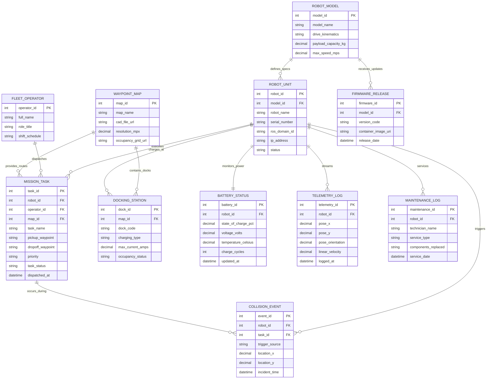

# Conceptual ERD — Autonomous Robotics Management System

## Mermaid Code

## Entity Description Table | Bảng mô tả Entity

| # | Entity Name | Vietnamese Name | Description | Key Attributes | Main Relationships |
|---|-------------|-----------------|-------------|----------------|-------------------|
| 1 | ROBOT_MODEL | Dòng / Model Robot | Hardware model specifications (Differential, Ackerman, Omni) defining payload and top speed. | model_id (PK), model_name, drive_kinematics, payload_capacity_kg | Defines specs for Robot Units, receives Firmware Releases |
| 2 | ROBOT_UNIT | Đơn vị Robot (AMR) | Individual autonomous robot instance operating on facility floors with IP and status. | robot_id (PK), model_id (FK), robot_name, serial_number, status | Defined by Model, executes Tasks, streams Telemetry, charges at Docking Stations |
| 3 | FLEET_OPERATOR | Điều hành Viên | Human operator or dispatcher creating transport missions and monitoring telemetry. | operator_id (PK), full_name, role_title, shift_schedule | Dispatches Mission Tasks |
| 4 | WAYPOINT_MAP | Bản đồ SLAM / CAD | Digital facility map containing occupancy grid tiles, coordinate anchors, and docking spots. | map_id (PK), map_name, cad_file_url, resolution_mpx | Provides routes for Tasks, contains Docking Stations |
| 5 | MISSION_TASK | Nhiệm vụ Vận chuyển | Material transport, picking, or inspection mission assigned to a specific robot. | task_id (PK), robot_id (FK), operator_id (FK), pickup_waypoint, task_status | Assigned to Robot Unit, dispatched by Operator, routed on Waypoint Map |
| 6 | DOCKING_STATION | Trạm Sạc Tự động | IoT charging station managing inductive or contact battery charging for robots. | dock_id (PK), map_id (FK), dock_code, charging_type, occupancy_status | Located on Waypoint Map, charges Robot Units |
| 7 | BATTERY_STATUS | Trạng thái Pin | Real-time battery monitoring record tracking State of Charge (SOC), voltage, and health cycles. | battery_id (PK), robot_id (FK), state_of_charge_pct, voltage_volts, charge_cycles | Monitors Robot Unit power |
| 8 | TELEMETRY_LOG | Nhật ký Sensor Telemetry | High-frequency telemetry log recording robot pose (X, Y, Theta), velocity, and sensor health. | telemetry_id (PK), robot_id (FK), pose_x, pose_y, linear_velocity, logged_at | Streamed from Robot Unit |
| 9 | COLLISION_EVENT | Sự cố Báo động Safety | Emergency stop or safety field breach event recording incident location and trigger source. | event_id (PK), robot_id (FK), task_id (FK), trigger_source, location_x | Triggered by Robot Unit during Mission Task |
| 10 | MAINTENANCE_LOG | Nhật ký Bảo trì | Technical service log recording motor repairs, wheel replacements, and sensor tuning. | maintenance_id (PK), robot_id (FK), technician_name, service_type, service_date | Services Robot Unit |
| 11 | FIRMWARE_RELEASE | Bản cập nhật Firmware | OTA container image package or ROS 2 node software build deployed across robot fleets. | firmware_id (PK), model_id (FK), version_code, container_image_uri | Updates Robot Model |

## Relationship Description | Mô tả Quan hệ

| # | From Entity | Cardinality | To Entity | Relationship Label | Business Explanation |
|---|-------------|-------------|-----------|-------------------|----------------------|
| 1 | ROBOT_MODEL | one-to-many | ROBOT_UNIT | defines_specs | A Robot Model defines hardware specifications for multiple Robot Units. |
| 2 | ROBOT_UNIT | one-to-many | MISSION_TASK | executes | A Robot Unit executes multiple Mission Tasks over time. |
| 3 | FLEET_OPERATOR | one-to-many | MISSION_TASK | dispatches | A Fleet Operator dispatches multiple Mission Tasks. |
| 4 | WAYPOINT_MAP | one-to-many | MISSION_TASK | provides_routes | A Waypoint Map provides route waypoints for multiple Mission Tasks. |
| 5 | WAYPOINT_MAP | one-to-many | DOCKING_STATION | contains_docks | A Waypoint Map contains multiple physical Docking Stations. |
| 6 | ROBOT_UNIT | one-to-one | BATTERY_STATUS | monitors_power | A Robot Unit monitors its power via a unique Battery Status record. |
| 7 | ROBOT_UNIT | one-to-many | TELEMETRY_LOG | streams | A Robot Unit streams high-frequency sensor Telemetry Logs. |
| 8 | ROBOT_UNIT | one-to-many | COLLISION_EVENT | triggers | A Robot Unit can trigger Collision Events upon safety breaches. |
| 9 | MISSION_TASK | one-to-many | COLLISION_EVENT | occurs_during | A Collision Event occurs during a specific Mission Task execution. |
| 10 | ROBOT_UNIT | one-to-many | MAINTENANCE_LOG | services | A Robot Unit receives multiple Maintenance Logs over its lifespan. |
| 11 | ROBOT_MODEL | one-to-many | FIRMWARE_RELEASE | receives_updates | A Robot Model receives multiple OTA Firmware Releases. |
| 12 | ROBOT_UNIT | many-to-many | DOCKING_STATION | charges_at | Robot Units charge at multiple Docking Stations. |
