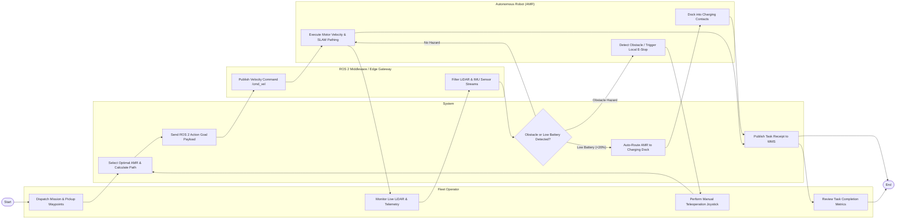

# Swimlane Diagram — Autonomous Robotics Management System

## Mermaid Code

## Flow Description | Mô tả luồng

| Lane | Actor | Role in Flow |
|------|-------|-------------|
| 1 | Fleet Operator | Dispatches material transport mission, monitors live 2D/3D LiDAR telemetry, performs teleoperation overrides when needed, and reviews task analytics. |
| 2 | System | Evaluates fleet proximity, calculates dynamic A* costmaps, publishes ROS 2 action goals, monitors battery thresholds, manages auto-docking, and posts receipts. |
| 3 | ROS 2 Middleware / Edge Gateway | Bridges cloud commands to hardware `/cmd_vel` topics, processes high-frequency sensor streams, and manages ROS node heartbeat parameters. |
| 4 | Autonomous Robot (AMR) | Executes physical motor velocity vectors, performs SLAM localization, triggers local safety E-Stops upon obstacle detection, and connects to charging docks. |
