# Action Tree — Autonomous Robotics Management System

## Mermaid Code

```mermaid
graph TD
    Root["Autonomous Robotics Management System"]

    Root --> M1["Robot Onboarding & Inventory"]
    Root --> M2["Mission Dispatch & Pathing"]
    Root --> M3["Real-Time Telemetry & SLAM"]
    Root --> M4["Battery & Autonomous Charging"]
    Root --> M5["Maintenance & Firmware OTA"]
    Root --> M6["Safety & Emergency Control"]

    M1 --> A11["Register Robot Unit & Network IP"]
    M1 --> A12["Map ROS 2 Topics & Domain IDs"]
    M1 --> A13["Calibrate Wheel Kinematics & IMU"]
    M1 --> A14["Configure Payload Capacity"]

    M2 --> A21["Dispatch Transport Mission Task"]
    M2 --> A22["Calculate Dynamic A* Costmaps"]
    M2 --> A23["Synchronize Orders with WMS"]
    M2 --> A24["Re-Route Around Dynamic Obstacles"]

    M3 --> A31["Stream 2D/3D LiDAR Scans"]
    M3 --> A32["Render SLAM Occupancy Grid Map"]
    M3 --> A33["Track Real-Time Pose & Velocity"]
    M3 --> A34["Override WebRTC Teleoperation"]

    M4 --> A41["Monitor Battery SOC Percentage"]
    M4 --> A42["Reserve Open IoT Docking Station"]
    M4 --> A43["Auto-Dock via Optical IR Sensor"]
    M4 --> A44["Track Charging Current & Cycles"]

    M5 --> A51["Deploy Containerized OTA Firmware"]
    M5 --> A52["Log Predictive Motor Fault Codes"]
    M5 --> A53["Recalibrate Sensor Alignments"]
    M5 --> A54["Record Component Repair History"]

    M6 --> A61["Trigger Emergency E-Stop Circuit"]
    M6 --> A62["Configure Laser Safety Field Zones"]
    M6 --> A63["Define Virtual Keep-Out Polygons"]
    M6 --> A64["Export Incident Collision Logs"]
```

## Module Description | Mô tả Module

| # | Module | Description | Actions |
|---|--------|-------------|---------|
| 1 | Robot Onboarding & Inventory | Registers new AMR/AGV hardware, configures ROS 2 edge gateway parameters, calibrates wheel encoders, and sets payload capacities. | Register Robot Unit & Network IP, Map ROS 2 Topics & Domain IDs, Calibrate Wheel Kinematics & IMU, Configure Payload Capacity |
| 2 | Mission Dispatch & Pathing | Handles material transport task dispatching, dynamic A*/D* path planning, costmap updates, WMS task synchronization, and obstacle rerouting. | Dispatch Transport Mission Task, Calculate Dynamic A* Costmaps, Synchronize Orders with WMS, Re-Route Around Dynamic Obstacles |
| 3 | Real-Time Telemetry & SLAM | Streams LiDAR point clouds, renders 2D SLAM occupancy grid maps, tracks robot pose (X, Y, Theta), and supports WebRTC manual teleoperation. | Stream 2D/3D LiDAR Scans, Render SLAM Occupancy Grid Map, Track Real-Time Pose & Velocity, Override WebRTC Teleoperation |
| 4 | Battery & Autonomous Charging | Monitors battery SOC levels, manages IoT docking station reservations, executes precision IR optical auto-docking, and tracks charging cycles. | Monitor Battery SOC Percentage, Reserve Open IoT Docking Station, Auto-Dock via Optical IR Sensor, Track Charging Current & Cycles |
| 5 | Maintenance & Firmware OTA | Manages containerized Over-The-Air (OTA) ROS 2 firmware updates, logs predictive motor fault codes, recalibrates sensors, and logs repairs. | Deploy Containerized OTA Firmware, Log Predictive Motor Fault Codes, Recalibrate Sensor Alignments, Record Component Repair History |
| 6 | Safety & Emergency Control | Controls hardware E-Stop circuit relays, laser scanner safety fields, virtual keep-out polygon boundaries, and exports collision incident logs. | Trigger Emergency E-Stop Circuit, Configure Laser Safety Field Zones, Define Virtual Keep-Out Polygons, Export Incident Collision Logs |
