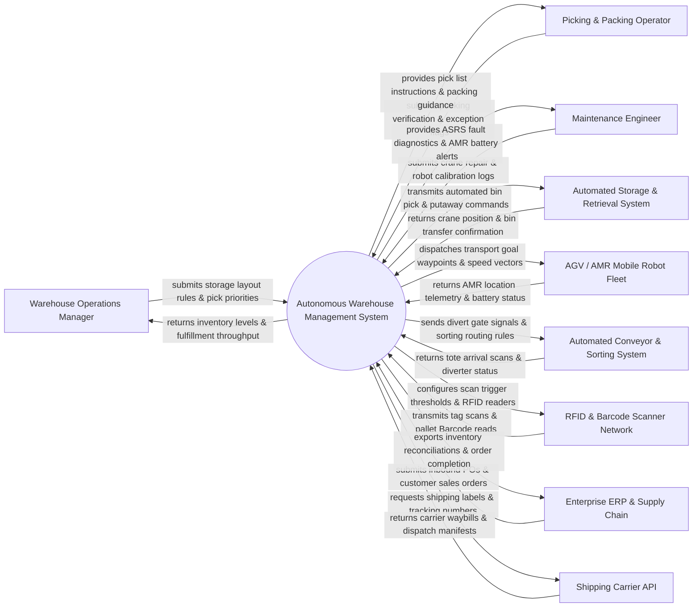

# Context Diagram — Autonomous Warehouse Management System

## Mermaid Code

## Actor & Interaction Table | Bảng Actor & Tương tác

| # | Actor | Actor Type | Data Sent TO System | Data Received FROM System | Notes |
|---|-------|------------|---------------------|---------------------------|-------|
| 1 | Warehouse Operations Manager | Primary | Storage layout slotting rules, picking priority overrides, labor shift schedules, velocity zone policies | Real-time inventory dashboards, order fulfillment throughput (PPH), dock utilization | Operations manager overseeing overall warehouse logistics, slotting, and productivity. |
| 2 | Picking & Packing Operator | Primary | Item packing confirmations, damaged goods flags, weight check overrides, shipping container scans | Pick-to-light visual cues, packing verification checklists, box sizing recommendations | Warehouse staff working at goods-to-person (G2P) workstations, packing items for dispatch. |
| 3 | Maintenance Engineer | Primary | Mechanical crane repair logs, robot wheel replacement notes, sensor alignment check results | ASRS fault codes, AMR battery health metrics, conveyor belt jam alerts, PM schedules | Maintenance technicians servicing automated crane rails, AGVs/AMRs, and conveyor sorters. |
| 4 | Automated Storage & Retrieval System | Supporting System | Crane X-Y-Z position telemetry, shuttle bin transfer confirmations, shelf sensor status | Automated bin retrieve/store commands, crane acceleration profiles, bin lock signals | High-density vertical crane/shuttle ASRS systems storing and retrieving totes automatically. |
| 5 | AGV / AMR Mobile Robot Fleet | Supporting System | Robot Pose coordinates (X, Y, Theta), battery State of Charge (SOC), obstacle sensor alerts | Transport task waypoints, target velocity vectors, dock reservation commands | Fleet of Autonomous Mobile Robots (AMRs) and Automated Guided Vehicles (AGVs) moving totes. |
| 6 | Automated Conveyor & Sorting System | Supporting System | Tote arrival scanner reads, divert arm sensor status, motor jam alerts, photo-eye counts | Divert gate activation signals, conveyor speed control commands, sorting lane assignments | High-speed shoe sorters, pop-up wheel diverters, and roller conveyor networks moving packages. |
| 7 | RFID & Barcode Scanner Network | Supporting System | Pallet RFID EPC tag reads, 1D/2D Barcode scans, portal reader timestamps | Reader power settings, scan trigger commands, tag read filter configurations | Fixed overhead RFID portals, inline barcode scanners, and handheld terminals reading tags. |
| 8 | Enterprise ERP & Supply Chain | Supporting System | Inbound Purchase Orders (POs), customer sales orders, return authorization codes (RMA) | Inventory level reconciliation files, order fulfillment completion receipts, ASN updates | Enterprise ERP (SAP, Oracle SCM) managing global supply chain, purchase orders, and sales. |
| 9 | Shipping Carrier API | Supporting System | Carrier shipping waybills, tracking numbers, dispatch manifests, shipping rate quotes | Shipping label request payloads, package dimensions, weight measurements | Logistics carriers (FedEx, UPS, DHL, Postal) accepting packed parcels for final delivery. |

## System Boundary Description | Mô tả Phạm vi Hệ thống

The **Autonomous Warehouse Management System (AWMS)** is an automated smart warehouse orchestration and execution engine. Inside the system boundary, AWMS manages dynamic inventory slotting, inbound putaway routing, Goods-to-Person (G2P) picking allocation, ASRS crane dispatch, AMR fleet traffic management, conveyor divert sorting, RFID inventory reconciliation, and shipping container packing optimization. External to the system boundary are physical robotic cranes (Automated Storage & Retrieval System), mobile robot fleets (AGV/AMR Fleet), physical conveyor PLCs (Conveyor & Sorting System), fixed RFID scanner portals (RFID Scanner Network), enterprise ERP software (Enterprise ERP System), and commercial shipping services (Shipping Carrier API).
