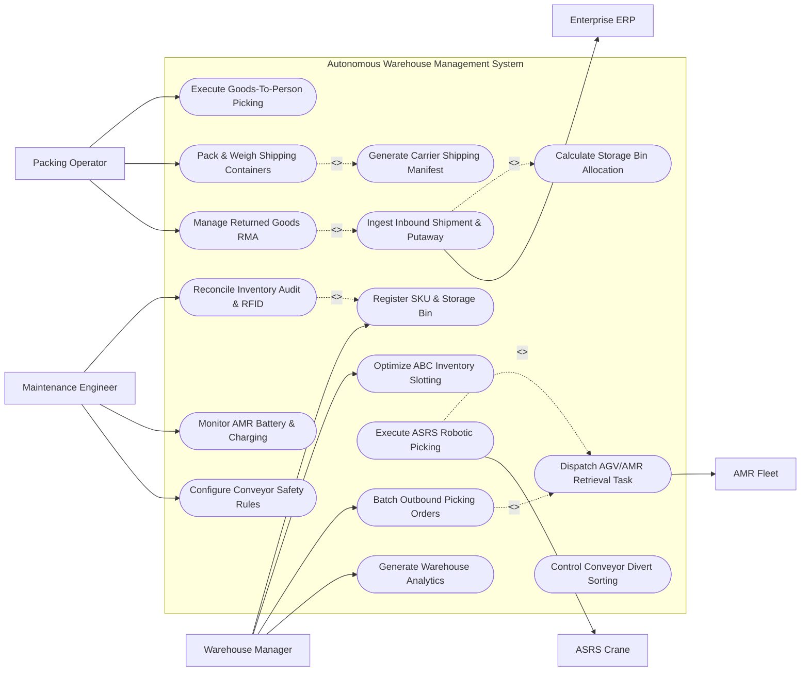

# Use Case Diagram — Autonomous Warehouse Management System

## Mermaid Code

## Actor Table | Bảng Actor

| # | Actor | Actor Type | Role Description | Related Use Cases |
|---|-------|------------|------------------|-------------------|
| 1 | Warehouse Manager | Primary | Operations manager defining storage slotting rules, batching picking orders, and analyzing throughput. | UC01, UC02, UC06, UC15 |
| 2 | Packing Operator | Primary | Warehouse staff operating goods-to-person stations, packing items, and managing returned goods. | UC07, UC10, UC14 |
| 3 | Maintenance Engineer | Primary | Engineer monitoring AMR battery levels, configuring conveyor safety rules, and conducting RFID audits. | UC11, UC13, UC16 |
| 4 | Enterprise ERP | System | Enterprise system supplying purchase orders, customer sales orders, and receiving inventory updates. | UC03 |
| 5 | AMR Fleet | System | Autonomous mobile robots transporting totes and pallets from ASRS racks to G2P stations. | UC05 |
| 6 | ASRS Crane | Hardware | Vertical automated storage crane picking and storing totes in high-density rack locations. | UC08 |

## Use Case Table | Bảng Use Case

| # | UC ID | Use Case Name | Primary Actor | Secondary Actor | Description | Priority |
|---|-------|---------------|---------------|-----------------|-------------|----------|
| 1 | UC01 | Register SKU & Storage Bin | Warehouse Manager | None | Registers inventory SKUs, dimensions, weights, barcode identifiers, and maps physical rack storage bins. | High |
| 2 | UC02 | Optimize ABC Inventory Slotting | Warehouse Manager | None | Analyzes SKU pick velocity (Fast, Medium, Slow moving) and reassigns high-velocity SKUs near picking docks. | High |
| 3 | UC03 | Ingest Inbound Shipment & Putaway | Warehouse Manager | Enterprise ERP | Ingests inbound ASN pallets, verifies barcode scans, and automates putaway routing to ASRS storage bins. | High |
| 4 | UC04 | Calculate Storage Bin Allocation | Warehouse Manager | None | Calculates optimal storage bin based on package dimensions, weight limits, temperature requirements, and velocity. | High |
| 5 | UC05 | Dispatch AGV/AMR Retrieval Task | Warehouse Manager | AMR Fleet | Dispatches AMR mobile robot to pick up retrieved tote from ASRS dropoff point and move to G2P station. | High |
| 6 | UC06 | Batch Outbound Picking Orders | Warehouse Manager | None | Batches customer sales orders by destination zone and wave release to optimize AMR transport efficiency. | High |
| 7 | UC07 | Execute Goods-To-Person Picking | Packing Operator | None | Displays pick-to-light visual cues at G2P workstation, guiding operator to select exact SKU quantities into order totes. | High |
| 8 | UC08 | Execute ASRS Robotic Picking | Warehouse Manager | ASRS Crane | Commands high-density vertical ASRS crane to retrieve target inventory tote and present it to transport conveyor. | High |
| 9 | UC09 | Control Conveyor Divert Sorting | Maintenance Engineer | None | Triggers high-speed shoe sorter divert gates based on barcode scans to route packages to target shipping lanes. | High |
| 10 | UC10 | Pack & Weigh Shipping Containers | Packing Operator | None | Verifies packed items against order manifest, measures total box weight/dimensions, and generates shipping labels. | High |
| 11 | UC11 | Reconcile Inventory Audit & RFID | Maintenance Engineer | None | Conducts continuous automated RFID portal audits, comparing physical tag reads against system ledger quantities. | High |
| 12 | UC12 | Generate Carrier Shipping Manifest | Packing Operator | None | Transmits package weight and dimensions to shipping carrier API and prints compliant carrier shipping waybills. | Medium |
| 13 | UC13 | Monitor AMR Battery & Charging | Maintenance Engineer | None | Monitors AMR robot fleet battery State of Charge (SOC) and dispatches low-power robots to inductive charging docks. | Medium |
| 14 | UC14 | Manage Returned Goods RMA | Packing Operator | None | Inspects returned customer parcels (RMA), checks item condition, and routes acceptable items back to ASRS putaway. | Medium |
| 15 | UC15 | Generate Warehouse Analytics | Warehouse Manager | None | Exports order fulfillment cycle time, lines picked per hour (PPH), ASRS crane uptime, and dock utilization. | Medium |
| 16 | UC16 | Configure Conveyor Safety Rules | Maintenance Engineer | None | Sets conveyor motor speed limits, photo-eye jam detection timers, and emergency stop interlock thresholds. | Low |

## Use Case Specification | Đặc tả Use Case

---

### UC01 — Register SKU & Storage Bin

| Field | Detail |
|-------|--------|
| **UC ID** | UC01 |
| **Use Case Name** | Register SKU & Storage Bin |
| **Actor(s)** | Primary: Warehouse Manager / Secondary: None |
| **Description** | Registers new Stock Keeping Units (SKUs) in the system catalog, specifying physical dimensions, weight, hazard class, barcode/RFID IDs, and mapping target rack storage bins. |
| **Precondition** | 1. Manager has administrative access to warehouse master data module.   2. Physical storage rack grid (Aisle, Rack, Shelf, Bin) is configured. |
| **Main Flow** | 1. Actor selects "Register New SKU Item".   2. System presents SKU registration form requesting SKU Code, Item Description, Category, Unit Barcode (UPC/EAN), and RFID EPC Tag Prefix.   3. Actor enters physical dimensions: Length, Width, Height (cm), Unit Weight (kg), and Packaging Type (Individual Item, Case, Pallet).   4. Actor specifies storage constraints: Temperature Zone (Ambient, Chilled, Frozen), Hazard Class (Flammable, Fragile, Standard), and ABC Velocity Class (A-Fast, B-Medium, C-Slow).   5. System validates data, assigns unique SKU ID, and generates barcode label preview.   6. Actor maps target storage zone or enables automated slotting (UC02).   7. System stores Inventory_SKU entity and sets status to "Active - Available for Inbound". |
| **Alternative Flow** | **AF1** — Bulk ERP Import: System automatically imports 500 SKU master records from Enterprise ERP (UC03) via REST API payload.   **AF2** — Dynamic Dimensioning & Weighing: SKU is placed on an automated inline cubiscan machine; System auto-populates dimensions and weight. |
| **Exception Flow** | **EX1** — Duplicate Barcode Code: If entered UPC barcode matches an existing SKU, System halts registration with error "UPC Barcode already registered to SKU-8819."   **EX2** — Invalid Storage Dimensions: If item dimensions exceed maximum ASRS tote size (60x40x30 cm), System flags "Item exceeds ASRS tote capacity. Assign to Pallet Rack Zone." |
| **Postcondition** | Inventory_SKU entity is created, configuring storage constraints and barcode mappings for warehouse operations. |
| **Business Rule** | **BR1**: Every SKU must have verified physical weight and 3D volume dimensions before being assigned to automated ASRS storage bins. |

---

### UC03 — Ingest Inbound Shipment & Auto-Putaway

| Field | Detail |
|-------|--------|
| **UC ID** | UC03 |
| **Use Case Name** | Ingest Inbound Shipment & Auto-Putaway |
| **Actor(s)** | Primary: Warehouse Manager / Secondary: Enterprise ERP |
| **Description** | Receives inbound Purchase Order (PO) Advanced Shipping Notices (ASN), verifies received pallet barcode/RFID scans, and automates putaway routing to ASRS storage bins. |
| **Precondition** | 1. Inbound PO/ASN manifest is transmitted from Enterprise ERP.   2. Inbound receiving dock barcode scanners and conveyor receiving lines are operational. |
| **Main Flow** | 1. Inbound truck arrives at receiving dock; System ingests ASN manifest payload from Enterprise ERP.   2. Receiving operator unloads pallet onto inbound conveyor receiving line.   3. Inline RFID/Barcode scanner portal scans pallet tag and SKU barcodes on incoming cases.   4. System matches scanned SKUs against ASN manifest, verifying line quantities and checking for damaged packaging flags.   5. System triggers UC04 (Calculate Storage Bin Allocation) to select the optimal ASRS storage bin based on SKU velocity, dimensions, and current bin availability.   6. System dispatches putaway transport order to inbound conveyor line and ASRS crane (UC08).   7. ASRS crane picks up tote/pallet at receiving induction station, transports it along crane aisle, and deposits tote into assigned storage bin.   8. System updates inventory balance, marks putaway task as "Completed", and sends receiving confirmation to Enterprise ERP. |
| **Alternative Flow** | **AF1** — Cross-Docking Direct Dispatch: Received SKU is urgently required for an active outbound sales order; System bypasses ASRS putaway and routes tote directly to outbound packing station (UC07).   **AF2** — Quarantine Hold: Inbound goods fail quality inspection; System routes tote to Quality Assurance (QA) Quarantine Zone. |
| **Exception Flow** | **EX1** — Over-Receipt Quantity Mismatch: If scanned case quantity exceeds PO manifest by >5%, System flags "Receiving Mismatch: Quantity exceeds PO limit" and holds pallet at dock.   **EX2** — ASRS Inbound Induction Jam: If photo-eye sensor detects box overhang on induction line, System halts conveyor and alerts maintenance. |
| **Postcondition** | Inbound inventory is received, stored in assigned ASRS storage bins, and updated in ERP inventory ledgers. |
| **Business Rule** | **BR1**: Inbound putaway algorithms must automatically distribute identical SKUs across separate ASRS crane aisles to ensure dual-aisle redundancy during maintenance. |

---

### UC05 — Dispatch AGV/AMR Retrieval Task

| Field | Detail |
|-------|--------|
| **UC ID** | UC05 |
| **Use Case Name** | Dispatch AGV/AMR Retrieval Task |
| **Actor(s)** | Primary: Warehouse Manager / Secondary: AMR Fleet |
| **Description** | Allocates and dispatches an Autonomous Mobile Robot (AMR) or AGV to transport retrieved inventory totes from ASRS dropoff stations to Goods-to-Person (G2P) picking workstations. |
| **Precondition** | 1. Outbound picking order (UC06) has triggered an ASRS tote retrieval (UC08).   2. ASRS crane has deposited retrieved tote onto the outbound transfer spur.   3. At least one AMR is available in "Standby" status. |
| **Main Flow** | 1. System receives notification that ASRS crane has deposited target Tote ID (e.g. TOTE-4491) onto outbound spur station.   2. System queries AMR Fleet Manager to select the optimal mobile robot (e.g. AMR-12) based on proximity, payload capacity, and battery SOC (>20%).   3. System dispatches transport task payload specifying Pick Location (ASRS Spur 4) and Drop Location (G2P Workstation 02).   4. AMR-12 accepts task, navigates autonomously along warehouse floor grid to ASRS Spur 4, and aligns under the tote lifting platform.   5. AMR-12 raises its top pin lift mechanism, securing Tote-4491.   6. AMR-12 navigates along designated robot travel lanes, using LiDAR collision avoidance to bypass dynamic obstacles.   7. AMR-12 arrives at G2P Workstation 02, lowers lift mechanism, deposits tote onto workstation queue, and updates task status to "Delivered to Station".   8. System alerts Packing Operator (UC07) that target tote has arrived. |
| **Alternative Flow** | **AF1** — Shelf-Carrying AMR Dispatch: AMR navigates under an entire mobile storage rack (pod), lifts rack off floor, and transports whole pod to G2P station.   **AF2** — Empty Tote Return Trip: Upon completing transport to G2P station, AMR picks up an empty tote from workstation queue and transports it back to ASRS inbound spur. |
| **Exception Flow** | **EX1** — AMR Battery Low During Transit: If battery SOC drops below 15% mid-task, AMR-12 safely deposits tote at nearest intermediate buffer station and routes to charging dock (UC13); System reassigns task to AMR-05.   **EX2** — Robot Traffic Congestion: If 4 AMRs meet at an aisle intersection, System fleet manager resolves deadlock by assigning temporary yield priority. |
| **Postcondition** | Target inventory tote is transported by AMR to the G2P picking workstation, advancing outbound order fulfillment. |
| **Business Rule** | **BR1**: AMR robot travel paths must maintain strict speed limits (max 1.5 m/s) and mandatory 1-meter safety separation buffers in shared human-robot zones. |

---

### UC08 — Execute ASRS Robotic Picking

| Field | Detail |
|-------|--------|
| **UC ID** | UC08 |
| **Use Case Name** | Execute ASRS Robotic Picking |
| **Actor(s)** | Primary: Warehouse Manager / Secondary: ASRS Crane |
| **Description** | Commands a high-density vertical automated storage crane or mini-load shuttle to navigate rack aisles, retrieve a specific inventory tote, and present it to outbound transport lines. |
| **Precondition** | 1. Outbound picking batch (UC06) has identified required SKU bin location (Aisle, Rack, Shelf, Bin).   2. ASRS crane is operational and in "Automatic" control mode. |
| **Main Flow** | 1. System dispatches retrieval command payload to ASRS Crane PLC controller specifying Target Aisle, Rack Column, Shelf Height, and Bin ID (e.g. Bin A04-R12-S03).   2. ASRS Crane moves rapidly along horizontal aisle rail while simultaneously raising its vertical hoist carriage to target shelf height.   3. Crane reaches target location, extends its telescopic extraction arm/forks into the rack shelf, and pulls tote onto crane carriage.   4. Crane verifies tote barcode scan via on-board scanner to confirm correct item retrieval.   5. Crane moves to aisle outbound transfer spur and lowers tote onto conveyor/AMR transfer station.   6. Crane sends completion signal to System, updating tote location to "Retrieved on Outbound Spur".   7. System triggers AMR transport dispatch (UC05) or conveyor routing (UC09). |
| **Alternative Flow** | **AF1** — Multi-Shuttle System: In a 3D matrix shuttle system, individual autonomous row shuttles retrieve tote and transfer it to a high-speed vertical lift elevator.   **AF2** — Robotic Gripper Arm Direct Pick: ASRS incorporates a 6-axis robotic arm with vacuum suction gripper that picks individual items directly out of tote into order shipping box. |
| **Exception Flow** | **EX1** — Bin Mismatch Error: If crane on-board scanner reads a different tote barcode than expected, Crane halts extraction, alerts system "Bin Content Mismatch", and moves to next task.   **EX2** — Crane Drive Mechanical Fault: If motor drive overload occurs on hoist axis, ASRS PLC trips emergency brake, sets crane status to "Faulted", and triggers maintenance alert. |
| **Postcondition** | Target inventory tote is retrieved from high-density ASRS storage racks and presented at outbound transfer spur. |
| **Business Rule** | **BR1**: ASRS crane movement sequences must be dynamically optimized using dual-cycle command logic (combining putaway and retrieval in one travel motion) to maximize crane efficiency. |

---

### UC11 — Reconcile Inventory Audit & RFID

| Field | Detail |
|-------|--------|
| **UC ID** | UC11 |
| **Use Case Name** | Reconcile Inventory Audit & RFID |
| **Actor(s)** | Primary: Maintenance Engineer / Secondary: None |
| **Description** | Executes continuous automated inventory audits using fixed RFID portal readers, drone scans, or AMR-mounted readers, comparing physical tag reads against system ledger counts. |
| **Precondition** | 1. Inventory SKUs and storage bins are tagged with RFID EPC tags (UC01).   2. RFID portal readers and AMR mobile scanners are operational. |
| **Main Flow** | 1. Actor (or automated off-shift schedule) initiates "Execute Automated RFID Inventory Audit".   2. System dispatches audit AMRs equipped with overhead RFID array readers to scan warehouse storage aisles.   3. AMR navigates down aisle, emitting UHF RFID radio pulses and capturing EPC tag responses from all stored cases and pallets.   4. Fixed overhead RFID portals simultaneously transmit continuous tag read events to System.   5. System ingests raw RFID read streams, filters duplicate tag reads using RSSI thresholding, and compiles physical tag inventory count by SKU and Bin location.   6. System compares physical RFID counts against master Inventory_SKU ledger balances.   7. If counts match 100%, System updates audit timestamp to "Verified".   8. If discrepancies are detected (e.g. 2 missing cases or misplaced tote), System logs Inventory_Discrepancy record, flags affected bin for manual cycle count, and exports reconciliation report. |
| **Alternative Flow** | **AF1** — Autonomous Drone Audit: An autonomous indoor quadcopter drone equipped with optical cameras and RFID reader flies high-bay pallet aisles to audit top-shelf pallet inventory.   **AF2** — Gate Read Reconciliation: Pallet passes through shipping dock RFID portal; System verifies all cases on pallet match the shipping manifest (UC12) before loading truck. |
| **Exception Flow** | **EX1** — RFID Tag Blind Spot (Shielding): Metal objects block RFID signal causing missing reads; System prompts "RF Shielding Detected in Zone B3. Requesting visual barcode check."   **EX2** — Unregistered RFID Tag Detected: Scanner reads unknown RFID tag; System logs "Phantom Tag Detected" and queues item for operator inspection. |
| **Postcondition** | Physical RFID inventory reads are reconciled against system ledgers, flagging discrepancies and maintaining >99.5% inventory accuracy. |
| **Business Rule** | **BR1**: Any inventory discrepancy exceeding $500 in value must trigger an immediate supervisor approval workflow before system ledger balances can be adjusted. |
