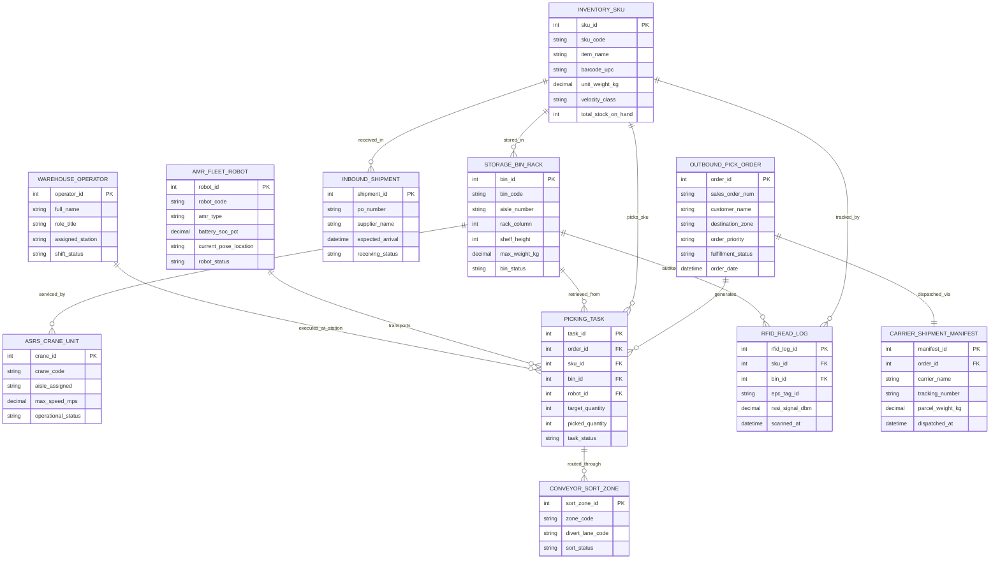

# Conceptual ERD — Autonomous Warehouse Management System

## Mermaid Code

## Entity Description Table | Bảng mô tả Entity

| # | Entity Name | Vietnamese Name | Description | Key Attributes | Main Relationships |
|---|-------------|-----------------|-------------|----------------|-------------------|
| 1 | INVENTORY_SKU | Mã Hàng hóa SKU | Master inventory SKU record tracking barcodes, weights, velocity classes, and on-hand stock. | sku_id (PK), sku_code, item_name, barcode_upc, velocity_class | Stored in Storage Bins, received in Inbound Shipments, picked in Tasks, tracked by RFID |
| 2 | STORAGE_BIN_RACK | Ô / Bin Lưu kho | Physical high-density ASRS rack bin location identified by aisle, rack, shelf coordinates. | bin_id (PK), bin_code, aisle_number, rack_column, shelf_height, bin_status | Stores SKUs, serviced by ASRS Cranes, retrieved in Picking Tasks |
| 3 | ASRS_CRANE_UNIT | Cần cẩu ASRS | High-density vertical automated storage crane unit moving along dedicated rack aisles. | crane_id (PK), crane_code, aisle_assigned, operational_status | Services Storage Bin Racks |
| 4 | AMR_FLEET_ROBOT | Robot AMR / AGV | Autonomous Mobile Robot (AMR) transporting totes from ASRS spurs to packing stations. | robot_id (PK), robot_code, amr_type, battery_soc_pct, robot_status | Transports Picking Tasks |
| 5 | INBOUND_SHIPMENT | Lô hàng Nhập kho PO | Inbound supplier purchase order shipment received at dock for automated putaway. | shipment_id (PK), po_number, supplier_name, receiving_status | Receives Inventory SKUs |
| 6 | OUTBOUND_PICK_ORDER | Đơn hàng Xuất kho | Customer sales order batched for automated ASRS retrieval and G2P packing fulfillment. | order_id (PK), sales_order_num, customer_name, fulfillment_status | Generates Picking Tasks, dispatched via Carrier Manifest |
| 7 | PICKING_TASK | Nhiệm vụ Lấy hàng | Individual item pick line task assigning SKU, storage bin, AMR robot, and target quantities. | task_id (PK), order_id (FK), sku_id (FK), bin_id (FK), robot_id (FK), task_status | Belongs to Outbound Order & SKU, transported by AMR Robot, executed by Operator |
| 8 | CONVEYOR_SORT_ZONE | Trạm Phân loại Băng tải | Automated high-speed conveyor sorting zone with divert gates and photo-eye sensors. | sort_zone_id (PK), zone_code, divert_lane_code, sort_status | Routes Picking Tasks |
| 9 | RFID_READ_LOG | Nhật ký Scann RFID | Real-time RFID EPC tag scan log capturing reader timestamps, RSSI signals, and locations. | rfid_log_id (PK), sku_id (FK), bin_id (FK), epc_tag_id, scanned_at | Tracks SKUs, audits Storage Bins |
| 10 | WAREHOUSE_OPERATOR | Nhân viên Vận hành | Warehouse packing operator working at Goods-to-Person (G2P) workstations. | operator_id (PK), full_name, role_title, assigned_station, shift_status | Executes Picking Tasks at Station |
| 11 | CARRIER_SHIPMENT_MANIFEST | Bảng Kê Vận chuyển | Shipping manifest and waybill details generated upon packing completion for final carrier delivery. | manifest_id (PK), order_id (FK), carrier_name, tracking_number, parcel_weight_kg | Dispatches Outbound Pick Order |

## Relationship Description | Mô tả Quan hệ

| # | From Entity | Cardinality | To Entity | Relationship Label | Business Explanation |
|---|-------------|-------------|-----------|-------------------|----------------------|
| 1 | INVENTORY_SKU | many-to-many | STORAGE_BIN_RACK | stored_in | Inventory SKUs are stored across multiple Storage Bin Racks. |
| 2 | STORAGE_BIN_RACK | one-to-many | ASRS_CRANE_UNIT | serviced_by | Storage Bin Racks in an aisle are serviced by assigned ASRS Crane Units. |
| 3 | INVENTORY_SKU | one-to-many | INBOUND_SHIPMENT | received_in | Inventory SKUs are received in multiple Inbound Shipments over time. |
| 4 | OUTBOUND_PICK_ORDER | one-to-many | PICKING_TASK | generates | An Outbound Pick Order generates multiple line-item Picking Tasks. |
| 5 | INVENTORY_SKU | one-to-many | PICKING_TASK | picks_sku | An Inventory SKU is picked across multiple Picking Tasks. |
| 6 | STORAGE_BIN_RACK | one-to-many | PICKING_TASK | retrieved_from | A Storage Bin Rack is retrieved from during multiple Picking Tasks. |
| 7 | AMR_FLEET_ROBOT | one-to-many | PICKING_TASK | transports | An AMR Fleet Robot transports totes for multiple Picking Tasks. |
| 8 | PICKING_TASK | many-to-many | CONVEYOR_SORT_ZONE | routed_through | Picking Tasks are routed through Conveyor Sort Zones. |
| 9 | INVENTORY_SKU | one-to-many | RFID_READ_LOG | tracked_by | An Inventory SKU is tracked by RFID Read Logs. |
| 10 | STORAGE_BIN_RACK | one-to-many | RFID_READ_LOG | audited_at | A Storage Bin Rack is audited at via RFID Read Logs. |
| 11 | WAREHOUSE_OPERATOR | one-to-many | PICKING_TASK | executes_at_station | A Warehouse Operator executes Picking Tasks at G2P Stations. |
| 12 | OUTBOUND_PICK_ORDER | one-to-one | CARRIER_SHIPMENT_MANIFEST | dispatched_via | A completed Outbound Pick Order is dispatched via a Carrier Shipment Manifest. |
