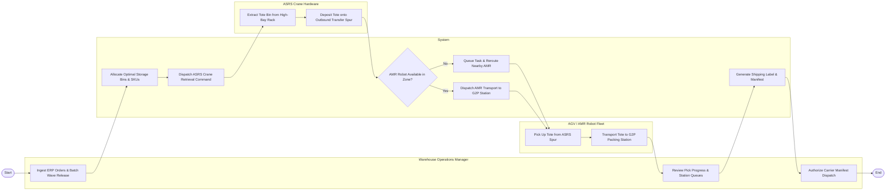

# Swimlane Diagram — Autonomous Warehouse Management System

## Mermaid Code

## Flow Description | Mô tả luồng

| Lane | Actor | Role in Flow |
|------|-------|-------------|
| 1 | Warehouse Operations Manager | Batches customer sales orders from ERP into wave releases, monitors real-time G2P station picking queues, and authorizes shipping manifest dispatch. |
| 2 | System | Calculates optimal SKU bin allocations, commands ASRS crane retrievals, checks AMR fleet availability, dispatches transport tasks to G2P stations, and generates carrier manifests. |
| 3 | ASRS Crane Hardware | Navigates high-bay rack aisles, extends extraction arm to retrieve target inventory totes, and deposits totes onto outbound transfer spurs. |
| 4 | AGV / AMR Robot Fleet | Navigates autonomously to ASRS transfer spurs, lifts retrieved totes, transports totes along warehouse travel lanes, and deposits them at G2P packing stations. |
