# Action Tree — Autonomous Warehouse Management System

## Mermaid Code

```mermaid
graph TD
    Root["Autonomous Warehouse Management System"]

    Root --> M1["Master Inventory & Storage Bin Control"]
    Root --> M2["Inbound Receipt & Auto-Putaway"]
    Root --> M3["Outbound Order Picking & Dispatch"]
    Root --> M4["ASRS & AMR Fleet Orchestration"]
    Root --> M5["Conveyor Sorting & RFID Tracking"]
    Root --> M6["Warehouse Analytics & Safety Audit"]

    M1 --> A11["Register SKU Dimensions & Barcodes"]
    M1 --> A12["Map High-Bay Storage Bin Grids"]
    M1 --> A13["Optimize ABC Velocity Slotting"]
    M1 --> A14["Set Temperature Zone Constraints"]

    M2 --> A21["Ingest Inbound PO ASN Manifests"]
    M2 --> A22["Scan Pallet Barcodes & Verify ASNs"]
    M2 --> A23["Calculate Optimal Putaway Storage Bins"]
    M2 --> A24["Process Returned Goods RMA Putaway"]

    M3 --> A31["Batch Outbound Orders into Waves"]
    M3 --> A32["Execute Pick-to-Light G2P Packing"]
    M3 --> A33["Pack & Weigh Shipping Containers"]
    M3 --> A34["Generate Carrier Waybills & Manifests"]

    M4 --> A41["Dispatch High-Bay ASRS Crane Retrieval"]
    M4 --> A42["Dispatch AMR Fleet Transport Tasks"]
    M4 --> A43["Monitor AMR Battery SOC & Charging"]
    M4 --> A44["Resolve AMR Robot Traffic Deadlocks"]

    M5 --> A51["Control Conveyor Divert Sorter Gates"]
    M5 --> A52["Ingest Real-Time RFID Portal Scans"]
    M5 --> A53["Reconcile Automated RFID Audits"]
    M5 --> A54["Detect Conveyor Motor Jams & Bins"]

    M6 --> A61["Export Order Fulfillment Throughput PPH"]
    M6 --> A62["Track ASRS Crane & AMR Fleet Uptime"]
    M6 --> A63["Configure Conveyor Speed Safety Rules"]
    M6 --> A64["Export ERP Inventory Ledgers"]
```

## Module Description | Mô tả Module

| # | Module | Description | Actions |
|---|--------|-------------|---------|
| 1 | Master Inventory & Storage Bin Control | Controls SKU dimensions, barcodes, high-bay storage rack mapping, ABC velocity slotting, and temperature zone rules. | Register SKU Dimensions & Barcodes, Map High-Bay Storage Bin Grids, Optimize ABC Velocity Slotting, Set Temperature Zone Constraints |
| 2 | Inbound Receipt & Auto-Putaway | Manages inbound PO ASN manifest ingestion, receiving dock barcode scanning, automated bin putaway calculations, and RMA returns. | Ingestion Inbound PO ASN Manifests, Scan Pallet Barcodes & Verify ASNs, Calculate Optimal Putaway Storage Bins, Process Returned Goods RMA Putaway |
| 3 | Outbound Order Picking & Dispatch | Handles wave order batching, Pick-to-Light G2P packing execution, container weighing, and carrier manifest generation. | Batch Outbound Orders into Waves, Execute Pick-to-Light G2P Packing, Pack & Weigh Shipping Containers, Generate Carrier Waybills & Manifests |
| 4 | ASRS & AMR Fleet Orchestration | Dispatches ASRS vertical crane retrievals, manages AMR fleet transport tasks, monitors robot battery charging, and resolves traffic deadlocks. | Dispatch High-Bay ASRS Crane Retrieval, Dispatch AMR Fleet Transport Tasks, Monitor AMR Battery SOC & Charging, Resolve AMR Robot Traffic Deadlocks |
| 5 | Conveyor Sorting & RFID Tracking | Controls high-speed conveyor divert sorters, ingests RFID portal scans, reconciles automated inventory audits, and detects jams. | Control Conveyor Divert Sorter Gates, Ingest Real-Time RFID Portal Scans, Reconcile Automated RFID Audits, Detect Conveyor Motor Jams & Bins |
| 6 | Warehouse Analytics & Safety Audit | Calculates fulfillment throughput (PPH), tracks ASRS/AMR equipment uptime, configures conveyor safety rules, and syncs ERP ledgers. | Export Order Fulfillment Throughput PPH, Track ASRS Crane & AMR Fleet Uptime, Configure Conveyor Speed Safety Rules, Export ERP Inventory Ledgers |
