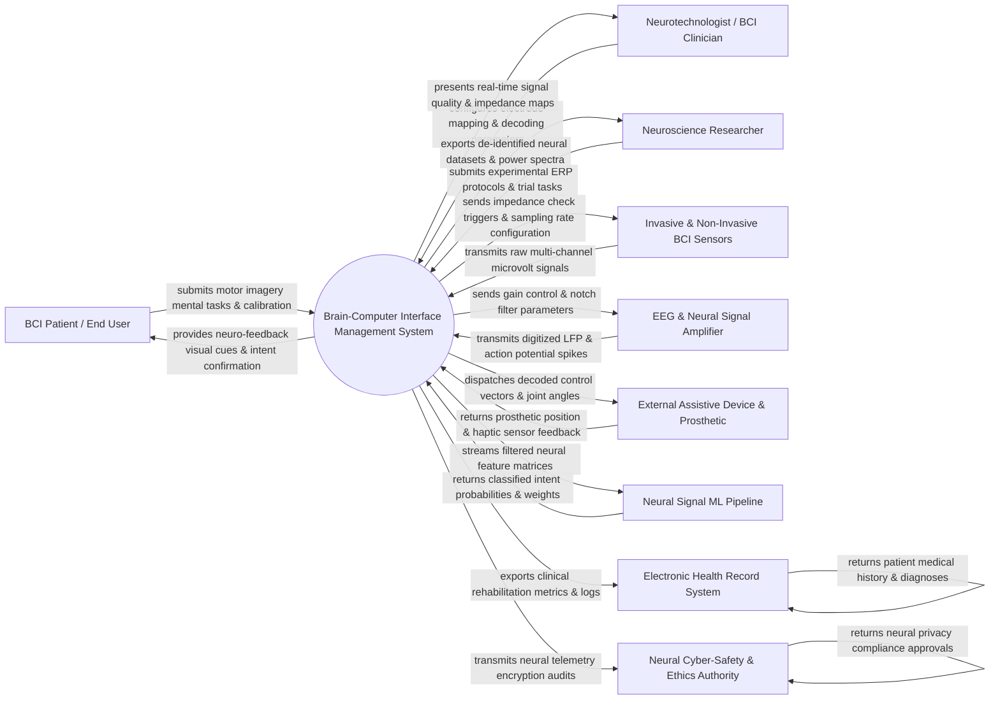

# Context Diagram — Brain-Computer Interface (BCI) Management System

## Mermaid Code

## Actor & Interaction Table | Bảng Actor & Tương tác

| # | Actor | Actor Type | Data Sent TO System | Data Received FROM System | Notes |
|---|-------|------------|---------------------|---------------------------|-------|
| 1 | BCI Patient / End User | Primary | Motor imagery mental tasks (hand clench, feet movement, imagined speech), visual focus, calibration trials | Real-time neuro-feedback visual cues, audio confirmation chimes, decoded action execution | Individuals with paralysis, ALS, stroke, or limb loss using BCIs for communication and control. |
| 2 | Neurotechnologist / BCI Clinician | Primary | Electrode Channel 10-20 mapping configurations, feature extraction parameters, clinical threshold settings | Real-time 32/64-channel impedance heatmaps, signal-to-noise ratio (SNR) indicators, error logs | Clinical specialists calibrating BCI headsets, microelectrode arrays, and monitoring sessions. |
| 3 | Neuroscience Researcher | Primary | Experimental Event-Related Potential (ERP) trial protocols, SSVEP frequency stimuli, research tags | De-identified multi-channel raw EEG/ECoG datasets, spectral power band analytics (Alpha, Beta, Gamma) | Academic or clinical researchers studying neural signal processing and brain plasticity. |
| 4 | Invasive & Non-Invasive BCI Sensors | Primary / Hardware | Raw multi-channel voltage time-series (µV), local field potentials (LFP), single-unit action potential spikes | Impedance test pulses, hardware reset commands, sampling rate configurations (250 Hz - 30 kHz) | EEG headsets (Emotiv, g.tec), ECoG grids, or microelectrode arrays (Utah Array, Neuralink). |
| 5 | EEG & Neural Signal Amplifier | Supporting System | Digitized 24-bit ADC neural signal streams, battery level, hardware synchronization clocks | Programmable gain amplifier settings, bandpass/notch filter commands, optical isolation triggers | High-precision bio-signal amplifiers converting analog microvolt brain signals to digital packets. |
| 6 | External Assistive Device & Prosthetic | Supporting System | Robotic joint angle encoders, gripping pressure feedback, battery power status, error states | Decoded motor intent vectors (e.g., Reach Left, Grasp Object, Move Cursor X/Y), velocity commands | Bionic robotic arms, motorized wheelchairs, spellers, or 3D digital avatars. |
| 7 | Neural Signal ML Pipeline | Supporting System | Trained classification weights, decoded intent confidence scores, CSP spatial filter matrices | Pre-processed neural feature vectors (spectral power, band-power features, spike counts) | Deep learning pipeline (EEGNet, CSP-LDA, Transformer) classifying user mental intent. |
| 8 | Electronic Health Record System | Supporting System | Patient medical history, neurological diagnoses, motor impairment scores (Fugl-Meyer) | BCI rehabilitation progress reports, daily session durations, motor recovery metrics | Enterprise hospital EHR platform (Epic, Cerner) archiving patient neurological therapy. |
| 9 | Neural Cyber-Safety & Ethics Authority | Regulatory System | Neural data privacy regulations, brainwave encryption mandates, ethical usage policies | Neural telemetry security audit logs, anonymization verification tokens, compliance filings | Regulatory bodies governing neural data privacy, brainwave encryption, and BCI ethics. |

## System Boundary Description | Mô tả Phạm vi Hệ thống

The **Brain-Computer Interface Management System (BCIMS)** is a medical and research platform engineered to acquire, filter, decode, and translate human brainwave activity into real-time control commands for assistive technology. Inside the system boundary, BCIMS manages multi-channel electrode impedance verification, raw EEG/ECoG signal pre-processing (notch filtering, common average referencing), feature extraction, motor imagery calibration, ML intent decoding, robotic prosthetic control dispatch, and seizure detection algorithms. External to the system boundary are physical neural sensor arrays (BCI Sensors), high-precision bio-amplifiers (EEG & Neural Signal Amplifier), external robotics (External Assistive Device & Prosthetic), deep learning decoding frameworks (Neural Signal ML Pipeline), hospital systems (EHR System), and neural privacy regulators (Neural Cyber-Safety Authority).
