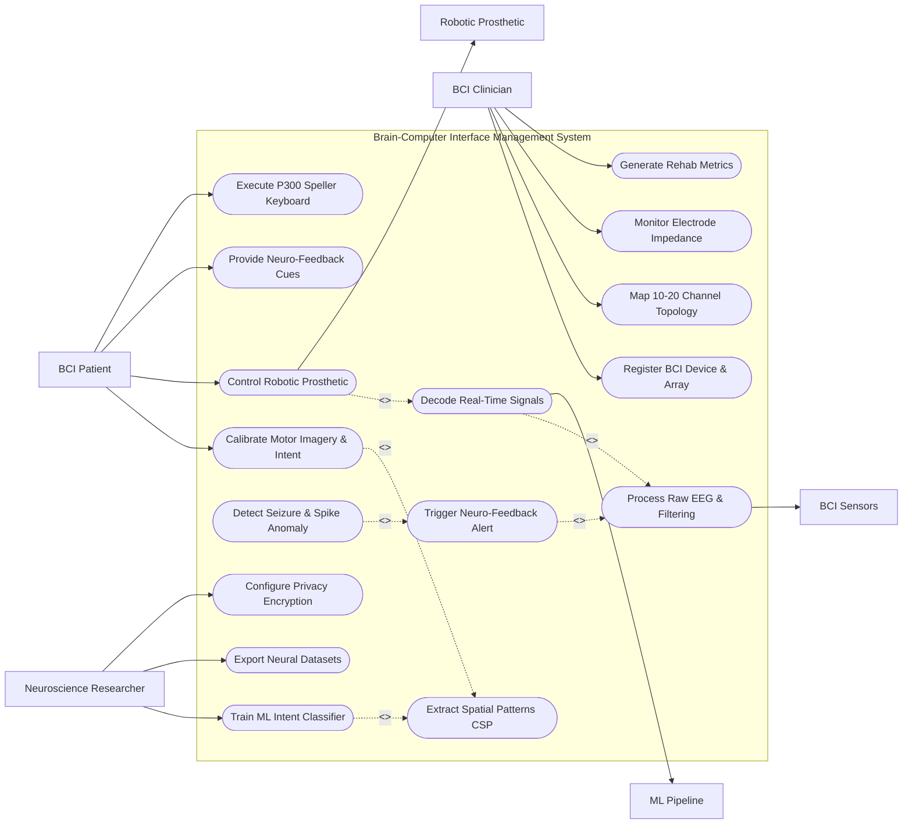

# Use Case Diagram — Brain-Computer Interface (BCI) Management System

## Mermaid Code

## Actor Table | Bảng Actor

| # | Actor | Actor Type | Role Description | Related Use Cases |
|---|-------|------------|------------------|-------------------|
| 1 | BCI Patient | Primary | Patient or end-user generating brain signals for motor imagery, P300 speller, or neuro-rehabilitation. | UC03, UC08, UC09, UC12 |
| 2 | BCI Clinician | Primary | Neurotechnologist onboard devices, mapping 10-20 electrode layout, verifying impedance, and checking rehab progress. | UC01, UC02, UC13, UC15 |
| 3 | Neuroscience Researcher | Primary | Researcher training machine learning decoding models, analyzing spectral bands, and configuring encryption rules. | UC07, UC14, UC16 |
| 4 | BCI Sensors | Hardware | Physical EEG cap, ECoG grid, or Utah microelectrode array streaming multi-channel raw voltage data. | UC04 |
| 5 | ML Pipeline | System | Deep learning decoding pipeline classifying CSP features and motor imagery spectral power vectors. | UC05 |
| 6 | Robotic Prosthetic | Supporting System | External assistive bionic arm, wheelchair, or computer cursor receiving decoded control vectors. | UC08 |

## Use Case Table | Bảng Use Case

| # | UC ID | Use Case Name | Primary Actor | Secondary Actor | Description | Priority |
|---|-------|---------------|---------------|-----------------|-------------|----------|
| 1 | UC01 | Register BCI Device & Array | BCI Clinician | None | Onboards a new BCI headset, microelectrode array, or bio-amplifier, specifying sampling rates and ADC resolution. | High |
| 2 | UC02 | Map 10-20 Channel Topology | BCI Clinician | None | Configures international 10-20 electrode placement maps (C3, C4, Cz, O1, O2) and reference channels. | High |
| 3 | UC03 | Calibrate Motor Imagery & Intent | BCI Patient | None | Conducts structured calibration trials prompting patient to imagine hand/foot movement to record baseline signals. | High |
| 4 | UC04 | Process Raw EEG & Filtering | BCI Clinician | BCI Sensors | Applies 50/60 Hz notch filters, 0.5-40 Hz bandpass filtering, and Common Average Referencing (CAR). | High |
| 5 | UC05 | Decode Real-Time Signals | BCI Patient | ML Pipeline | Classifies real-time filtered brainwave features using ML models to decode user mental intent in <50ms. | High |
| 6 | UC06 | Extract Spatial Patterns CSP | Neuroscience Researcher | None | Computes Common Spatial Pattern (CSP) matrices to maximize variance differences between distinct motor tasks. | High |
| 7 | UC07 | Train ML Intent Classifier | Neuroscience Researcher | None | Trains SVM, LDA, or EEGNet deep learning models on calibrated user trial datasets to produce classifier weights. | High |
| 8 | UC08 | Control Robotic Prosthetic | BCI Patient | Robotic Prosthetic | Translates decoded mental intent vectors into multi-axis joint commands for robotic arm or cursor movement. | High |
| 9 | UC09 | Provide Neuro-Feedback Cues | BCI Patient | None | Displays visual target bars, audio tones, or VR avatar movements to provide real-time neuro-feedback reinforcement. | Medium |
| 10 | UC10 | Detect Seizure & Spike Anomaly | BCI Clinician | None | Monitors EEG streams for abnormal high-voltage epileptiform spikes or paroxysmal rhythm bursts. | High |
| 11 | UC11 | Trigger Neuro-Feedback Alert | BCI Clinician | None | Issues high-priority clinical alerts and activates neuro-feedback calming protocols upon seizure detection. | High |
| 12 | UC12 | Execute P300 Speller Keyboard | BCI Patient | None | Enables non-verbal patient communication by detecting P300 event-related potential responses to flashing letter grids. | Medium |
| 13 | UC13 | Monitor Electrode Impedance | BCI Clinician | None | Measures electrode-to-skin contact impedance (<5 kΩ threshold) across all channels with visual heatmap cues. | High |
| 14 | UC14 | Export Neural Datasets | Neuroscience Researcher | None | Exports de-identified multi-channel EDF+ or MNE Python dataset files for academic research. | Medium |
| 15 | UC15 | Generate Rehab Metrics | BCI Clinician | None | Calculates motor recovery indices, classification accuracy trends over time, and daily active BCI usage duration. | Medium |
| 16 | UC16 | Configure Privacy Encryption | Neuroscience Researcher | None | Enforces AES-256 encryption on raw brainwave telemetry streams to protect user neural privacy. | Low |

## Use Case Specification | Đặc tả Use Case

---

### UC01 — Register BCI Device & Array

| Field | Detail |
|-------|--------|
| **UC ID** | UC01 |
| **Use Case Name** | Register BCI Device & Array |
| **Actor(s)** | Primary: BCI Clinician / Secondary: None |
| **Description** | Registers a new BCI hardware device (Non-invasive EEG Cap, Semi-invasive ECoG Grid, or Invasive Utah Array), configuring sampling rate, ADC bit depth, and amplifier gain settings. |
| **Precondition** | 1. Clinician has administrator access to the BCI Management System.   2. BCI hardware amplifier is powered on and connected via USB, Bluetooth, or optical fiber. |
| **Main Flow** | 1. Actor selects "Register New BCI Device".   2. System presents hardware registration form requesting Device Name (e.g. `g.Nautilus PRO 32`), Hardware Modality (Non-Invasive EEG, Invasive ECoG, Microelectrode Array), and Channel Count (8, 16, 32, 64, 128 channels).   3. Actor configures hardware parameters: Sampling Rate (e.g. 500 Hz, 1000 Hz, 30 kHz), ADC Resolution (24-bit), and Communication Interface (Bluetooth LE, USB, LSL Stream).   4. Actor selects default hardware filters: 50 Hz Notch filter (Powerline noise) and High-Pass filter (0.5 Hz).   5. System initiates test connection, sends handshake query to bio-amplifier, and verifies data stream sync.   6. System stores Neural_Sensor_Headset record and updates status to "Registered - Pending Impedance Check". |
| **Alternative Flow** | **AF1** — Lab Streaming Layer (LSL) Auto-Discovery: System scans local network for active LSL neural streams; automatically imports stream metadata and channel labels.   **AF2** — Invasive Microelectrode Array Pairing: Clinician pairs 96-channel Utah Array; System configures high-rate spike sorting channels (30 kHz sampling). |
| **Exception Flow** | **EX1** — Bio-Amplifier Handshake Timeout: If bio-amplifier fails to respond within 15 seconds, System alerts "Device connection failed. Verify battery level and USB/Bluetooth pairing."   **EX2** — Unsupported Sampling Rate: If specified sampling rate exceeds system buffer capacity, System alerts "Sampling rate >10 kHz requires dedicated optical interface." |
| **Postcondition** | A Neural_Sensor_Headset entity is created, configuring data ingestion parameters for neural signal processing. |
| **Business Rule** | **BR1**: All non-invasive EEG bio-amplifiers must feature galvonic optical isolation to ensure absolute patient safety against electrical mains ground loops. |

---

### UC03 — Calibrate Motor Imagery & Intent

| Field | Detail |
|-------|--------|
| **UC ID** | UC03 |
| **Use Case Name** | Calibrate Motor Imagery & Intent |
| **Actor(s)** | Primary: BCI Patient / Secondary: BCI Clinician |
| **Description** | Conducts a structured calibration session prompting the patient to perform specific mental tasks (e.g. Imagine Left Hand Clench, Imagine Right Hand Clench, Rest) to gather training data for ML decoders. |
| **Precondition** | 1. BCI device is registered (UC01) and electrode contact impedance is verified (<5 kΩ via UC13).   2. Patient is seated comfortably facing the neuro-feedback display. |
| **Main Flow** | 1. Clinician selects "Start New Calibration Session" and chooses task paradigm: Motor Imagery (Left Hand vs Right Hand vs Feet) or P300 Speller.   2. System initializes calibration protocol: configures 40 trials per mental task class with randomized inter-trial intervals (3 to 5 seconds).   3. System presents visual cue on screen: e.g., Left Arrow appears for 4 seconds, prompting Patient to imagine clenching their left hand.   4. System records multi-channel neural signal streams (UC04) during the 4-second motor imagery window, tagging data with Task Label `CLASS_LEFT_HAND`.   5. System displays "Rest" cue for 3 seconds allowing Mu/Beta rhythm recovery.   6. System repeats trial sequence across all classes until all 120 trials are completed.   7. System processes raw trial data, extracts Common Spatial Patterns (CSP) features (UC06), trains ML Intent Classifier (UC07), and displays calibration accuracy score (e.g. 88.5% classification accuracy). |
| **Alternative Flow** | **AF1** — Steady-State Visually Evoked Potential (SSVEP) Calibration: Patient looks at boxes flickering at distinct frequencies (10 Hz, 12 Hz, 15 Hz); System records occipital (O1, O2) SSVEP resonance peaks.   **AF2** — Guided VR Avatar Training: Patient wears VR headset; visual cues are rendered as a 3D virtual avatar hand performing movements. |
| **Exception Flow** | **EX1** — Excessive Muscle Artifact (EMG Noise): If jaw clenching or eye blinks contaminate >30% of trials, System alerts "High EMG artifact noise detected. Rejecting corrupted trials and adding 10 extra clean trials."   **EX2** — Low Classifier Accuracy (<60%): If trained model accuracy is near chance level, System prompts "Calibration accuracy low. Check C3/C4 electrode placement or rest patient." |
| **Postcondition** | A Calibration_Session entity and trained Intent_Decoder_Model are generated, enabling real-time intent decoding (UC05). |
| **Business Rule** | **BR1**: Calibration trial datasets must automatically filter out muscle movement artifacts (EMG >100 µV) prior to ML model training. |

---

### UC05 — Decode Real-Time EEG & Spike Signals

| Field | Detail |
|-------|--------|
| **UC ID** | UC05 |
| **Use Case Name** | Decode Real-Time EEG & Spike Signals |
| **Actor(s)** | Primary: BCI Patient / Secondary: ML Pipeline |
| **Description** | Ingests real-time pre-processed neural signals, extracts spatial/frequency features, applies trained ML decoding models, and classifies user mental intent every 50 ms. |
| **Precondition** | 1. Real-time neural signal streaming (UC04) is active.   2. A trained Intent Decoder Model (UC07) is loaded for the active patient. |
| **Main Flow** | 1. System receives real-time 100ms sliding window of filtered multi-channel neural signals from bio-amplifier.   2. System computes logarithmic band-power features across standard EEG frequency bands: Mu/Alpha (8-13 Hz) and Beta (13-30 Hz) over motor cortex channels (C3, Cz, C4).   3. System applies Common Spatial Pattern (CSP) projection matrix (UC06) to maximize class separability.   4. System feeds feature vector into ML Pipeline (SVM / Linear Discriminant Analysis / EEGNet model).   5. ML Pipeline calculates class probability vector (e.g. `[P(Left)=0.85, P(Right)=0.10, P(Rest)=0.05]`).   6. If confidence exceeds threshold (>0.75), System decodes intent as `COMMAND_REACH_LEFT`.   7. System formats Decoded_Command payload, dispatches command to Assistive Device (UC08), and updates real-time neuro-feedback display (UC09).   8. Process repeats continuously at 20 Hz loop rate (every 50 ms). |
| **Alternative Flow** | **AF1** — Invasive Spike Train Decoding: For Utah Array microelectrode data, System detects action potential spikes (>4 sigma threshold), computes binned firing rates, and decodes continuous 2D cursor velocity vectors via Kalman Filter.   **AF2** — Hybrid BCI (EEG + Eye-Tracking): System combines EEG motor imagery intent with eye-gaze coordinates to select targets precisely on screen. |
| **Exception Flow** | **EX1** — Intent Ambiguity (Low Confidence): If maximum class probability is below threshold (<0.60), System outputs `COMMAND_NEUTRAL` to prevent accidental prosthetic movement.   **EX2** — Signal Saturation / Electrode Detachment: If an electrode rail-disconnects (>500 µV flatline), System excludes corrupted channel and alerts clinician (UC13). |
| **Postcondition** | Decoded mental intent is translated into actionable command vectors for external device control (UC08). |
| **Business Rule** | **BR1**: Real-time intent decoding latency from neural signal acquisition to command output must remain under 50 milliseconds to maintain natural closed-loop control. |

---

### UC08 — Control Robotic Prosthetic & Avatar

| Field | Detail |
|-------|--------|
| **UC08** | Control Robotic Prosthetic & Avatar |
| **Actor(s)** | Primary: BCI Patient / Secondary: Robotic Prosthetic |
| **Description** | Translates decoded mental intent vectors (UC05) into real-time joint motor commands, velocity vectors, or discrete actions sent to a robotic prosthetic arm, wheelchair, or digital avatar. |
| **Precondition** | 1. Decoded intent command (UC05) is generated with confidence above threshold (>0.75).   2. Robotic prosthetic arm or assistive device is connected and safety-checked. |
| **Main Flow** | 1. System receives decoded intent command payload: e.g. `COMMAND_GRASP_HAND` with confidence 0.88.   2. System maps intent command to device kinematics controller: converts `COMMAND_GRASP_HAND` into multi-joint motor actuation parameters (Finger Flexion Servo Angles: 45°).   3. System checks assistive device hardware limits: verifies safety boundaries, joint velocity constraints, and obstacle distance.   4. System transmits control payload (via CAN bus, Bluetooth, or ROS 2 topic) to Robotic Prosthetic hardware.   5. Robotic Prosthetic actuates finger servos, closing bionic hand around target object.   6. Robotic Prosthetic sends tactile haptic feedback payload (pressure sensor reading = 2.4 N) back to System.   7. System updates patient visual display (UC09) with tactile pressure indicator and logs execution event in Decoded_Command database. |
| **Alternative Flow** | **AF1** — Motorized Wheelchair Steering: Decoded intents `TURN_LEFT`, `FORWARD`, `STOP` are mapped to wheelchair motor speed controllers for hands-free navigation.   **AF2** — Digital Avatar & Keyboard Speller: Decoded intents drive 3D digital avatar gestures in virtual reality or select letters on a P300 speller keyboard (UC12). |
| **Exception Flow** | **EX1** — Excessive Gripping Force Warning: If prosthetic tactile sensor detects force exceeding 5.0 N, System automatically caps motor torque to prevent crushing object.   **EX2** — Assistive Device Communication Loss: If Bluetooth link to prosthetic drops, System immediately freezes motor commands and alerts patient. |
| **Postcondition** | Assistive target device executes physical or digital action corresponding to patient's decoded mental intent. |
| **Business Rule** | **BR1**: All BCI-controlled robotic prosthetics must feature hardware-level emergency software stops that halt motor movement if intent confidence drops below safety thresholds. |

---

### UC11 — Trigger Neuro-Feedback & Seizure Alert

| Field | Detail |
|-------|--------|
| **UC ID** | UC11 |
| **Use Case Name** | Trigger Neuro-Feedback & Seizure Alert |
| **Actor(s)** | Primary: BCI Clinician / Secondary: None |
| **Description** | Automatically detects abnormal epileptiform spikes, high-amplitude paroxysmal bursts, or cognitive fatigue, triggering visual/audio alerts and initiating neuro-feedback soothing protocols. |
| **Precondition** | 1. Continuous neural signal processing (UC04) is running during BCI session.   2. Seizure spike detection algorithms (UC10) and alarm thresholds are configured. |
| **Main Flow** | 1. System processes continuous multi-channel EEG signals in background.   2. Seizure detection algorithm detects sudden high-amplitude (>200 µV) synchronous spike-and-wave discharges across temporal/frontal channels (UC10).   3. System calculates epileptiform probability (>0.92 confidence) indicating impending or active seizure onset.   4. System immediately pauses active BCI motor control / prosthetic output (UC08) to prevent involuntary device movement.   5. System sounds high-priority audible clinical alarm at BCI console and flashes red warning "SEIZURE SPIKE DETECTED".   6. System dispatches automated SMS/pager alert to attending BCI Clinician and logs event in Seizure_Alert_Log database with 30-second pre-event EEG buffer.   7. System switches patient display to calming neuro-feedback protocol (relaxing blue visual wave and soothing 432 Hz audio tone) to aid neural recovery. |
| **Alternative Flow** | **AF1** — Cognitive Fatigue Detection: System detects sustained theta/alpha ratio increase indicating patient exhaustion; System prompts "Patient Fatigue Alert: Recommend 15-minute rest break."   **AF2** — Closed-Loop Neuro-Stimulation Trigger: System sends trigger pulse to implanted Vagus Nerve Stimulator (VNS) or Responsive Neurostimulator (RNS) to abort seizure electrically. |
| **Exception Flow** | **EX1** — False Alarm Movement Artifact: Clinician reviews alert and marks event as "Artifact (Chewing/Movement)"; System recalibrates spike threshold to prevent duplicate false alarms.   **EX2** — Clinician Unresponsive: If clinician fails to acknowledge alarm within 60 seconds, System escalates alert to hospital central nursing station. |
| **Postcondition** | BCI device control is safely paused, clinical personnel are alerted, and pre-event EEG signal buffers are locked for diagnostic review. |
| **Business Rule** | **BR1**: Seizure spike detection algorithms must continuously analyze raw neural streams with zero-latency (<100ms detection delay) to maximize patient safety. |
