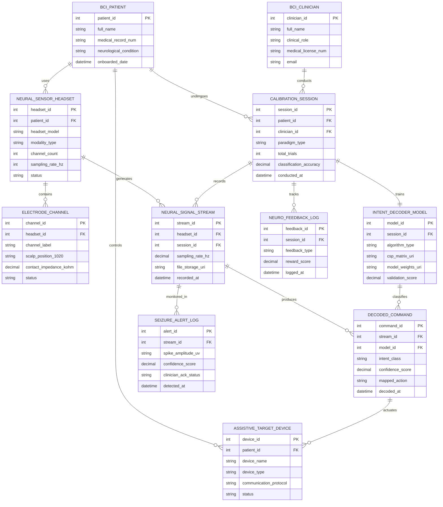

# Conceptual ERD — Brain-Computer Interface (BCI) Management System

## Mermaid Code

## Entity Description Table | Bảng mô tả Entity

| # | Entity Name | Vietnamese Name | Description | Key Attributes | Main Relationships |
|---|-------------|-----------------|-------------|----------------|-------------------|
| 1 | BCI_PATIENT | Bệnh nhân BCI | Patient using BCI hardware for assistive control or neuro-rehabilitation. | patient_id (PK), full_name, medical_record_num, neurological_condition | Uses Neural Sensor Headset, undergoes Calibration Sessions, controls Assistive Devices |
| 2 | BCI_CLINICIAN | Chuyên gia BCI | Neurotechnologist or clinician conducting calibration, checking impedance, and managing therapy. | clinician_id (PK), full_name, clinical_role, medical_license_num | Conducts Calibration Sessions |
| 3 | NEURAL_SENSOR_HEADSET | Thiết bị Đo Tín hiệu Não | Physical EEG cap, ECoG grid, or microelectrode array paired with the patient. | headset_id (PK), patient_id (FK), headset_model, modality_type, channel_count | Used by Patient, contains Electrode Channels, generates Neural Signal Streams |
| 4 | ELECTRODE_CHANNEL | Kênh Kênh Điện cực | Individual electrode channel (e.g. C3, C4, Cz) tracking skin contact impedance. | channel_id (PK), headset_id (FK), channel_label, scalp_position_1020, contact_impedance_kohm | Belongs to Neural Sensor Headset |
| 5 | CALIBRATION_SESSION | Phiên Hiệu chuẩn | Structured calibration session gathering motor imagery trial data to train decoders. | session_id (PK), patient_id (FK), clinician_id (FK), paradigm_type, classification_accuracy | Undergone by Patient, conducted by Clinician, trains Intent Decoder Model, records Signal Streams |
| 6 | INTENT_DECODER_MODEL | Model Giải mã Intent | Machine learning classification model (CSP-LDA, SVM, EEGNet) trained on calibration data. | model_id (PK), session_id (FK), algorithm_type, csp_matrix_uri, model_weights_uri | Trained by Calibration Session, classifies Decoded Commands |
| 7 | NEURAL_SIGNAL_STREAM | Luồng Tín hiệu Não | Multi-channel neural voltage time-series data recorded during calibration or live use. | stream_id (PK), headset_id (FK), session_id (FK), sampling_rate_hz, file_storage_uri | Generated by Headset, produces Decoded Commands, monitored in Seizure Alerts |
| 8 | DECODED_COMMAND | Lệnh Intent Đã Giải mã | Real-time classified mental intent output (e.g. Reach Left, Grasp) with confidence score. | command_id (PK), stream_id (FK), model_id (FK), intent_class, confidence_score, mapped_action | Produced by Signal Stream, classified by Decoder Model, actuates Assistive Target Device |
| 9 | ASSISTIVE_TARGET_DEVICE | Thiết bị Hỗ trợ Ngoại vi | External robotic arm, wheelchair, P300 speller, or VR avatar receiving decoded commands. | device_id (PK), patient_id (FK), device_name, device_type, status | Controlled by Patient, actuated by Decoded Commands |
| 10 | NEURO_FEEDBACK_LOG | Nhật ký Neuro-Feedback | Real-time neuro-feedback score log tracking visual cues and user reward points. | feedback_id (PK), session_id (FK), feedback_type, reward_score, logged_at | Tracked in Calibration Session |
| 11 | SEIZURE_ALERT_LOG | Nhật ký Báo động Seizure | Incident log recording epileptiform spike detections, amplitude, and clinician acknowledgment. | alert_id (PK), stream_id (FK), spike_amplitude_uv, confidence_score, clinician_ack_status | Monitored in Neural Signal Stream |

## Relationship Description | Mô tả Quan hệ

| # | From Entity | Cardinality | To Entity | Relationship Label | Business Explanation |
|---|-------------|-------------|-----------|-------------------|----------------------|
| 1 | BCI_PATIENT | one-to-many | NEURAL_SENSOR_HEADSET | uses | A BCI Patient uses one or more Neural Sensor Headsets over time. |
| 2 | BCI_PATIENT | one-to-many | CALIBRATION_SESSION | undergoes | A BCI Patient undergoes multiple Calibration Sessions. |
| 3 | BCI_CLINICIAN | one-to-many | CALIBRATION_SESSION | conducts | A BCI Clinician conducts multiple Calibration Sessions. |
| 4 | NEURAL_SENSOR_HEADSET | one-to-many | ELECTRODE_CHANNEL | contains | A Neural Sensor Headset contains multiple Electrode Channels. |
| 5 | CALIBRATION_SESSION | one-to-one | INTENT_DECODER_MODEL | trains | A Calibration Session trains one active Intent Decoder Model. |
| 6 | NEURAL_SENSOR_HEADSET | one-to-many | NEURAL_SIGNAL_STREAM | generates | A Neural Sensor Headset generates continuous Neural Signal Streams. |
| 7 | CALIBRATION_SESSION | one-to-many | NEURAL_SIGNAL_STREAM | records | A Calibration Session records multiple Neural Signal Streams. |
| 8 | NEURAL_SIGNAL_STREAM | one-to-many | DECODED_COMMAND | produces | A Neural Signal Stream produces real-time Decoded Commands. |
| 9 | INTENT_DECODER_MODEL | one-to-many | DECODED_COMMAND | classifies | An Intent Decoder Model classifies real-time Decoded Commands. |
| 10 | BCI_PATIENT | one-to-many | ASSISTIVE_TARGET_DEVICE | controls | A BCI Patient controls one or more Assistive Target Devices. |
| 11 | DECODED_COMMAND | one-to-many | ASSISTIVE_TARGET_DEVICE | actuates | Decoded Commands actuate motor movement on Assistive Target Devices. |
| 12 | CALIBRATION_SESSION | one-to-many | NEURO_FEEDBACK_LOG | tracks | A Calibration Session tracks continuous Neuro-Feedback Logs. |
| 13 | NEURAL_SIGNAL_STREAM | one-to-many | SEIZURE_ALERT_LOG | monitored_in | A Neural Signal Stream is monitored in Seizure Alert Logs. |
